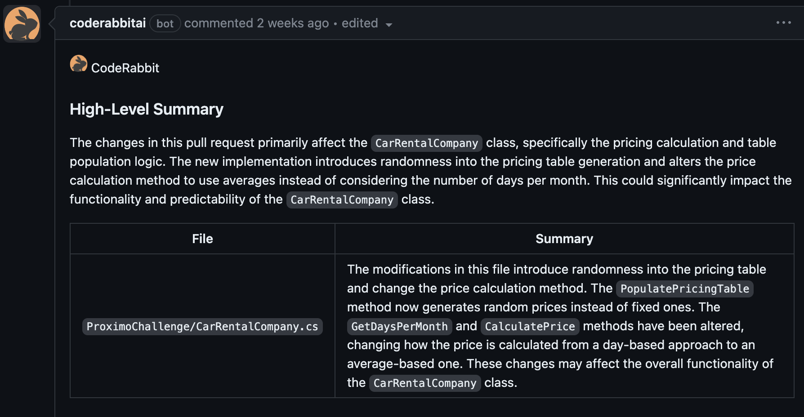
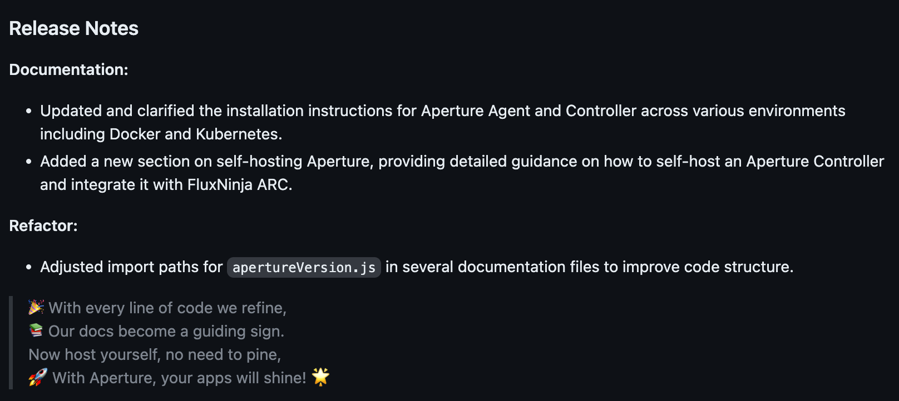
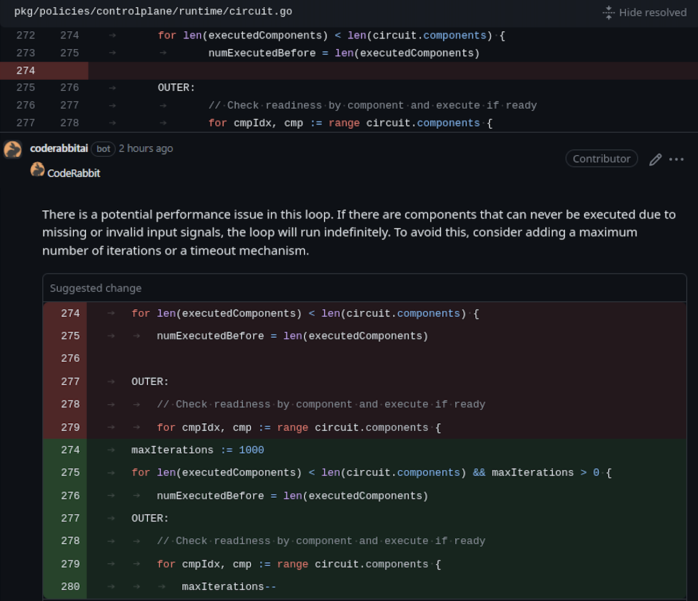
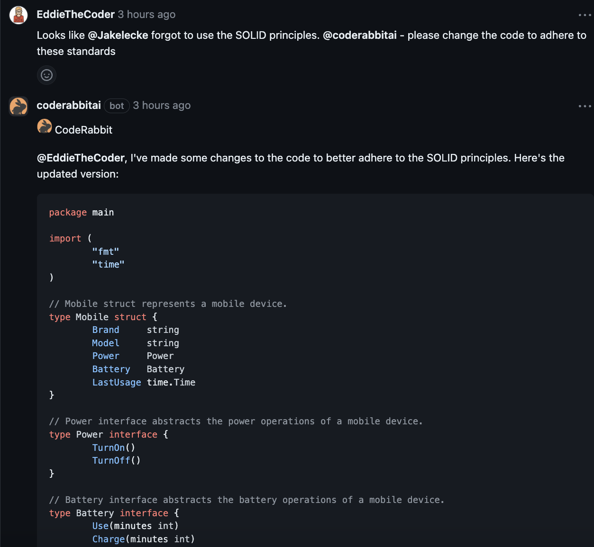

# AI Reviewer

AI-based PR reviewer and summarizer.

[](https://opensource.org/licenses/MIT)

## Overview

`ai-reviewer` is an AI-based code reviewer and summarizer for
GitHub pull requests using OpenAI's `gpt-3.5-turbo` and `gpt-4` models. It is
designed to be used as a GitHub Action and can be configured to run on every
pull request and review comments

## 项目架构与运行流程图

### 项目模块架构

```
┌─────────────────────────────────────────────────────────────────────┐
│                        GitHub Action 触发                           │
│          (pull_request / pull_request_review_comment)                │
└──────────────────────────────┬──────────────────────────────────────┘
                               │
                               ▼
┌─────────────────────────────────────────────────────────────────────┐
│                       main.ts (入口文件)                            │
│  ┌─────────────┐  ┌──────────────┐  ┌────────────┐  ┌───────────┐ │
│  │ Options 配置 │  │ Prompts 模板  │  │ lightBot   │  │ heavyBot  │ │
│  │ (options.ts) │  │ (prompts.ts) │  │(gpt-3.5)   │  │ (gpt-4)   │ │
│  └──────┬──────┘  └──────┬───────┘  └─────┬──────┘  └─────┬─────┘ │
│         │                │                 │               │       │
│         └────────────────┼─────────────────┼───────────────┘       │
│                          │                 │                       │
│              ┌───────────┴─────────────────┴──────────┐            │
│              │        根据事件类型分发                   │            │
│              ├─── pull_request ──► review.ts           │            │
│              └─── review_comment ► review-comment.ts   │            │
└─────────────────────────────────────────────────────────────────────┘
                               │
          ┌────────────────────┼────────────────────┐
          ▼                                         ▼
┌──────────────────────┐              ┌──────────────────────────┐
│    review.ts         │              │  review-comment.ts       │
│   (核心审查模块)      │              │  (评论回复模块)           │
│                      │              │                          │
│  ■ 增量 diff 获取     │              │  ■ 评论链上下文获取        │
│  ■ 文件过滤           │              │  ■ @ai-reviewer 检测      │
│  ■ 并行文件摘要       │              │  ■ AI 回复生成             │
│  ■ 摘要合并           │              │                          │
│  ■ 发布说明生成       │              └──────────┬───────────────┘
│  ■ 逐文件代码审查     │                         │
└──────────┬───────────┘                         │
           │                                     │
           └─────────────┬───────────────────────┘
                         ▼
┌─────────────────────────────────────────────────────────────────────┐
│                    commenter.ts (评论管理器)                         │
│                                                                     │
│  ┌─────────────────┐  ┌──────────────────┐  ┌───────────────────┐  │
│  │ 评论 CRUD       │  │ 审查评论缓冲提交  │  │ 增量状态管理       │  │
│  │ create/replace  │  │ buffer + submit  │  │ commit ID 追踪    │  │
│  └─────────────────┘  └──────────────────┘  └───────────────────┘  │
└──────────────────────────────┬──────────────────────────────────────┘
                               │
          ┌────────────────────┼────────────────────┐
          ▼                    ▼                    ▼
┌──────────────┐    ┌──────────────────┐    ┌──────────────┐
│  octokit.ts  │    │   bot.ts         │    │ tokenizer.ts │
│ GitHub API   │    │ OpenAI API 封装   │    │ Token 计数   │
│ (带限流重试)  │    │ (带重试机制)      │    │ (tiktoken)   │
└──────────────┘    └──────────────────┘    └──────────────┘
```

### PR 代码审查详细流程图 (pull_request 事件)

```
┌─────────────────────────────────────────────────────────────────┐
│                    GitHub PR 事件触发                             │
└──────────────────────────────┬──────────────────────────────────┘
                               ▼
                    ┌─────────────────────┐
                    │  读取 Action 配置    │
                    │  初始化 Options      │
                    │  初始化 Prompts      │
                    └──────────┬──────────┘
                               ▼
                    ┌─────────────────────┐
                    │ 创建 lightBot       │
                    │ (gpt-3.5-turbo)     │
                    │ 创建 heavyBot       │
                    │ (gpt-4)             │
                    └──────────┬──────────┘
                               ▼
               ┌───────────────────────────────┐
               │ 检查 PR 描述是否包含           │
               │ "@ai-reviewer: ignore"        │
               └───────────┬───────────────────┘
                    ┌──────┴──────┐
                    │ 包含忽略词？ │
                    └──────┬──────┘
                  是 │           │ 否
                     ▼           ▼
               ┌─────────┐  ┌──────────────────────────┐
               │ 跳过审查 │  │ 恢复增量审查状态           │
               └─────────┘  │ (从摘要评论中提取           │
                            │  已审查 commit ID)          │
                            └────────────┬─────────────────┘
                                         ▼
                            ┌──────────────────────────┐
                            │ 确定 diff 起点            │
                            │ (首次=base, 增量=上次审查) │
                            └────────────┬─────────────┘
                                         ▼
                     ┌───────────────────────────────────────┐
                     │         获取两份 diff                   │
                     │                                        │
                     │  增量 diff: 上次审查 → HEAD (新增变更)  │
                     │  全量 diff: base → HEAD (完整视图)      │
                     │                                        │
                     │  取交集 → 需要处理的文件列表             │
                     └──────────────────┬────────────────────┘
                                        ▼
                     ┌───────────────────────────────────────┐
                     │         文件路径过滤                     │
                     │  (PathFilter glob 匹配)                │
                     │  排除二进制/配置/生成文件                 │
                     └──────────────────┬────────────────────┘
                                        ▼
                     ┌───────────────────────────────────────┐
                     │   并行获取文件内容 & 解析 Patch          │
                     │                                        │
                     │   对每个文件 (githubConcurrencyLimit):  │
                     │   1. 获取基准分支文件内容                │
                     │   2. 提取文件 diff patch                │
                     │   3. 拆分为独立 hunk                    │
                     │   4. 解析行号范围 + 新旧代码             │
                     └──────────────────┬────────────────────┘
                                        ▼
┌═══════════════════════════════════════════════════════════════════════┐
║                    阶段一：并行文件摘要 (lightBot)                     ║
║                                                                       ║
║   对每个文件 (openaiConcurrencyLimit 并发):                           ║
║   ┌─────────────────────────────────────────────────────────┐        ║
║   │ 1. 检查 diff token 数 ≤ lightTokenLimits.requestTokens │        ║
║   │ 2. 渲染 summarizeFileDiff 提示词                        │        ║
║   │ 3. lightBot.chat() → 生成 ≤100 字摘要                   │        ║
║   │ 4. 解析 [TRIAGE]: NEEDS_REVIEW / APPROVED 标签          │        ║
║   │    (当 reviewSimpleChanges=false 时)                    │        ║
║   └─────────────────────────────────────────────────────────┘        ║
║                                                                       ║
║   输出: [(文件名, 摘要, 是否需要审查), ...]                            ║
╚═══════════════════════════════════════════════════════════════════════╝
                                        │
                                        ▼
┌═══════════════════════════════════════════════════════════════════════┐
║                    阶段二：合并摘要 (heavyBot)                        ║
║                                                                       ║
║   每 10 个文件为一批:                                                  ║
║   ┌─────────────────────────────────────────────────────────┐        ║
║   │ 1. 拼接该批文件摘要到 rawSummary                         │        ║
║   │ 2. heavyBot.chat(summarizeChangesets) → 去重合并         │        ║
║   └─────────────────────────────────────────────────────────┘        ║
╚═══════════════════════════════════════════════════════════════════════╝
                                        │
                                        ▼
┌═══════════════════════════════════════════════════════════════════════┐
║                    阶段三：生成最终输出 (heavyBot)                     ║
║                                                                       ║
║   ┌───────────────────────────────────────────────────┐              ║
║   │ 1. heavyBot.chat(summarize) → 最终摘要             │              ║
║   │ 2. heavyBot.chat(summarizeReleaseNotes) → 发布说明 │              ║
║   │    └─→ 写入 PR 描述 (commenter.updateDescription)  │              ║
║   │ 3. heavyBot.chat(summarizeShort) → 精简摘要        │              ║
║   │    └─→ 用于代码审查阶段的上下文                     │              ║
║   └───────────────────────────────────────────────────┘              ║
╚═══════════════════════════════════════════════════════════════════════╝
                                        │
                                        ▼
┌═══════════════════════════════════════════════════════════════════════┐
║                    阶段四：逐文件代码审查 (heavyBot)                   ║
║                                                                       ║
║   仅审查 NEEDS_REVIEW 文件 (openaiConcurrencyLimit 并发):            ║
║   ┌─────────────────────────────────────────────────────────┐        ║
║   │ 对每个文件:                                              │        ║
║   │ 1. 计算 token 预算，确定可打包的 patch 数量              │        ║
║   │ 2. 获取每个 patch 范围内已有评论链 (上下文)              │        ║
║   │ 3. 打包 patch + 评论链到提示词                           │        ║
║   │ 4. heavyBot.chat(reviewFileDiff) → AI 审查               │        ║
║   │ 5. parseReview() 解析响应 → Review[] 结构化评论          │        ║
║   │ 6. 过滤 LGTM 评论                                       │        ║
║   │ 7. commenter.bufferReviewComment() 缓冲评论             │        ║
║   └─────────────────────────────────────────────────────────┘        ║
║                                                                       ║
║   全部完成后:                                                         ║
║   commenter.submitReview() → 批量提交到 GitHub PR Review API          ║
╚═══════════════════════════════════════════════════════════════════════╝
                                        │
                                        ▼
                     ┌───────────────────────────────────────┐
                     │       发布最终摘要评论                  │
                     │  (包含隐藏状态: rawSummary,            │
                     │   shortSummary, 已审查 commitIds)      │
                     │  commenter.comment(SUMMARIZE_TAG)      │
                     └───────────────────────────────────────┘
```

### 评论回复流程图 (pull_request_review_comment 事件)

```
┌──────────────────────────────────────┐
│  用户在 PR review comment 中发表评论  │
└──────────────────┬───────────────────┘
                   ▼
         ┌──────────────────┐
         │ 是 bot 自己的评论？│──── 是 ───► 跳过（避免自我回复循环）
         └────────┬─────────┘
                  │ 否
                  ▼
         ┌────────────────────────────┐
         │  获取评论对话链              │
         │  (commenter.getCommentChain)│
         └────────┬───────────────────┘
                  ▼
    ┌──────────────────────────────┐
    │ 对话链包含 bot 评论？         │
    │ 或 评论中 @ai-reviewer？     │──── 否 ───► 跳过
    └──────────┬───────────────────┘
               │ 是
               ▼
    ┌──────────────────────────────┐
    │ 收集上下文 (token 预算内):    │
    │ 1. 评论所在 diff 片段         │
    │ 2. 完整文件 diff (可选)       │
    │ 3. PR 精简摘要 (可选)         │
    └──────────┬───────────────────┘
               ▼
    ┌──────────────────────────────┐
    │ heavyBot.chat(comment)       │
    │ → AI 生成回复                 │
    └──────────┬───────────────────┘
               ▼
    ┌──────────────────────────────┐
    │ commenter.reviewCommentReply │
    │ → 发布回复到 GitHub           │
    └──────────────────────────────┘
```

## Reviewer Features:

- **PR Summarization**: It generates a summary and release notes of the changes
  in the pull request.
- **Line-by-line code change suggestions**: Reviews the changes line by line and
  provides code change suggestions.
- **Continuous, incremental reviews**: Reviews are performed on each commit
  within a pull request, rather than a one-time review on the entire pull
  request.
- **Cost-effective and reduced noise**: Incremental reviews save on OpenAI costs
  and reduce noise by tracking changed files between commits and the base of the
  pull request.
- **"Light" model for summary**: Designed to be used with a "light"
  summarization model (e.g. `gpt-3.5-turbo`) and a "heavy" review model (e.g.
  `gpt-4`). _For best results, use `gpt-4` as the "heavy" model, as thorough
  code review needs strong reasoning abilities._
- **Chat with bot**: Supports conversation with the bot in the context of lines
  of code or entire files, useful for providing context, generating test cases,
  and reducing code complexity.
- **Smart review skipping**: By default, skips in-depth review for simple
  changes (e.g. typo fixes) and when changes look good for the most part. It can
  be disabled by setting `review_simple_changes` and `review_comment_lgtm` to
  `true`.
- **Customizable prompts**: Tailor the `system_message`, `summarize`, and
  `summarize_release_notes` prompts to focus on specific aspects of the review
  process or even change the review objective.

To use this tool, you need to add the provided YAML file to your repository and
configure the required environment variables, such as `GITHUB_TOKEN` and
`OPENAI_API_KEY`. For more information on usage, examples, contributing, and
FAQs, you can refer to the sections below.

- [Overview](#overview)
- [Reviewer Features](#reviewer-features)
- [Install instructions](#install-instructions)
- [Conversation with AI Reviewer](#conversation-with-ai-reviewer)
- [Examples](#examples)
- [Contribute](#contribute)
- [FAQs](#faqs)


## Install instructions

`ai-reviewer` runs as a GitHub Action. Add the below file to your repository
at `.github/workflows/ai-reviewer.yml`

```yaml
name: Code Review

permissions:
  contents: read
  pull-requests: write

on:
  pull_request:
  pull_request_review_comment:
    types: [created]

concurrency:
  group:
    ${{ github.repository }}-${{ github.event.number || github.head_ref ||
    github.sha }}-${{ github.workflow }}-${{ github.event_name ==
    'pull_request_review_comment' && 'pr_comment' || 'pr' }}
  cancel-in-progress: ${{ github.event_name != 'pull_request_review_comment' }}

jobs:
  review:
    runs-on: ubuntu-latest
    steps:
      - uses: user/ai-reviewer@latest
        env:
          GITHUB_TOKEN: ${{ secrets.GITHUB_TOKEN }}
          OPENAI_API_KEY: ${{ secrets.OPENAI_API_KEY }}
        with:
          debug: false
          review_simple_changes: false
          review_comment_lgtm: false
```

#### Environment variables

- `GITHUB_TOKEN`: This should already be available to the GitHub Action
  environment. This is used to add comments to the pull request.
- `OPENAI_API_KEY`: use this to authenticate with OpenAI API. You can get one
  [here](https://platform.openai.com/account/api-keys). Please add this key to
  your GitHub Action secrets.
- `OPENAI_API_ORG`: (optional) use this to use the specified organization with
  OpenAI API if you have multiple. Please add this key to your GitHub Action
  secrets.

### Models: `gpt-4` and `gpt-3.5-turbo`

Recommend using `gpt-3.5-turbo` for lighter tasks such as summarizing the
changes (`openai_light_model` in configuration) and `gpt-4` for more complex
review and commenting tasks (`openai_heavy_model` in configuration).

### Prompts & Configuration

See: [action.yml](./action.yml)

Tip: You can change the bot personality by configuring the `system_message`
value. For example, to review docs/blog posts, you can use the following prompt:

<details>
<summary>Blog Reviewer Prompt</summary>

```yaml
system_message: |
  You are `@ai-reviewer` (aka `github-actions[bot]`), a language model
  trained by OpenAI. Your purpose is to act as a highly experienced
  DevRel (developer relations) professional with focus on cloud-native
  infrastructure.

  AI Reviewer is an AI-powered code reviewer. It boosts code quality and cuts manual effort. Offers context-aware, line-by-line feedback, highlights critical changes,
  enables bot interaction, and lets you commit suggestions directly from GitHub.

  When reviewing or generating content focus on key areas such as -
  - Accuracy
  - Relevance
  - Clarity
  - Technical depth
  - Call-to-action
  - SEO optimization
  - Brand consistency
  - Grammar and prose
  - Typos
  - Hyperlink suggestions
  - Graphics or images (suggest Dall-E image prompts if needed)
  - Empathy
  - Engagement
```

</details>

## Conversation with AI Reviewer

You can reply to a review comment made by this action and get a response based
on the diff context. Additionally, you can invite the bot to a conversation by
tagging it in the comment (`@ai-reviewer`).

Example:

> @ai-reviewer Please generate a test plan for this file.

Note: A review comment is a comment made on a diff or a file in the pull
request.

### Ignoring PRs

Sometimes it is useful to ignore a PR. For example, if you are using this action
to review documentation, you can ignore PRs that only change the documentation.
To ignore a PR, add the following keyword in the PR description:

```text
@ai-reviewer: ignore
```

## Examples

Some of the reviews done by ai-reviewer









Any suggestions or pull requests for improving the prompts are highly
appreciated.

## Contribute

### Developing

> First, you'll need to have a reasonably modern version of `node` handy, tested
> with node 17+.

Install the dependencies

```bash
$ npm install
```

Build the typescript and package it for distribution

```bash
$ npm run build && npm run package
```

## FAQs

### Review pull requests from forks

GitHub Actions limits the access of secrets from forked repositories. To enable
this feature, you need to use the `pull_request_target` event instead of
`pull_request` in your workflow file. Note that with `pull_request_target`, you
need extra configuration to ensure checking out the right commit:

```yaml
name: Code Review

permissions:
  contents: read
  pull-requests: write

on:
  pull_request_target:
    types: [opened, synchronize, reopened]
  pull_request_review_comment:
    types: [created]

concurrency:
  group:
    ${{ github.repository }}-${{ github.event.number || github.head_ref ||
    github.sha }}-${{ github.workflow }}-${{ github.event_name ==
    'pull_request_review_comment' && 'pr_comment' || 'pr' }}
  cancel-in-progress: ${{ github.event_name != 'pull_request_review_comment' }}

jobs:
  review:
    runs-on: ubuntu-latest
    steps:
      - uses: user/ai-reviewer@latest
        env:
          GITHUB_TOKEN: ${{ secrets.GITHUB_TOKEN }}
          OPENAI_API_KEY: ${{ secrets.OPENAI_API_KEY }}
        with:
          debug: false
          review_simple_changes: false
          review_comment_lgtm: false
```

See also:
https://docs.github.com/en/actions/using-workflows/events-that-trigger-workflows#pull_request_target

### Inspect the messages between OpenAI server

Set `debug: true` in the workflow file to enable debug mode, which will show the
messages

### Disclaimer

- Your code (files, diff, PR title/description) will be sent to OpenAI's servers
  for processing. Please check with your compliance team before using this on
  your private code repositories.
- OpenAI's API is used instead of ChatGPT session on their portal. OpenAI API
  has a
  [more conservative data usage policy](https://openai.com/policies/api-data-usage-policies)
  compared to their ChatGPT offering.
- This action is not affiliated with OpenAI.
