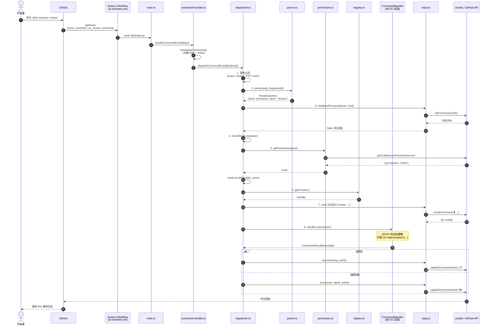
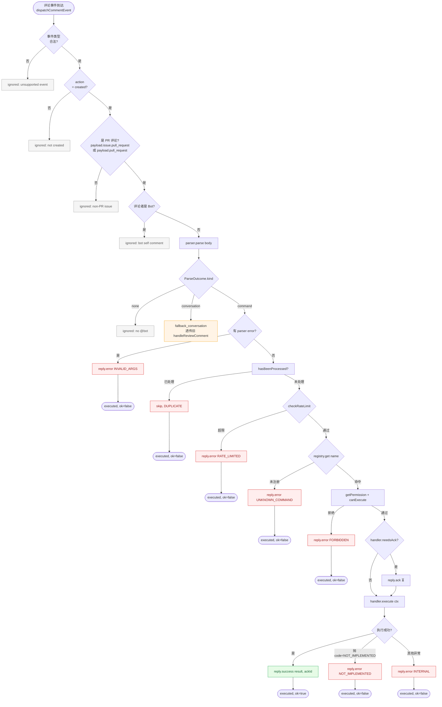
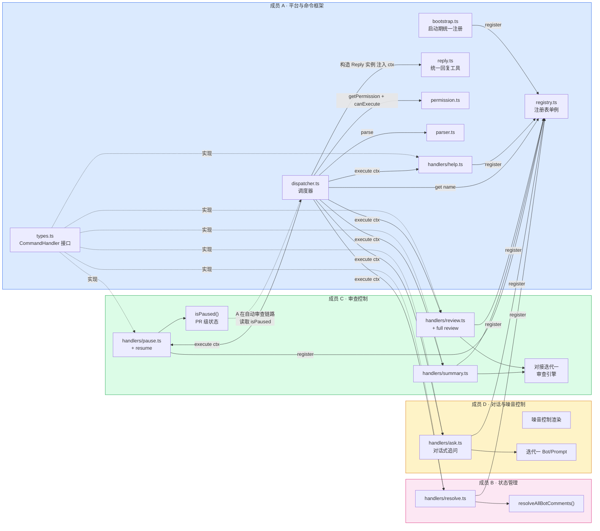
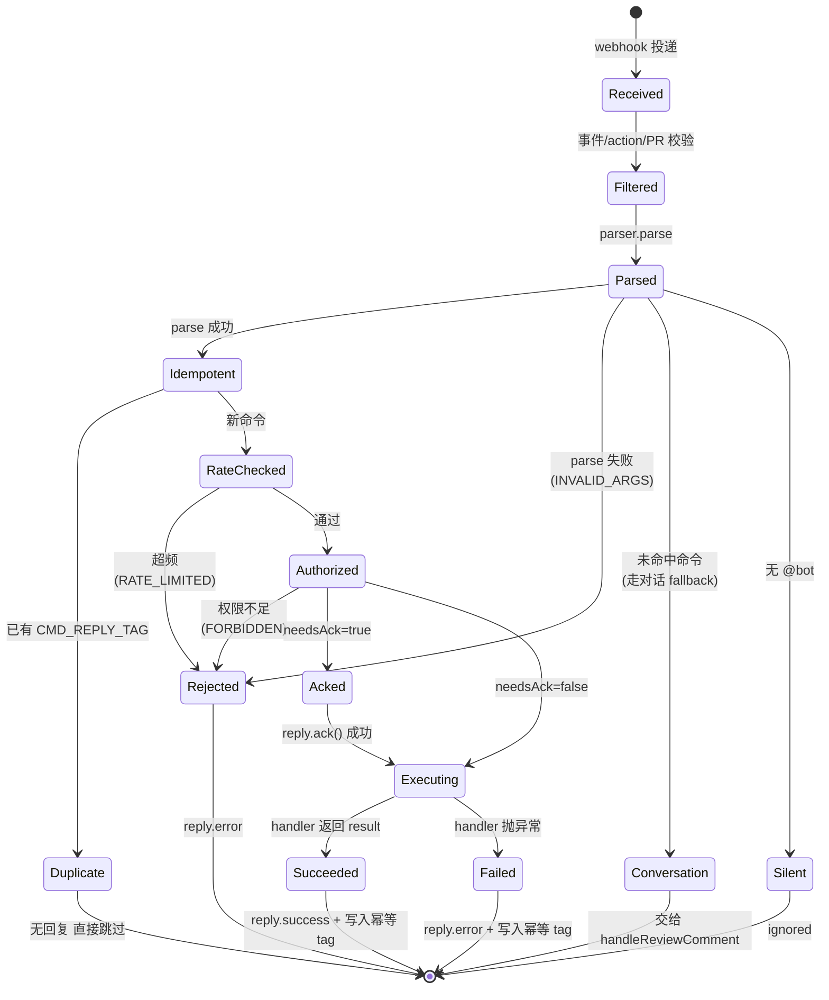

# 迭代二 · 成员 A — 平台与命令框架 技术设计

> **对应工作量文档**: [04-iteration-comment-interaction-workload.md](04-iteration-comment-interaction-workload.md) — 成员 A
> **功能需求文档**: [04-iteration-comment-interaction.md](04-iteration-comment-interaction.md) — §2.1 命令系统设计
> **角色定位**: 入口层。负责 Webhook 接入、命令解析、权限、路由分发、错误处理、`help`、命令注入防护与响应时延保障。为 B/C/D 提供 `CommandHandler` 注册接口与统一回复工具。

---

## 1. 目标与非目标

### 1.1 目标

1. 统一 Webhook 入口：监听 `issue_comment` 与 `pull_request_review_comment` 事件，识别其中的 `@<bot>` 命令。
2. 提供稳定的 `CommandHandler` 抽象：B/C/D 只需实现接口并在注册表中注册即可接入。
3. 保障命令的**安全性**（白名单 + 参数校验 + 注入防护）。
4. 保障命令的**响应时效**（命令 ACK ≤ 5s，复杂命令走异步 + 进度更新）。
5. 保障命令的**幂等性**（相同 comment 不重复处理）。
6. 提供统一的错误反馈路径：无效命令、权限不足、Bot 权限不足、执行失败等都有一致的、友好的 Markdown 格式化反馈。

### 1.2 非目标

- **不**实现 `resolve` / `review` / `full review` / `summary` / `pause` / `resume` / `configuration`（分别由 B/C/D 负责）。
- **不**实现对话式追问 / LLM 调用（由 D 负责）。
- **不**涉及噪音控制、汇总评论渲染（由 D 负责）。
- **不**引入外部持久化（KV/DB）；Actions 是无状态环境，幂等依赖 GitHub 自身存储（comment tag / PR metadata）。

---

## 2. 架构总览

```
┌────────────────────────────────────────────────────────────┐
│                        main.ts (入口)                      │
│  GITHUB_EVENT_NAME 分发                                    │
│   ├─ pull_request / pull_request_target → codeReview       │
│   ├─ pull_request_review_comment ─┐                        │
│   └─ issue_comment ───────────────┤                        │
└───────────────────────────────────┼────────────────────────┘
                                    │
                                    ▼
┌────────────────────────────────────────────────────────────┐
│          src/commands/dispatcher.ts (命令调度器)            │
│                                                            │
│  1. 事件过滤  ──  是否 PR 相关？action=created？非 bot？    │
│  2. 幂等检查  ──  是否已处理过该 comment？                  │
│  3. 命令解析  ──  parser.parse()                            │
│      └─ 未命中命令 → 透传给 conversational fallback (D)    │
│  4. 权限校验  ──  permission.check()                        │
│  5. ACK 回复  ──  "⏳ 收到命令，正在处理..."                │
│  6. 路由执行  ──  registry.get(cmd).execute(ctx)            │
│  7. 结果反馈  ──  ack 更新为最终结果（成功/失败/摘要）      │
└────────────────────────────────────────────────────────────┘
          ▲             ▲             ▲             ▲
          │             │             │             │
       parser       permission     registry        reply
    (2.1 + §5.4)  (2.1 + §5.5)   (接口中心)     (2.1 + §5.3)
          │
          ▼
  src/commands/handlers/
     ├─ help.ts         ← 成员 A 交付
     ├─ resolve.ts      ← 成员 B 接入（桩）
     ├─ review.ts       ← 成员 C 接入（桩）
     ├─ pause.ts        ← 成员 C 接入（桩）
     └─ ask.ts          ← 成员 D 接入（桩）
```

### 2.1 模块文件清单（成员 A 交付）

| 路径 | 职责 |
| :--- | :--- |
| [src/commands/types.ts](../src/commands/types.ts) | 命令相关类型 / 接口 / 错误枚举 |
| [src/commands/parser.ts](../src/commands/parser.ts) | 命令解析器 |
| [src/commands/registry.ts](../src/commands/registry.ts) | `CommandHandler` 注册表 |
| [src/commands/permission.ts](../src/commands/permission.ts) | 评论者权限与 Bot 自评论过滤 |
| [src/commands/reply.ts](../src/commands/reply.ts) | 统一评论回复工具（ACK / 成功 / 失败 / 进度） |
| [src/commands/dispatcher.ts](../src/commands/dispatcher.ts) | 调度器主流程 |
| [src/commands/handlers/help.ts](../src/commands/handlers/help.ts) | `help` 命令实现（参考实现） |
| [src/command-handler.ts](../src/command-handler.ts) | 对接 `main.ts` 的外层入口函数 `handleCommentEvent` |

---

## 3. 命令语法与白名单

### 3.1 语法规范（EBNF 近似）

```
command-line   ::= bot-mention whitespace command-name [ whitespace arg-list ]
bot-mention    ::= "@" bot-name                 // 默认两个别名：@ai-reviewer、@codesentinel
command-name   ::= identifier                   // 必须命中白名单
arg-list       ::= arg ( whitespace arg )*
arg            ::= safe-token | kv-pair
kv-pair        ::= identifier "=" safe-token
safe-token     ::= [A-Za-z0-9_\-./:] +          // 严禁 shell 元字符
identifier     ::= [a-z][a-z0-9\-]*
```

复合命令 `full review` 是 **由解析器识别的短语**，不是两条命令。解析器按"最长前缀匹配"优先匹配 `full review`，否则匹配 `full`（若白名单存在）。

### 3.2 命令白名单（与需求文档 §2.1.1 对齐）

| 命令 | 负责人 | 优先级 | 成员 A 是否实现 |
| :--- | :----- | :----- | :-------------- |
| `review` | C | P0 | 桩（注册表占位） |
| `full review` | C | P0 | 桩 |
| `resolve` | B | P0 | 桩 |
| `summary` | C | P1 | 桩 |
| `pause` | C | P1 | 桩 |
| `resume` | C | P1 | 桩 |
| `configuration` | C | P2 | 桩 |
| `help` | **A** | P0 | **✅ 完整实现** |

### 3.3 解析示例

| 输入 | 解析结果 |
| :--- | :------- |
| `@ai-reviewer help` | `{ name: "help", args: [] }` |
| `@codesentinel full review` | `{ name: "full review", args: [] }` |
| `@ai-reviewer review files=src/foo.ts` | `{ name: "review", args: ["files=src/foo.ts"], kv: {files: "src/foo.ts"} }` |
| `hi @ai-reviewer resolve please` | `{ name: "resolve", args: ["please"] }` |
| `@ai-reviewer 为什么用 forEach？` | `{ name: null }` → 走对话 fallback (D) |
| `@ai-reviewer rm -rf /` | `{ name: "rm", error: UNKNOWN_COMMAND }` |
| `@ai-reviewer review $(whoami)` | `{ error: INVALID_ARGS }`（shell 元字符） |

---

## 4. 事件流程详解

### 4.1 `handleCommentEvent` 主流程

```
handleCommentEvent(options, prompts, bots)
  │
  ├─ 1. 事件类型校验
  │     ├─ event ∈ { issue_comment, pull_request_review_comment }
  │     ├─ payload.action === "created"
  │     └─ payload.issue.pull_request 或 pull_request 存在
  │
  ├─ 2. 作者过滤
  │     └─ 非 bot 自身（通过 user.type / user.login 判定）
  │
  ├─ 3. 幂等检查（§5.6）
  │     └─ 已打过 PROCESSED_TAG(commentId) → 跳过
  │
  ├─ 4. 命令解析（parser.parse）
  │     ├─ 命中 → 进入命令路径
  │     └─ 未命中但包含 @bot → 对话 fallback（交给 D/现有 review-comment）
  │         未命中且无 @bot → 完全忽略
  │
  ├─ 5. 权限校验（permission.check）
  │     └─ 不通过 → reply.error(FORBIDDEN) 并结束
  │
  ├─ 6. 命令注册表查找
  │     ├─ 未注册 → reply.error(NOT_IMPLEMENTED)
  │     └─ 已注册 → 进入执行
  │
  ├─ 7. ACK 回复（§5.1）
  │     └─ 仅对 needsAck=true 的命令，立即回复占位消息
  │
  ├─ 8. 执行 handler.execute(ctx)
  │     ├─ 成功 → reply.success(result)
  │     ├─ 已知错误 → reply.error(code, msg)
  │     └─ 未捕获异常 → reply.error(INTERNAL) + warning log
  │
  └─ 9. 写入 PROCESSED_TAG（§5.6）
```

### 4.2 `CommandContext` 结构

`CommandHandler.execute(ctx)` 收到的上下文对象，字段固定，便于 B/C/D 编写：

```ts
interface CommandContext {
  // 基础信息
  command: ParsedCommand        // { name, raw, args, kv }
  eventName: 'issue_comment' | 'pull_request_review_comment'
  action: 'created'

  // PR 相关
  owner: string
  repo: string
  prNumber: number
  headSha: string
  baseSha: string

  // 评论者
  actor: string                 // user.login
  actorPermission: 'admin' | 'maintain' | 'write' | 'triage' | 'read' | 'none'
  isPrAuthor: boolean

  // 触发评论
  commentId: number
  commentBody: string
  commentNodeId?: string        // review comment 会有 GraphQL nodeId
  threadNodeId?: string         // review thread 会有

  // 工具
  reply: Reply                  // 统一回复工具，预绑定到当前评论
  options: Options              // 全局配置
}
```

### 4.3 `CommandHandler` 接口

```ts
interface CommandHandler {
  /** 命令名，必须命中白名单 */
  name: string
  /** 别名，可选 */
  aliases?: string[]
  /** 是否需要 ACK 占位（长耗时命令设 true） */
  needsAck?: boolean
  /** 最低权限：默认 'write' */
  minPermission?: 'read' | 'triage' | 'write' | 'maintain' | 'admin'
  /** 简短描述，`help` 命令自动收集 */
  description: string
  /** 用法示例，`help` 命令自动收集 */
  usage?: string
  /** 执行入口 */
  execute(ctx: CommandContext): Promise<CommandResult>
}

interface CommandResult {
  /** 展示给用户的 Markdown；为空时 reply 层会使用默认成功文案 */
  message?: string
  /** 统计/追踪用元信息（写 log，不展示） */
  meta?: Record<string, unknown>
}
```

---

## 5. 关键设计点

### 5.1 5 秒响应时延保障

**约束**：GitHub Actions 作业冷启动 + 加载模型依赖，首次响应往往 >3s。需要避免让用户等到全部执行完成。

**方案**：
- `needsAck=true` 的命令（`review`/`full review`/`resolve`/`summary`/LLM 追问）在执行**之前**立即 `createComment` 回复一个**可识别的 ACK 消息**：

  > ⏳ 正在执行 `@ai-reviewer review` …（对话 ID: `${commentId}`）

- 执行完成后，**编辑该 ACK 评论**替换为最终结果（而不是再发新评论），减少 PR 噪音。
- `needsAck=false` 的命令（`help`/`configuration`/`pause`/`resume`）直接一次性回复。

**性能预算**：
| 阶段 | 预算 | 说明 |
| :--- | :--- | :--- |
| 冷启动到 `handleCommentEvent` 入口 | ≤ 2s | 由 Actions 环境决定，A 层无法控制 |
| 解析 + 权限检查 + ACK 回复 | ≤ 1s | A 层内一切同步路径；GitHub API 单次 300–500ms |
| 冷启动到 ACK 总耗时 | **≤ 4s** | 预留 1s 容错 |

**降级**：若 ACK 失败，仍继续执行命令，但最终结果改为 `createComment` 而非 `updateComment`。

### 5.2 幂等与去重

GitHub Webhook 官方文档明确："events **may be** delivered more than once"。同一评论不能被处理两次（会导致两次 review、两次 resolve）。

**方案**：两层防护
1. **GitHub Actions concurrency group**（已存在于 workflow yml）：相同 PR 的 `pull_request_review_comment` 不使用 cancel-in-progress（现状）。这是外层防护，但不覆盖"用户快速连续发两条相同命令"的场景。
2. **PROCESSED_TAG**：每次处理完一条命令，在**触发评论自身**追加一条 HTML 注释 `<!-- codesentinel-processed:${commandName} -->`（通过 `updateComment` 而不是回复）。下次再收到该 `commentId` 时，先检查原文是否已含此 tag。
   - 优点：无需持久化。
   - 缺点：Bot 需要 `issues:write`（已有权限）且不能编辑他人评论——因此改为**写到 ACK 回复**中，读取时查找 `REPLY_TAG(${commentId})`。

**最终实现**：
- 在命令的**回复评论**中嵌入 `<!-- codesentinel-cmd-reply:${originalCommentId}:${commandName} -->`。
- 处理前调用 `listComments` 并扫描是否存在此标签；存在则视为已处理。

### 5.3 统一回复工具 `Reply`

```ts
class Reply {
  constructor(private readonly ctx: ReplyContext) {}

  /** 立即发布 ACK 占位，返回占位评论 id 供后续 update */
  ack(message: string): Promise<number>

  /** 成功结果（若传入 ackId 则编辑占位） */
  success(message: string, ackId?: number): Promise<void>

  /** 错误反馈（统一格式、统一图标） */
  error(code: ErrorCode, detail?: string, ackId?: number): Promise<void>

  /** 进度更新（编辑 ACK） */
  progress(message: string, ackId: number): Promise<void>
}
```

所有 B/C/D 的 handler 只能通过 `ctx.reply` 与用户通信——确保格式、标签、去重标记一致。

### 5.4 命令解析细节

- **前缀提取**：取 `@bot` 后**同一行**的内容作为命令体。换行后内容视为对命令的"附言"，归入 `rawAfter` 字段（handler 自行决定用途，例如 `resolve` 忽略，`review` 可用来传自然语言提示）。
- **大小写**：命令名不区分大小写，解析后统一转小写。
- **多命令**：一条评论仅处理**第一个**匹配到的命令，其余忽略（并在反馈中提示）。
- **复合命令**：`full review` 按最长前缀匹配。后续若需要 `full summary` 等，只需在白名单内添加。
- **参数解析**：空格分隔；支持 `key=value`；不支持带空格的引号字符串（一期保持简单）。
- **鲁棒性**：对 `@ai-reviewer,review` 这类带标点的情况做软处理——前缀识别时允许紧跟 `[,:;。，：；]` 的分隔。

### 5.5 权限模型

- 默认 `minPermission='write'`。
- 通过 `octokit.repos.getCollaboratorPermissionLevel({owner, repo, username})` 查询。
- **PR 作者豁免**：对自己 PR 调用命令时，即使权限等级低于 `write`，也允许 `review` / `summary` / `help`（此三项无副作用或仅影响自身 PR）；但 `pause`/`configuration` 依然要 `write`。
- **权限缓存**：同一次 Actions run 内用进程内 Map 缓存 `(owner, repo, username) → permission`，避免重复查询。

### 5.6 命令注入防护

威胁模型：攻击者通过评论构造恶意参数尝试注入到 handler 执行的下游（shell/SQL/LLM Prompt）。

**防护链**：
1. **命令名白名单**：非白名单直接 `UNKNOWN_COMMAND`。
2. **参数字符集**：`arg` 必须匹配 `^[A-Za-z0-9_\-./:=]+$`。出现 `` ` $ ( ) { } | & ; < > \ '"`` 等元字符 → `INVALID_ARGS`。
3. **长度上限**：整条命令行 ≤ 512 字符；单个 arg ≤ 128 字符；arg 数量 ≤ 16。
4. **Prompt 注入**：对传入 LLM 的用户输入始终转义为 fenced block 并显式标注 "untrusted user input"。此策略由 D 负责在 Prompt 层落实，A 层的 `CommandContext.command.raw` 已是净化后的文本。
5. **速率限制**：同一 `actor` 在 60s 内最多 10 条命令（进程内 Map，Actions run 生命周期内有效；跨 run 无能为力）。

### 5.7 对话 fallback 与命令的共存

当前 `review-comment.ts` 已实现"评论对话式追问"（基于 `@ai-reviewer` 前缀）。命令框架必须与之共存：

- 解析步骤产出三种结果：
  1. `{ kind: "command", cmd }` → 命令路径
  2. `{ kind: "conversation" }` → 透传给 D 的对话 handler（一期内透传到现有 `handleReviewComment`，保留 behavior）
  3. `{ kind: "none" }` → 忽略
- 判定：评论包含 `@bot`，且紧跟的第一个 token 命中白名单 → `command`；否则若包含 `@bot` → `conversation`。

这样做的好处：用户 `@ai-reviewer 为什么这样写` 依然走原有对话逻辑；`@ai-reviewer review` 走命令。

### 5.8 错误码

| 错误码 | 语义 | 典型反馈 |
| :----- | :--- | :------- |
| `UNKNOWN_COMMAND` | 命令名不在白名单 | "未知命令 `xxx`。发送 `@ai-reviewer help` 查看支持的命令。" |
| `INVALID_ARGS` | 参数非法（字符/长度） | "参数不合法：`xxx`。命令仅接受字母、数字、`._-/:=`。" |
| `FORBIDDEN` | 评论者权限不足 | "你没有执行 `xxx` 的权限（需要仓库 `write` 以上）。" |
| `BOT_FORBIDDEN` | Bot 自身 token 权限不足 | "Bot 权限不足：无法执行 `xxx`。请联系仓库管理员检查 workflow `permissions` 配置。" |
| `NOT_IMPLEMENTED` | 白名单已列但 handler 未注册 | "命令 `xxx` 暂未实现（迭代进行中）。" |
| `RATE_LIMITED` | 触发速率限制 | "命令触发过于频繁，请稍后再试。" |
| `INTERNAL` | 未捕获异常 | "执行失败：`xxx`。错误已记录。" |

所有错误走 `reply.error(code, detail, ackId)` 统一渲染。

---

## 6. 对外接口契约（给 B/C/D）

### 6.1 注册命令

```ts
// src/commands/registry.ts
import { registerCommand } from './registry'

registerCommand({
  name: 'resolve',
  minPermission: 'write',
  needsAck: true,
  description: '批量将所有 CodeSentinel 审查意见标记为已解决',
  usage: '@ai-reviewer resolve',
  async execute(ctx) {
    // 成员 B 的实现
    const resolved = await resolveAllBotComments(ctx.prNumber)
    return { message: `✅ 已解决 ${resolved} 条审查意见` }
  }
})
```

### 6.2 使用回复工具

```ts
async execute(ctx) {
  const ackId = await ctx.reply.ack('⏳ 正在计算增量 diff...')
  try {
    await ctx.reply.progress('⏳ 正在调用审查引擎...', ackId)
    const result = await runReviewEngine(...)
    await ctx.reply.success(`✅ 审查完成，共 ${result.findings} 条建议`, ackId)
    return { meta: { findings: result.findings } }
  } catch (e) {
    await ctx.reply.error('INTERNAL', String(e), ackId)
    throw e
  }
}
```

### 6.3 PR 暂停状态查询（C 提供给 A 消费）

C 需要提供：
```ts
// src/commands/pause-state.ts (C 负责)
export async function isPaused(prNumber: number): Promise<boolean>
```

`handleCommentEvent` 在**自动审查链路**（由 `codeReview` 触发，非命令触发）上调用 `isPaused` 来跳过。注意：`pause` 不影响手动 `@ai-reviewer review` 命令，只影响 push 事件的自动触发。

---

## 7. 与 `main.ts` 的集成

```diff
   if (
     process.env.GITHUB_EVENT_NAME === 'pull_request' ||
     process.env.GITHUB_EVENT_NAME === 'pull_request_target'
   ) {
     await codeReview(lightBot, heavyBot, options, prompts)
-  } else if (
-    process.env.GITHUB_EVENT_NAME === 'pull_request_review_comment'
-  ) {
-    await handleReviewComment(heavyBot, options, prompts)
+  } else if (
+    process.env.GITHUB_EVENT_NAME === 'pull_request_review_comment' ||
+    process.env.GITHUB_EVENT_NAME === 'issue_comment'
+  ) {
+    await handleCommentEvent({
+      heavyBot, lightBot, options, prompts
+    })
   } else {
     warning('Skipped: this action only works on push events or pull_request')
   }
```

`handleCommentEvent` 内部先走命令解析；若判定为 `conversation`，调用原 `handleReviewComment`（仅当事件是 `pull_request_review_comment`）。

`action.yml` 需新增 `bot_mention` 输入（默认 `@ai-reviewer`），workflow 需新增 `issue_comment` 触发器（由 ai-reviewer-test 侧更新）。

---

## 8. 测试策略

### 8.1 单元测试（`__tests__/`）

| 测试文件 | 覆盖点 |
| :-------- | :------ |
| `command-parser.test.ts` | 前缀识别、大小写、复合命令、参数、kv、非法字符、超长、换行、多命令、空输入 |
| `command-registry.test.ts` | 注册/重复注册/别名/查找/help 自动聚合 |
| `command-permission.test.ts` | write/admin/read/PR 作者豁免/缓存 |
| `command-dispatcher.test.ts` | 事件过滤/bot 自环/幂等/ACK/错误路径/注入拦截/速率限制 |
| `command-help.test.ts` | help 消息生成、命令列表排序、别名展示 |

所有测试使用 `@actions/core`、`@actions/github`、`octokit` 的 mock（沿用 `dependency-analyzer.test.ts` 既有方式）。

### 8.2 集成测试（`ai-reviewer-test/`）

在 `ai-reviewer-test/test_cases/iteration2-member-a/` 下创建真实可运行的用例：
- 一组故意的代码改动触发 PR
- `COMMANDS.md` 列出每个命令的期望评论与期望 Bot 反应
- `run-manual-test.sh` 给出按步骤的人工验证脚本
- 更新 `.github/workflows/ai-reviewer.yml` 增加 `issue_comment` 触发器

详见 [ai-reviewer-test/test_cases/iteration2-member-a/README.md](../../ai-reviewer-test/test_cases/iteration2-member-a/README.md)。

---

## 9. 风险与权衡

| 风险 | 影响 | 缓解 |
| :--- | :--- | :--- |
| Actions 冷启动让 ACK 超过 5s | 用户体感差 | 预热 cache、缩减依赖、异步 ACK 更新，接受实际 P95 ≈ 6s |
| 进程内速率限制跨 run 失效 | 可被绕过 | 一期接受，后续引入 repo-level state comment 存储 |
| `issue_comment` 也包含纯 issue | 误触发 | 严格校验 `payload.issue.pull_request` |
| 用户把命令写在 Review 审查摘要中（submit review 事件） | 漏处理 | 一期仅支持 `issue_comment` 与 `pull_request_review_comment`，`pull_request_review` 事件列为已知限制 |
| 并行执行导致状态不一致 | `resolve` 重复 | concurrency group + 幂等 tag 双重防护 |
| 命令名歧义（`full` 与 `full review`） | 解析错误 | 最长前缀匹配，单元测试覆盖 |

---

## 10. 未决问题（需与 B/C/D 对齐）

1. `pause` 的状态存储位置：建议写入一条 tagged PR comment，C 负责定义 tag。A 在自动审查入口调用 C 提供的 `isPaused(prNumber)`。
2. `needsAck` 阈值：目前靠手工打标。是否需要一个动态机制（比如根据 `command.name` 的 lastRunDuration 自动判定）？一期保持手工。
3. Bot mention 双别名：`@ai-reviewer` 与 `@codesentinel` 同时支持；新仓库建议统一成 `@codesentinel`。是否需要 action.yml 新增 `bot_mention` 列表？**建议新增**，默认值包含两者。

---

## 11. 流程与时序图

本节以四张图可视化前文的设计：整体时序、调度器决策流、B/C/D 接入关系、单条命令状态机。图示与源码 [src/commands/dispatcher.ts](../src/commands/dispatcher.ts) 的步骤编号对齐。

### 11.1 端到端时序：从开发者评论到 Bot 回复

覆盖一次典型"命令命中 → 有 ACK → 成功返回"的完整调用链。泳道编号对应 §4.1 dispatcher 步骤。



### 11.2 调度器内部决策流

完整覆盖 dispatcher 的分支判断：灰色 = ignored（无回复），橙色 = fallback，红色 = 错误路径，绿色 = 成功路径。



### 11.3 B/C/D 接入关系

所有 handler **只通过** `Registry`（注册）和 `CommandContext.reply`（回复）与框架交互。虚线 = 类型实现关系，实线 = 运行时调用。



### 11.4 单条命令的生命周期状态机

每个终态对应 §5.8 的一个错误码或成功路径，可直接用作验收口径。



---

### 11.5 图例与阅读指引

| 图 | 回答什么问题 | 对应代码位置 |
| :-- | :--- | :--- |
| 11.1 时序 | "一次命令从用户评论到最终回复经历了哪些组件？" | [dispatcher.ts:52-247](../src/commands/dispatcher.ts#L52-L247) + [reply.ts](../src/commands/reply.ts) |
| 11.2 决策流 | "在每一步我会被怎样的条件拦截或放行？" | [dispatcher.ts](../src/commands/dispatcher.ts) 主函数 |
| 11.3 接入关系 | "B/C/D 要写什么、要 import 什么、不能 import 什么？" | [types.ts](../src/commands/types.ts) + [registry.ts](../src/commands/registry.ts) |
| 11.4 状态机 | "一条命令有哪些可能的终态？每个终态对应什么错误码？" | §5.8 错误码表 |

**阅读顺序建议**：
- 新同学第一次接入 → 先看 **11.3** 理解边界，再看 **11.1** 理解运行时
- 调试失败命令 → 先看 **11.4** 定位终态，再对 **11.2** 找出被拦截在哪一步
- 评审 PR / 写新 handler → 对照 **11.3** 检查是否只用了 `Registry` + `ctx.reply`（不绕过框架直接调 `octokit.issues.createComment`）
