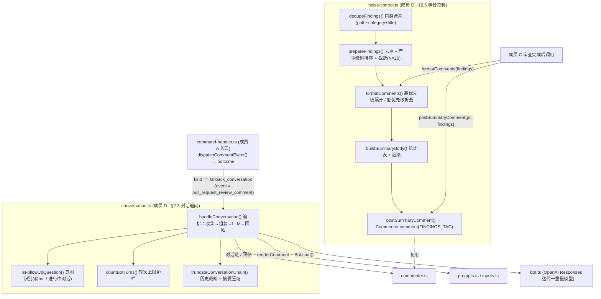
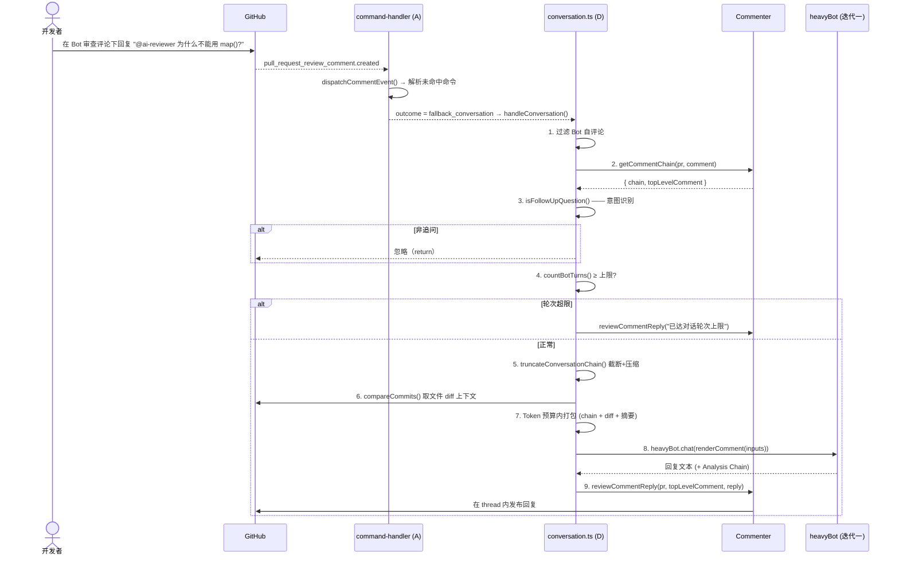
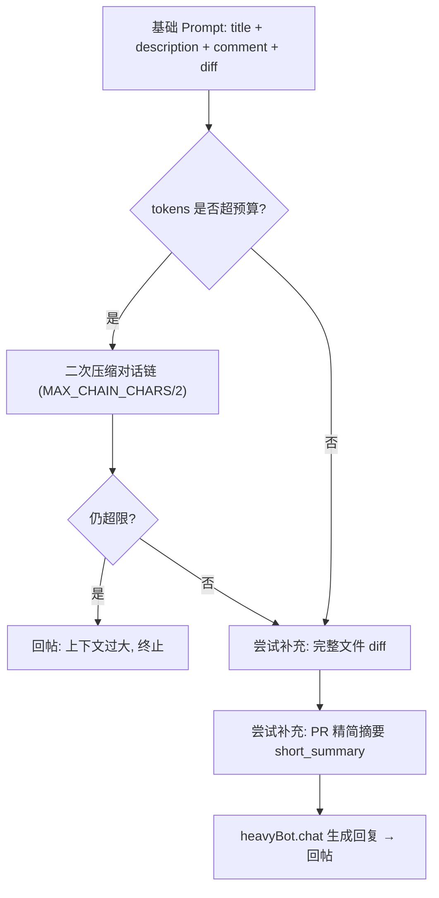
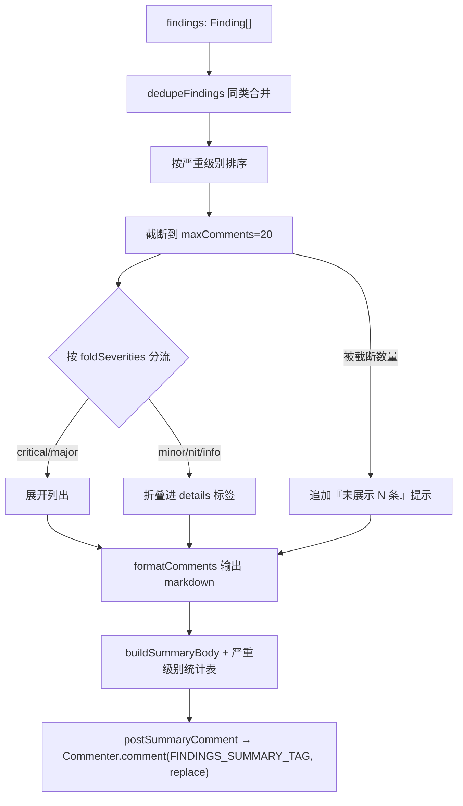

# 迭代二 · 成员 D — 对话交互与噪音控制 技术设计

> **对应工作量文档**: [04-iteration-comment-interaction-workload.md](04-iteration-comment-interaction-workload.md) — 成员 D
> **功能需求文档**: [04-iteration-comment-interaction.md](04-iteration-comment-interaction.md) — §2.3 对话式追问交互、§2.5 评论噪音控制
> **依赖入口框架**: [04-iteration-02-member-a-design.md](04-iteration-02-member-a-design.md) — 成员 A 的 `fallback_conversation` 分发
> **角色定位**: 对话层 + 渲染层。负责开发者对 Bot 审查意见的对话式追问（上下文收集 + LLM 调用 + thread 回复），以及审查评论的噪音控制（去重 / 截断 / 折叠 / PR 顶部汇总）。

---

## 1. 目标与非目标

### 1.1 目标

1. **追问对话（§2.3）**：当开发者在 PR 行级评论里 `@<bot>` 追问，或在已有 Bot 对话链中继续提问时，携带完整上下文生成高质量回复并发布到 thread。
2. **上下文收集**：thread 完整对话历史 + 关联代码行 / 文件 diff + PR 摘要，组装为对话 Prompt。
3. **LLM 调用**：复用迭代一的重量模型（含 Analysis Chain / Web Query 能力）。
4. **资源护栏**：对话上下文截断 + 摘要压缩（防 Token 超限）、对话轮次上限（防无限对话）。
5. **噪音控制（§2.5）**：同类评论合并去重、单次评论数量上限（默认 N=20，按优先级截断）、低优先级 `<details>` 折叠、PR 顶部汇总评论。
6. **对外接口**：向成员 C 提供 `postSummaryComment(prNumber, findings)` 与 `formatComments(findings)`。

### 1.2 非目标

- **不**实现 Webhook 接入 / 命令解析 / 路由（成员 A）。
- **不**实现 `resolve`（成员 B）、`review` / `full review` / `pause` / `resume` / `summary` / `configuration`（成员 C）。
- **不**修改成员 B/C 已占用的文件（`bootstrap.ts` / `stubs.ts` / `handlers/resolve.ts` / `dispatcher.ts` / `reply.ts`）；D 不注册任何命令。
- **不**引入外部持久化；轮次与去重均基于 GitHub 评论自身状态（HTML tag / 对话链）推导。

---

## 2. 架构总览

成员 D 的两条能力线挂载在两个独立模块上，互不耦合：



### 2.1 模块文件清单（成员 D 交付）

| 文件 | 说明 | 状态 |
| :--- | :--- | :--- |
| `src/conversation.ts` | §2.3 对话追问：意图识别 / 上下文收集 / Prompt 组装 / LLM 调用 / 回帖 / 截断 / 轮次上限 | 新增 |
| `src/noise-control.ts` | §2.5 噪音控制：`Finding` 类型 / 去重 / 截断 / 折叠 / 汇总评论 / 严重级别分类 | 新增 |
| `src/command-handler.ts` | 将 `fallback_conversation` 接到 `handleConversation` | 修改 |
| `src/review-comment.ts` | 旧对话处理器，已被 `handleConversation` 取代 | **删除** |
| `src/review.ts` | 审查管线接入噪音控制（收集 Finding → 排序/截断 → 汇总评论）；成员 C 的文件，已获授权改动 | 修改 |
| `src/options.ts` / `src/main.ts` / `action.yml` | 新增 `max_review_comments` 配置项（默认 20，≤0 不限制） | 修改 |
| `__tests__/conversation.test.ts` | 对话纯逻辑单测 | 新增 |
| `__tests__/noise-control.test.ts` | 噪音控制单测（含严重级别分类） | 新增 |

---

## 3. 对话追问（§2.3）数据流

### 3.1 端到端时序



### 3.2 上下文组装与 Token 预算

`handleConversation` 按"必需 → 可选"的顺序在 `heavyTokenLimits.requestTokens` 预算内逐层填充：



- **截断策略**：`truncateConversationChain` 保留**最近**若干轮（信息最相关），较早内容压缩为一行省略提示，避免硬截断割裂上下文。
- **轮次上限**：`MAX_CONVERSATION_TURNS = 10`，以对话链中 Bot 专属标签（`COMMENT_TAG` / `COMMENT_REPLY_TAG`）出现次数为准。

### 3.3 意图识别规则（`isFollowUpQuestion`）

| 条件 | 结果 |
| :--- | :--- |
| 评论来自 Bot 自身 | ❌ 不触发（最高优先级排除，防自我循环） |
| 评论正文含 Bot 专属 HTML 标签 | ❌ 不触发（视为 Bot 文案） |
| 评论显式 `@ai-reviewer` / `@codesentinel` | ✅ 触发 |
| 对话链中已存在 Bot 评论（进行中对话） | ✅ 触发（即使本条未 @） |
| 以上皆否 | ❌ 不触发（普通评论，不打扰） |

> ✅ **dispatcher 已放宽 mention 门禁（支持续轮无 @）**：`isFollowUpQuestion` 运行在
> dispatcher 之后。dispatcher 现对 `pull_request_review_comment` 做如下处理——
> 评论命中 mention → 走对话；**未命中 mention 但是 thread 内回复（`in_reply_to_id` 存在）
> → 也进入 `fallback_conversation`**，由 `handleConversation` 用上表规则判定（链中有 Bot
> 评论才回帖，纯人类讨论不打扰）。因此"对话链中已有 Bot 评论即触发（即使本条未 @）"现已生效。
>
> 仅 **review thread 外的顶层评论** 且无 mention 时，仍 `ignored("no bot mention")`。

---

## 4. 噪音控制（§2.5）数据流

### 4.1 渲染流水线



### 4.2 `Finding` 数据结构

```ts
export type FindingSeverity = 'critical' | 'major' | 'minor' | 'nit' | 'info'

export interface Finding {
  path: string          // 文件路径
  startLine: number
  endLine: number
  severity: FindingSeverity
  category?: string     // 类别（用于同类合并，如 "security" / "style"）
  title?: string        // 简短标题
  body: string          // 评论正文 (markdown)
}
```

### 4.3 去重 / 截断 / 折叠规则

| 能力 | 规则 |
| :--- | :--- |
| 同类合并 | 合并键 = `path \| category \| 归一化(title 或正文首行)`；命中同键合并为一条，**保留最高严重级别**，标题追加"（合并 N 处同类问题）" |
| 排序 | 按严重级别降序（critical > major > minor > nit > info），同级保持原序（稳定） |
| 截断 | `maxComments` 默认 20，**可经 Action 输入 `max_review_comments` 配置**（≤0 表示不限制）；超出部分丢弃并在末尾提示"另有 N 条未展示" |
| 折叠 | `foldSeverities` 默认 `[minor, nit, info]`，折叠进 `<details>` |
| 幂等 | 汇总评论使用独立 `FINDINGS_SUMMARY_TAG`，与迭代一 `SUMMARIZE_TAG` 隔离，重复调用只更新同一条 |

### 4.4 严重级别分类（`classifyFindingSeverity`）

审查模型当前不直接输出严重级别，`classifyFindingSeverity(text)` 用中英关键词做轻量启发式分类，供排序 / 截断 / 折叠使用，按"高 → 低"匹配：

| 级别 | 命中关键词（示例） |
| :--- | :--- |
| critical | security / vulnerability / injection / secret / hardcoded / 密钥 / 注入 / 漏洞 |
| major | crash / leak / off-by-one / unhandled / exception / await / 错误 / 异常 / 泄露 |
| nit | nit / typo / formatting / naming / 拼写 / 格式 / 命名 |
| minor | consider / recommend / readability / 建议 / 可读性（**及无明显信号的默认值**） |

> 后续可让审查 prompt 直接输出级别字段，替换该启发式以提升准确度。

---

## 5. 对外接口契约（给成员 C）

> 对应工作量文档 §5：`D → C` 提供 `postSummaryComment()` 与 `formatComments()`。

```ts
// 通用评论渲染：去重 + 截断 + 折叠，返回 markdown 字符串（无发现返回 ''）
export function formatComments(
  findings: Finding[],
  options?: NoiseControlOptions
): string

// 去重 + 排序 + 截断后的结构化结果（供 C 逐条发布行级评论）
export function prepareFindings(
  findings: Finding[],
  options?: NoiseControlOptions
): { kept: Finding[]; truncated: number }

// 发布/更新 PR 顶部汇总评论（幂等替换）
export async function postSummaryComment(
  prNumber: number,
  findings: Finding[],
  options?: NoiseControlOptions,
  commenter?: Commenter
): Promise<void>

export interface NoiseControlOptions {
  maxComments?: number              // 默认 20，由 max_review_comments 配置
  foldSeverities?: FindingSeverity[] // 默认 [minor, nit, info]
  dedupe?: boolean                  // 默认 true
}
```

**已集成进 `review.ts` 审查管线**（成员 C 文件，已获授权）：审查阶段把每条解析结果收集为 `Finding`（用 `classifyFindingSeverity` 标级别），全部文件完成后统一处理：

```ts
import {prepareFindings, postSummaryComment, classifyFindingSeverity} from './noise-control'

// 1. 行级评论：排序 + 截断（dedupe:false 保留每个代码位置），再逐条发布
const {kept} = prepareFindings(findings, {
  dedupe: false,
  maxComments: options.maxReviewComments
})
for (const f of kept) {
  await commenter.bufferReviewComment(f.path, f.startLine, f.endLine, f.body)
}
await commenter.submitReview(...)
// 2. PR 顶部发布一条按级别统计的汇总评论
await postSummaryComment(prNumber, findings, {maxComments: options.maxReviewComments})
```

> ✅ **dedupe 行号丢失问题已解决**：行级评论用 `dedupe: false`，**保留每个代码位置**，绝不合并不同行；同类合并（`dedupeFindings`）仅用于 PR 顶部汇总评论的概览统计。

---

## 6. 测试策略

### 6.1 单元测试（`ai-reviewer/__tests__/`）

| 文件 | 覆盖 |
| :--- | :--- |
| `conversation.test.ts` | 意图识别（@bot / 进行中对话 / Bot 自评论排除）、轮次统计、对话历史截断+压缩 |
| `noise-control.test.ts` | 同类合并、排序+截断（含 ≤0 不限制）、低优先级折叠、截断提示、汇总正文统计表、严重级别分类、幂等 tag |

纯逻辑函数（`isFollowUpQuestion` / `countBotTurns` / `truncateConversationChain` / `dedupeFindings` / `prepareFindings` / `formatComments` / `buildSummaryBody` / `classifyFindingSeverity`）均可脱离 GitHub/OpenAI 独立运行。

### 6.2 端到端测试（`ai-reviewer-test/`）

见 [08-iteration2-member-d-test-case.md](../../ai-reviewer-test/docs/08-iteration2-member-d-test-case.md)：通过真实 PR 触发初始审查，再在 Bot 的行级评论 thread 内进行**多轮 `@ai-reviewer` 追问**，验证上下文携带、轮次护栏与回帖。

---

## 7. 风险与权衡

| 风险 | 说明 | 缓解 |
| :--- | :--- | :--- |
| 对话上下文膨胀 | 长对话 Token 超限 | 字符级截断 + token 预算二次压缩 + 硬上限提示 |
| 无限对话消耗资源 | 反复追问 | `MAX_CONVERSATION_TURNS` 轮次上限 + 友好终止提示 |
| 误把普通评论当追问 | 噪音回帖 | 多条件意图识别 + Bot 自评论/标签排除 |
| 汇总评论覆盖摘要 | 与迭代一 `SUMMARIZE_TAG` 冲突 | 使用独立 `FINDINGS_SUMMARY_TAG` |
| 严重级别分类不准 | 关键词启发式有误判 | 影响仅限排序/折叠；后续可由审查 prompt 直接产出级别 |
| 截断丢失低优先级发现 | N 上限截掉低优先级评论 | 按严重级别排序后再截断；`max_review_comments` 可调，`≤0` 关闭上限 |

---

## 8. 与成员 B/C 的冲突边界（合并 B/C 后复核）

- **D 独有文件**：`conversation.ts` / `noise-control.ts`（B/C 均未触碰），以及已删除的 `review-comment.ts`。
- **共享文件改动**：
  - `command-handler.ts` —— B/C 未触碰。合并时一度出现 `handleReviewComment` 与 `handleConversation` **双重回帖** bug，已修复为只调用 `handleConversation`。
  - `review.ts` —— **成员 C 的文件**，D 在此接入噪音控制（已获用户授权）。改动集中在审查发布阶段，未触碰 C 的增量/全量/状态逻辑。
  - `options.ts` / `main.ts` / `action.yml` —— 仅在末尾追加 `max_review_comments`，不影响既有位置传参。
  - `dispatcher.ts` —— **成员 A/C 的文件**，D 仅在 `outcome.kind === 'none'` 分支放宽：review thread 内的回复（`in_reply_to_id` 存在）即使无 mention 也走 `fallback_conversation`（支持续轮无 @ 追问）；另加了一行 bot 过滤诊断日志。未改动命令解析/路由/权限逻辑。
- **D 不注册任何命令**，因此不涉及 `bootstrap.ts` / `stubs.ts`（B）、`reply.ts`（C）。
- 已知遗留：`resolve.test.ts` 4 个失败为 B 合并带入的既有问题，与 D 无关。
