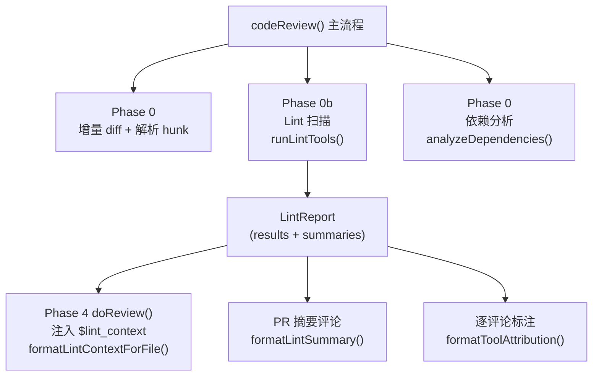
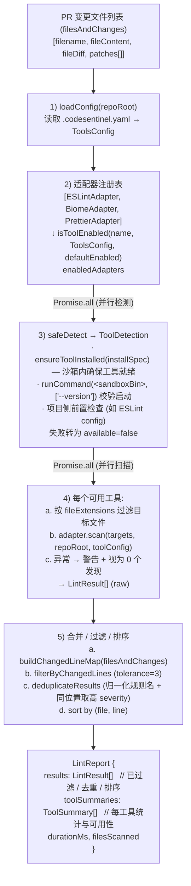
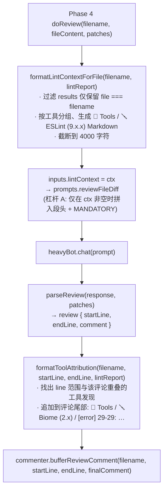

# 迭代三：Linter/SAST 工具集成 — 技术实现文档

> **对应产品计划**: `codesentinel-docs/docs/product-plan/05-iteration-linter-sast.md`
>
> **实现位置**: `ai-reviewer/src/lint/`
>
> **交付范围**: Phase 1（JavaScript / TypeScript）+ 可扩展工具集成框架

---

## 1. 设计目标回顾

让 AI 审查结果与静态分析工具结果**交叉验证**：工具命中的问题由 AI 解释业务影响；
工具盲区由 AI 补充逻辑/架构问题；最终评论中标注交叉验证状态。

要点：

- **可扩展**：新增语言工具仅需实现 `ToolAdapter` 接口（含声明式 `installSpec`）
- **失败容忍**：单个工具不可用/超时/抛异常都不阻塞整体审查
- **变更行聚焦**：扫描整个文件，但只保留变更行 ± N 行内的发现
- **零额外依赖**：不引入新的 npm 包（YAML 解析复用 `js-yaml`）
- **🆕 项目侧零负担**：ai-reviewer 自带工具，待审查项目**不需要把 lint 工具写入 `package.json`**

---

## 2. 模块结构

```mermaid
flowchart TB
  subgraph Shared["src/changed-lines.ts (共享 diff 扫描器)"]
    cl["scanPatch / buildPatchScans<br/>一次 walk 产出 addedLines + touchedLines"]
  end

  subgraph Lint["src/lint/  (Linter/SAST 集成模块)"]
    direction TB

    idx["index.ts<br/>对外公开 API"]

    subgraph Core["核心模块"]
      direction LR
      types["types.ts<br/>LintResult / ToolAdapter / ToolConfig<br/>InstallSpec (npm / binary)"]
      ld["language-detector.ts<br/>扩展名 → 语言"]
      df["diff-filter.ts<br/>过滤 + 跨工具去重"]
      cfg["config.ts<br/>.codesentinel.yaml 解析"]
      orch["orchestrator.ts<br/>检测 → 选择 → 并行扫描 → 聚合"]
      fmt["formatter.ts<br/>Prompt 注入 / PR 摘要表 / 评论标注"]
      installer["tool-installer.ts<br/>多策略安装 dispatcher<br/>(npm / binary[Phase 2+])"]
    end

    subgraph Adapters["adapters/  (工具适配器)"]
      direction LR
      exec["exec.ts<br/>execFile + JSON 解析 + 版本提取"]
      es["eslint.ts<br/>installSpec=npm/eslint"]
      bi["biome.ts<br/>installSpec=npm/@biomejs/biome"]
      pr["prettier.ts<br/>installSpec=npm/prettier"]
    end
  end

  subgraph Dep["src/dependency-analyzer.ts"]
    da["analyzeDependencies / findEnclosingExports"]
  end

  idx --> Core
  idx --> Adapters
  orch --> df
  orch --> cfg
  orch --> Adapters
  Core -. 类型契约 .-> types
  es -. 共享 .-> exec
  bi -. 共享 .-> exec
  pr -. 共享 .-> exec
  es -. installSpec .-> installer
  bi -. installSpec .-> installer
  pr -. installSpec .-> installer
  orch -. 用 addedLines .-> cl
  da -. 用 touchedLines .-> cl
```



集成点：

- `src/review.ts` 在 Phase 0/0b **之前** 通过 `buildPatchScans(filesAndChanges)` 一次性扫描每个 file 的 unified diff，得到 `PatchScanMap`
- 把同一份 `PatchScanMap` 同时传入 `runLintTools(...)` 和 `analyzeDependencies(...)`
- lint 用 `addedLines`（仅 `+` 行，删除行不存在于新文件无 finding 可言）
- 依赖分析用 `touchedLines`（`+` 与 `-` 都标，"作用域内被改"也包括纯删除）
- 同一份 diff 字符串只 walk 一次，三处冗余扫描收敛为一处

---

## 3. 工作流总览



### 3.1 详细数据流



### 3.2 评论生成阶段



### 3.3 PR 摘要评论中的工具统计表

`review.ts` 在最终摘要评论里追加：

```
formatLintSummary(lintReport) →
<details>
<summary>🧰 Static Analysis Summary (3 tools)</summary>

_5 findings on changed lines._

| Tool | Errors | Warnings | Files Scanned | Duration |
|:-----|:------:|:--------:|:-------------:|:---------|
| ESLint 9.15.0 | 2 | 3 | 5 | 1234ms |
| Biome 2.3.13 | 1 | 0 | 5 | 432ms |
| Prettier _unavailable_ | _unavailable_ | 0 | command not found |

</details>
```

---

## 4. 核心类型契约

### 4.1 LintResult

所有适配器输出的统一结构。详见 [src/lint/types.ts](../src/lint/types.ts)。

```typescript
interface LintResult {
  tool: string                    // "ESLint" / "Biome" / "Prettier"
  toolVersion: string             // "9.15.0"
  file: string                    // 相对仓库根
  line: number; column: number    // 1-based
  endLine?: number; endColumn?: number
  severity: 'error' | 'warning' | 'info'
  ruleId: string                  // "no-unused-vars"
  message: string
  suggestion?: string
  fixable: boolean
  category?: 'quality' | 'security' | 'style' | 'performance'
}
```

### 4.2 ToolAdapter

```typescript
interface ToolAdapter {
  readonly name: string                    // 配置 key（小写）
  readonly displayName: string             // 用于评论展示
  readonly supportedLanguages: string[]
  readonly fileExtensions: string[]        // 含点号
  readonly defaultEnabled: boolean         // 用户未配置时的默认值

  detect(): Promise<ToolDetection>
  scan(files, repoRoot, config): Promise<LintResult[]>
}
```

适配器只负责"调用工具 + 解析"。所有过滤/合并/去重/格式化由 orchestrator 与 formatter 处理。

---

## 5. 适配器实现要点

每个适配器**声明**一个 `installSpec`，由 `tool-installer.ts` 把工具装到沙箱目录
（`/tmp/ai-reviewer-lint-tools/`）。`detect()` 和 `scan()` 都用沙箱里的绝对路径调用，
**不再用 `npx --no-install`**，因此**待审查项目的 `node_modules` 不必有这些工具**。

| 适配器 | InstallSpec | CLI 调用 | 输出解析 | 默认启用 |
|:-------|:-----------|:---------|:---------|:---------|
| ESLint | `{ kind: 'npm', package: 'eslint', binName: 'eslint', version: '^9.15.0' }` | `<bundled-bin> --format json --no-error-on-unmatched-pattern <files>` | JSON 数组，每元素 `{filePath, messages[]}` | ✅ |
| Biome  | `{ kind: 'npm', package: '@biomejs/biome', binName: 'biome', version: '^2.3.0' }` | `<bundled-bin> check --reporter=json <files>` | `{diagnostics: [{category, severity, location.line_start, …}]}` | ✅ |
| Prettier | `{ kind: 'npm', package: 'prettier', binName: 'prettier', version: '^3.0.0' }` | `<bundled-bin> --check --no-error-on-unmatched-pattern <files>` | stderr 中按行匹配 `[warn] <file>` | ❌（默认关闭） |

通用约定：

- `detect(repoRoot)`：先调用 `ensureToolInstalled(this.installSpec)` 拿到沙箱内的二进制路径，再跑 `<bin> --version` 确认可启动；按需检查项目侧前置文件（如 ESLint 配置）
- `scan()` 直接调用 `<resolvedBinPath>`，不再走 `npx`
- 任何执行错误都通过 stdout/exitCode 体现，不抛异常
- 退出码 ≠ 0 不视为失败（lint 工具按惯例发现问题就返回非零）

ESLint 适配器额外检查（**改进 A**）：ESLint 9 Flat Config 不再内置默认规则，
`detect()` 在确认二进制可用后会扫描 `repoRoot` 下的：

- `eslint.config.{js,mjs,cjs,ts,mts,cts}` （Flat Config 系列）
- `.eslintrc.{js,cjs,yaml,yml,json}` 与 `.eslintrc` （Legacy）
- `package.json` 中的 `eslintConfig` 字段

任一命中即可。**全部缺失时返回 `available: false`**，原因写入 `reason` 字段，
用户能在 PR 摘要的统计表中直接看到 `_unavailable_ — no ESLint config found in repo …`，
而不是面对一堆"扫描了 N 个文件，0 finding"的迷惑结果。

---

## 5b. 多策略工具安装（[tool-installer.ts](../src/lint/tool-installer.ts)）

每个适配器在自身字段上**声明式**地写出"我用什么策略安装"，由
`ensureToolInstalled(spec)` 统一执行：

```typescript
type InstallSpec = NpmInstallSpec | BinaryInstallSpec

interface NpmInstallSpec {
  kind: 'npm'
  package: string         // 'eslint' / '@biomejs/biome'
  binName: string         // 'eslint' / 'biome'
  version: string         // '^9.15.0'
}

interface BinaryInstallSpec {       // Phase 2+ 占位（golangci-lint / ruff / semgrep）
  kind: 'binary'
  urlPattern: string                // 含 {version}/{os}/{arch} 占位
  version: string
  binPathInArchive: string
  sha256?: Record<string, string>
}
```

### npm 策略落地（Phase 1）

1. 沙箱目录：`os.tmpdir() + '/ai-reviewer-lint-tools'`
2. 首次调用：在该目录写一个最小 `package.json`，跑 `npm install --no-save --legacy-peer-deps --no-audit --no-fund <pkg>@<version>`
3. 缓存命中：检查 `node_modules/.bin/<binName>` 是否存在 → 直接返回 binPath（同 runner job 内的多个 adapter 不重复装）
4. 失败诊断：把 `exit` 码、`stderr` 首行带回 `InstallResult.reason`，写入 ToolSummary，PR 摘要表里直接可见

### binary 策略（占位接口）

`installViaBinary` 当前直接返回 `{ ok: false, reason: 'not yet implemented (planned for Phase 2+)' }`。Phase 2 实现 golangci-lint 适配器时，新增：

- 按 `os.platform()` / `os.arch()` 渲染 URL
- 用 Node 内建 `https` 下载 + sha256 校验
- 解压 `tar.gz`/`zip` 到沙箱
- 标记 binPath 可执行权限

新增工具仅需在自己的 `installSpec` 里声明 URL 模板，**无需触动 Phase 1 的三个适配器**。

### 项目侧零负担的边界条件

| 工具 | 待审查项目还需要什么 |
|:----|:-----------------|
| **Biome** | **完全不需要**（零配置）。无 `biome.json` 时用内置 `recommended` 规则集 |
| **Prettier** | **完全不需要**（自带默认规则） |
| **ESLint** | 需要一份 `eslint.config.js` 或 `.eslintrc.*`（ESLint 9 Flat Config 不内置规则集是 ESLint 自身的设计）。**插件需在项目自己的 `node_modules` 中**：当沙箱内的 ESLint 加载项目的 config 文件时，Node 模块解析机制会从 config 文件所在目录向上寻找 `node_modules` —— 所以项目自带的 plugin 仍可被解析 |

### 缓存与冷启动

- 同一 runner job 内：第二个适配器命中缓存即时返回
- 跨 job：默认无持久化（每次 ~15s 冷启动）。用户可在 workflow 加 `actions/cache` 把 `/tmp/ai-reviewer-lint-tools/` 持久化以省时间

---

## 6. 用户配置

`.codesentinel.yaml`（仓库根目录）：

```yaml
tools:
  eslint:
    enabled: true
    useProjectConfig: true     # 默认 true，使用项目自带 .eslintrc / eslint.config.js
  biome:
    enabled: true
  prettier:
    enabled: false             # 与 ESLint 重叠时常关闭
  golangci-lint:               # Phase 2 预留
    enabled: true
  ruff:                        # Phase 3 预留
    enabled: true
    select: ["E", "F", "W", "I", "S"]
  semgrep:                     # Phase 4 预留
    enabled: false
```

加载策略（[src/lint/config.ts](../src/lint/config.ts)）：

- 仓库根缺少配置文件 → 全部使用适配器默认值
- YAML 解析失败 → 警告 + 回退默认值
- 单个工具 `enabled` 字段缺失 → 使用适配器 `defaultEnabled`

GitHub Action 输入 `enable_lint_tools`（默认 `true`）是总开关，关闭后整个 Phase 0b 跳过。

---

## 7. 与 review.ts 的集成

[src/review.ts](../src/review.ts) 中新增：

1. **Phase 0b**（依赖分析之前）：
   ```typescript
   if (options.enableLintTools) {
     lintReport = await runLintTools({
       repoRoot: process.cwd(),
       filesAndChanges,
       disabled: false
     })
   }
   ```

2. **Phase 4 `doReview` 内**：
   ```typescript
   if (lintReport != null) {
     const ctx = formatLintContextForFile(filename, lintReport)
     if (ctx.length > 0) ins.lintContext = ctx
   }
   ```

3. **每条评论尾部**：
   ```typescript
   const toolAttribution = formatToolAttribution(
     filename, review.startLine, review.endLine, lintReport
   )
   if (toolAttribution.length > 0) {
     commentWithChain = `${commentWithChain}\n${toolAttribution}`
   }
   ```

4. **最终 PR 摘要评论**：
   ```typescript
   summarizeComment += formatLintSummary(lintReport)
   ```

5. **`Inputs.render()`**：当 `lintContext` 非空时把 `$lint_context` 占位符替换为本次 lint 结果。
   注：杠杆 A 启用后，`reviewFileDiff` 模板在无 finding 时不再含 `$lint_context` 占位符，
   保留兜底替换仅为防御未来其他 prompt 直接消费 `$lint_context`。

6. **Prompt 模板（条件注入，杠杆 A）**：
   - `reviewFileDiff` 中以 `$lint_section` / `$lint_mandatory_instruction` 两个占位符承载
     "静态分析工具结果"段头和 MANDATORY 指令。
   - `Prompts.renderReviewFileDiff` 在渲染前根据 `inputs.lintContext` 是否为空决定填入：
     - **非空**：填入 `lintSection`（段头 + `$lint_context`）+ `lintMandatoryInstruction`
       （4 条 MANDATORY 规则）
     - **空**：两个占位符替换为空串，最终 prompt 完全不含 lint 相关字样
   - 这样在文件无 finding 时节省 ~300 token / 文件，对 5 文件 PR 约节省 1.5 K token。
   - MANDATORY 指令本体未变化，要求 AI：
     - 对每条变更行上的工具发现写一条评论，命名工具并解释业务影响
     - 不同意工具发现时，标注为 false positive 并给出理由
     - 同时仍需指出工具盲区中的逻辑/架构问题

---

## 8. 性能与失败容忍

| 维度 | 措施 |
|:-----|:-----|
| 总耗时 | orchestrator 内 `Promise.all` 并行执行所有可用工具 |
| 单工具超时 | `runCommand` 默认 60 秒（可在适配器内传入 `timeoutMs`） |
| 单工具失败 | 检测失败 → `available=false` 记入 ToolSummary；scan 抛异常 → 警告 + 0 发现 |
| Token 预算 | `formatLintContextForFile` 截断到 4000 字符；**杠杆 A** 在无 finding 文件中完全跳过段头与 MANDATORY 指令注入（节省 ~300 token / 文件） |
| 缓冲区 | `runCommand` 单次 stdout 上限 64 MB，避免极端大输出 OOM |

---

## 9. 测试

| 测试文件 | 覆盖范围 |
|:---------|:---------|
| [`__tests__/lint-diff-filter.test.ts`](../__tests__/lint-diff-filter.test.ts) | unified diff 行号提取、变更行窗口过滤、跨工具去重（含规则名归一化） |
| [`__tests__/lint-orchestrator.test.ts`](../__tests__/lint-orchestrator.test.ts) | 启用/禁用、不可用工具的 ToolSummary、scan 抛异常的容忍、`disabled=true` 短路 |
| [`__tests__/lint-prompt-injection.test.ts`](../__tests__/lint-prompt-injection.test.ts) | 杠杆 A 条件注入：lintContext 空/非空两条路径在最终 prompt 中的体现；token 节省下界 |
| [`__tests__/lint-eslint-config-detection.test.ts`](../__tests__/lint-eslint-config-detection.test.ts) | 改进 A：项目缺少 ESLint 配置时 `detect()` 返回 available=false；覆盖 Flat Config / Legacy / package.json#eslintConfig / 损坏 package.json 等 7 种情形 |
| [`__tests__/changed-lines.test.ts`](../__tests__/changed-lines.test.ts) | 集中 diff 扫描：`scanPatch` 单次 walk 产出 added/touched 两份集合；`buildPatchScans`/`toAddedLineMap`；纯删除 hunk / 多 hunk / 边界字符（"\\ No newline …"）等 8 种情形 |
| [`__tests__/lint-tool-installer.test.ts`](../__tests__/lint-tool-installer.test.ts) | 多策略 dispatcher：npm 策略首次安装 / 缓存命中 / 沙箱目录初始化 / `npm install` 失败诊断 / `npm` 不存在 / 安装但 bin 缺失；binary 策略占位返回 7 种情形 |

执行：`npm test`（合并后总计 220 个用例全部通过）。

---

## 10. 后续扩展（Phase 2 - 5）

新增一种语言的工具支持时：

1. 在 `src/lint/adapters/` 中新增适配器实现 `ToolAdapter`
2. **声明 `installSpec`**（npm / binary / 未来的 pip / jar）；多策略 dispatcher 自动处理获取
3. 在 `orchestrator.ts` 的 `defaultAdapters()` 中注册
4. 在 `language-detector.ts` 的 `EXTENSION_TO_LANGUAGE` 中扩展（如已存在可跳过）
5. **若用 binary 策略**，在 `tool-installer.ts::installViaBinary` 中实现首个 binary 工具的下载/解压/校验逻辑（一次性投入，后续 binary 适配器复用）

无需改动 review.ts、prompts.ts、formatter.ts、diff-filter.ts。**也不再需要 Docker 镜像预装**（项目侧零负担承诺也对未来语言生效）。

| 阶段 | 工具 | InstallSpec 类型 | 备注 |
|:-----|:-----|:----------------|:-----|
| Phase 2 | golangci-lint | `binary` | GitHub Releases 有预编译 tar.gz；零运行时依赖 |
| Phase 3 | Ruff | `binary` | Rust 编译，预编译多平台 |
| Phase 3 | Bandit / Pylint | （后续考虑 pip 策略） | 需要 Python 运行时（runner 自带） |
| Phase 4 | Semgrep | `binary`（也支持 pip） | 多种发布形态 |
| Phase 5 | RuboCop / PMD / Checkstyle | （后续考虑 gem / jar 策略） | 需对应语言运行时 |

> Phase 2/3/4 的主流工具大多有预编译二进制，所以 `binary` 策略落地后即可覆盖大部分扩展需求，**不引入新的运行时依赖**。

---

## 11. 验收对应

| 文档要求 | 实现位置 |
|:---------|:---------|
| 框架可扩展 | `ToolAdapter` 接口 + `orchestrator` 注册表 |
| ESLint / Biome / Prettier 集成 | `src/lint/adapters/*.ts` |
| 变更行过滤 | `diff-filter.ts::filterByChangedLines` |
| 结果注入 LLM Prompt | `Inputs.lintContext` + `$lint_context` 占位符 |
| AI 交叉验证 | `formatToolAttribution` + Prompt 中的 MANDATORY 指令 |
| `.codesentinel.yaml` 配置化 | `config.ts::loadConfig` |
| 性能 ≤ 3 分钟 | 并行执行 + 单工具 60s 默认超时 |
| 错误容忍 | `safeDetect` + scan try/catch + `available=false` 上报 |
| ESLint 项目无配置时优雅降级 | `EslintAdapter.detect()` 检测到 `eslint.config.*` / `.eslintrc.*` / `package.json#eslintConfig` 缺失时返回 `available=false`（改进 A） |
| diff 扫描去冗余 | `src/changed-lines.ts::scanPatch` 单次 walk 产出 `addedLines` + `touchedLines`；`review.ts` 通过 `buildPatchScans` 预扫描后传给 `runLintTools` 与 `analyzeDependencies`，三处冗余收敛为一处 |
| **项目侧零负担**（多策略安装） | `tool-installer.ts` 用 npm 策略把工具装到 `/tmp/ai-reviewer-lint-tools/`；待审查项目无需把 lint 工具写入 `package.json`；workflow 也无需 `npm install` 步骤 |
