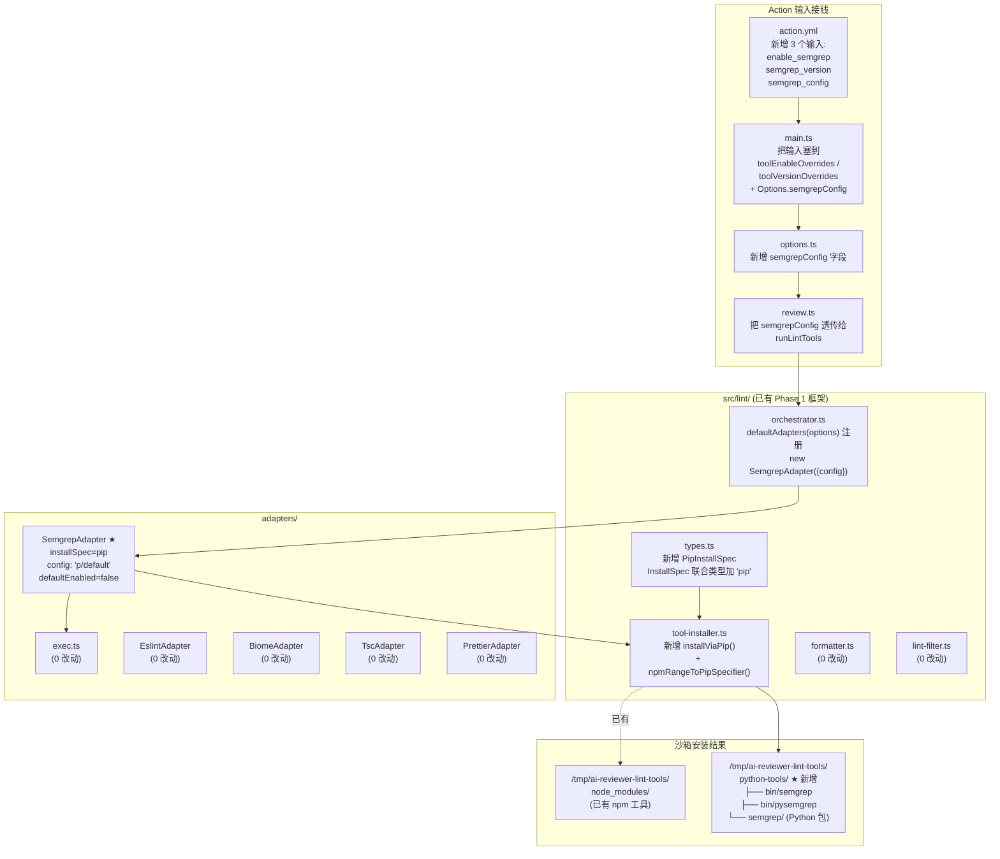
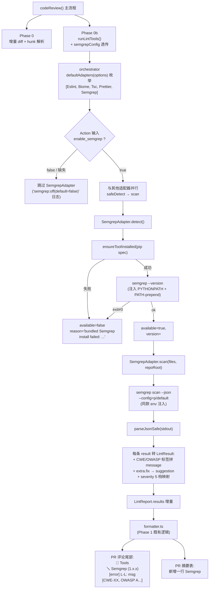
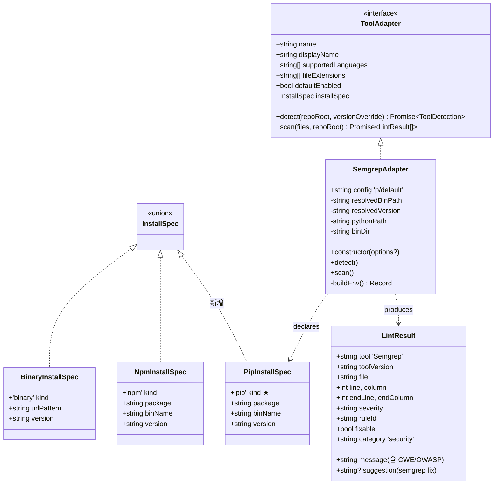
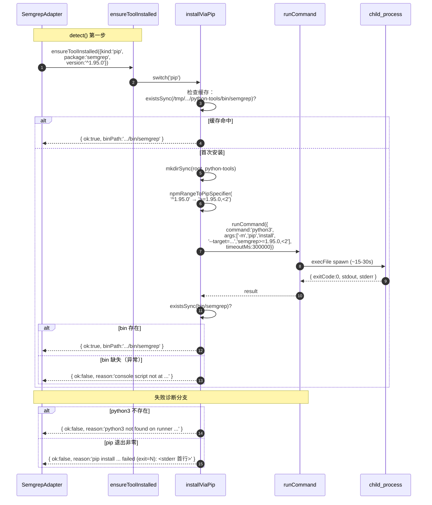
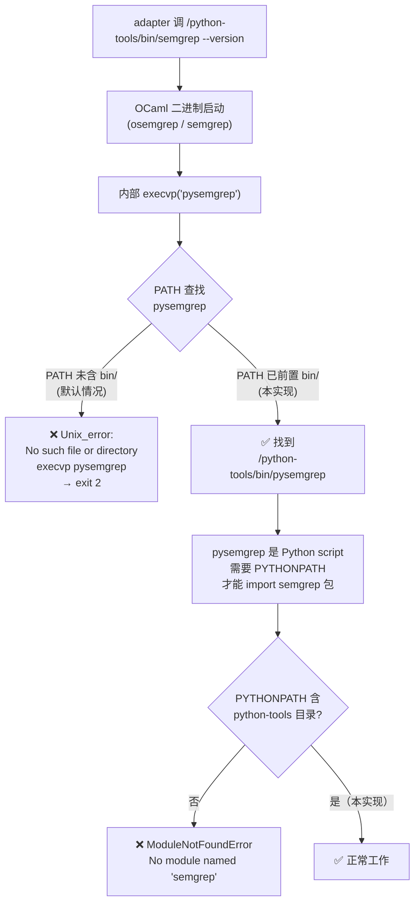
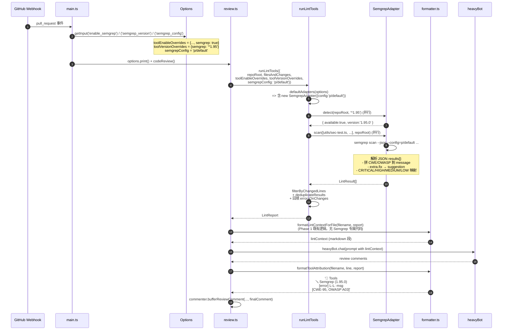

# 迭代三 · Phase 4：Semgrep SAST 集成 — 技术实现文档

> **对应产品计划**: `codesentinel-docs/docs/product-plan/05-iteration-linter-sast.md` §1.2 Phase 4
>
> **依赖**: 迭代三 Phase 1 工具集成框架（参见 [06-iteration-linter-sast-design.md](./06-iteration-linter-sast-design.md) /
> [07-linter-sast-architecture.md](./07-linter-sast-architecture.md)）
>
> **实现位置**: `ai-reviewer/src/lint/adapters/semgrep.ts` + `ai-reviewer/src/lint/tool-installer.ts::installViaPip()`
>
> **交付范围**：跨语言通用安全扫描（OWASP-Top-10 / CWE 模式匹配），与 ESLint / Biome / tsc 互补

---

## 1. 设计目标

让 ai-reviewer 在 lint 阶段额外跑一遍 Semgrep SAST，把"机械可判定的安全模式"
（命令注入、eval、硬编码密钥、不安全反序列化…）抓出来，与 AI 评审形成"模式
匹配 + 上下文推理"的双重验证。

| 优先级 | 目标 | 度量 |
|:------|:----|:----|
| 1 | **复用 Phase 1 框架**，不破坏任何契约 | 仅新增文件 + 1 行注册；`ToolAdapter` / `LintResult` / `formatter.ts` / `review.ts` / `prompts.ts` 0 改动 |
| 2 | **项目侧零负担**（与 Phase 1 同款承诺） | 待审查项目不需要装 semgrep；不需要 `requirements.txt`；不需要在 workflow 写 `pip install` |
| 3 | **失败容忍** | pip 装包失败 / 规则集拉不下来 / 子进程异常 → SemgrepAdapter 标 `_unavailable_` 但不影响 AI 评审 |
| 4 | **opt-in 而非默认开启** | `enable_semgrep` 默认 `false`，避免给所有用户增加 +15-30s 冷启动 |
| 5 | **LLM 友好的 finding** | CWE / OWASP 标签拼到 message；`suggestion` 字段透传 semgrep 自带修复 |

---

## 2. 关键设计决策

### 2.1 安装策略：pip（非 binary、非 docker）

| 备选 | 否决原因 |
|:----|:--------|
| **binary（GitHub Releases 下载）** | semgrep 不发布真正的"单文件预编译二进制"。GitHub Releases 上的"semgrep-core"只是 OCaml 引擎的一半，**必须配合 Python 后端 `pysemgrep` 才能用**。所以"下载预编译二进制"在 semgrep 这是个伪选项 |
| **docker（`returntocorp/semgrep` 镜像）** | (a) 首次 `docker pull` ~200 MB，比 pip 安装慢；(b) 自托管 runner 必须装 Docker，违反"零额外环境依赖"；(c) 与 Phase 1 的"沙箱内 npm 装包"模式异构，infra 难维护 |
| **pip install --user** | `~/.local/` 跨 job 不可控；`actions/cache` 也难按子目录单独缓存 |
| **✅ pip install --target=<沙箱>** | 与 Phase 1 npm 策略**对称**：装到沙箱 `/tmp/ai-reviewer-lint-tools/python-tools/`，console script 落在 `bin/` 下，缓存策略同款 |

新增的 `PipInstallSpec` 类型加入 `InstallSpec` 联合类型，由
`tool-installer.ts::ensureToolInstalled` 在 dispatcher 里统一处理 ——
**对其他适配器透明**。

### 2.2 默认规则集 = `p/default`

| 备选 | 否决原因 |
|:----|:--------|
| 自己维护一份 yaml | 不可持续；semgrep 社区已经做了这件事 |
| `--config=auto`（按 PR 语言自动选） | 每次扫描都要联网，且规则随上游变动 → 测试不稳定 |
| `p/security-audit`（更激进的规则包） | 误报率显著高于 `p/default`；不适合默认值 |
| **✅ `p/default`** | OWASP-Top-10 覆盖；首次联网拉规则后本地缓存；用户可经 `semgrep_config` 输入覆盖 |

> ⚠️ 早期注释错误地写"`p/default` 离线可用"。修正：**首次运行需联网拉取**，
> 后续命中 `~/.semgrep/` 缓存即离线可用。

### 2.3 `enable_semgrep` 默认 `false`

与 Prettier 同款保守。理由：

- **冷启动 +15-30s**：pip 装包 + 首次拉规则；对每个 PR review 都是非平凡的 latency 增量
- **SAST 信噪比**：安全规则的误报率天然高于 lint；不是所有项目都需要
- **opt-in 模式更尊重用户**：用户写一行 `enable_semgrep: true` 就开启，比"默认开启 + 大家想关再去查文档"心智成本低

### 2.4 复用还是新增 InstallSpec？

复用现有 `BinaryInstallSpec` 不行（前面 §2.1 说明）。所以新增 `PipInstallSpec`：

```typescript
export interface PipInstallSpec {
  readonly kind: 'pip'
  readonly package: string   // 'semgrep'
  readonly binName: string   // 'semgrep'（pip 生成的 console script 名）
  readonly version: string   // '^1.95.0' 等 npm-range 语法，installer 内部转 pip
}
```

`version` 字段刻意接受 npm 风格 caret/tilde range（`^1.95.0` / `~1.95.0`），
因为 ai-reviewer 现有 4 个适配器都用 npm 风格，**统一**比"pip 专用语法"更可
读。`installViaPip` 内部用 `npmRangeToPipSpecifier()` 转换：

```
^1.95.0  →  >=1.95.0,<2
~1.95.0  →  >=1.95.0,<1.96
1.95.0   →  ==1.95.0
>=1.95   →  >=1.95   （已是 pip 语法，原样透传）
```

---

## 3. 模块结构



**总结**：本期新增 = **1 个适配器文件 + 1 个 install 策略**；其余全是配置接线。
Phase 1 的契约（`ToolAdapter` 接口、`LintResult` 字段、formatter / prompt / review.ts）
**零改动**。

---

## 4. 工作流总览



---

## 5. 关键类型契约



---

## 6. 安装策略详图（pip 落地）



---

## 7. 调用 semgrep 时的环境注入（关键技术点）

Semgrep 1.x+ 是"OCaml 二进制壳 + Python 后端"双层架构。`semgrep --version` /
`semgrep scan` 进入 OCaml 壳后，**内部 `execvp("pysemgrep")` 调起 Python
后端**。`pysemgrep` 也是 pip 装的 console script，与 `semgrep` 同在
`<sandbox>/python-tools/bin/`，但 **`execvp` 按 `PATH` 查找**：



`SemgrepAdapter.buildEnv()` 处理两个注入：

```typescript
{
  PYTHONPATH: '<sandbox>/python-tools' + sep + process.env.PYTHONPATH,  // 前置而非覆盖
  PATH:       '<sandbox>/python-tools/bin' + sep + process.env.PATH,    // 前置而非覆盖
  PYTHONDONTWRITEBYTECODE: '1',
  SEMGREP_SEND_METRICS: 'off'  // 关掉子进程意外触发的额外 execvp
}
```

> ⚠️ **PATH/PYTHONPATH 都是前置而非整体覆盖** —— 自托管 runner 的用户可能有
> 自定义 Python 环境（如 conda），保留原值避免破坏他们的设置。

---

## 8. 单次 PR 评审中的端到端数据流



---

## 9. 失败容错路径

```mermaid
flowchart TB
  PHASE["Phase 0b runLintTools"]
  PHASE --> CHECK{"enable_semgrep=true?"}
  CHECK -->|否| SKIP["不进入 SemgrepAdapter<br/>日志: 'semgrep:off(default=false)'"]
  CHECK -->|是| DETECT["SemgrepAdapter.detect()"]

  DETECT --> INST{"pip install ok?"}
  INST -->|否| F1["统计表: Semgrep _unavailable_<br/>reason: pip install ... failed (exit=N): ..."]
  INST -->|是| VER{"semgrep --version ok?"}

  VER -->|否（exit≠0）| F2["统计表: Semgrep _unavailable_<br/>reason: bundled semgrep --version failed: ..."]
  VER -->|否（execvp pysemgrep 失败）| F2A["统计表: Semgrep _unavailable_<br/>reason: ... 'Unix_error: No such<br/>file or directory execvp pysemgrep'<br/><br/>★ 已通过 PATH 前置修复，<br/>不应再出现"]
  VER -->|ok| SCAN["scan(files, repoRoot)"]

  SCAN --> EX{"runCommand 结果?"}
  EX -->|spawnError| F3["finding=[]，下次依然装<br/>(瞬态错误)"]
  EX -->|timedOut(>120s)| F4["finding=[]，warning 提示<br/>切换更小 config"]
  EX -->|JSON 解析失败| F5["finding=[]，warning 含<br/>stderr 首行 + 3 条排查建议"]
  EX -->|JSON ok 但 errors[].length>0| F6["finding 仍处理；warning<br/>报告 semgrep 级错误"]
  EX -->|JSON ok 且 results=0| F7["info 提示三条原因：<br/>(1)config 是否覆盖语言<br/>(2)防火墙挡 semgrep.dev<br/>(3)文件被静默跳过"]
  EX -->|JSON ok 且 results>0| OK["✅ 转换为 LintResult[]"]

  F1 --> CONTINUE["主流程继续<br/>(AI 评审不受影响)"]
  F2 --> CONTINUE
  F2A --> CONTINUE
  F3 --> CONTINUE
  F4 --> CONTINUE
  F5 --> CONTINUE
  F6 --> OK
  F7 --> OK
  OK --> CONTINUE
```

**关键原则**：**任何失败路径都不阻塞 AI 评审**。Semgrep 仅作为"额外信号源"，
不可用时统计表里清晰标 `_unavailable_` + reason，行为同 ESLint config 缺失场景。

---

## 10. LintResult 增强：CWE / OWASP 标签 + suggestion 透传

Semgrep `--json` 输出的 `extra` 字段含富文本元数据：

```json
{
  "check_id": "javascript.lang.security.audit.eval-detected",
  "extra": {
    "severity": "ERROR",
    "message": "Detected eval() use. This is a sink for code injection.",
    "metadata": {
      "cwe": ["CWE-95: Improper Neutralization of Directives..."],
      "owasp": ["A03:2021 - Injection"]
    },
    "fix": "JSON.parse(input)"
  }
}
```

适配器把它转换为 `LintResult`：

| Semgrep 字段 | LintResult 字段 | 处理 |
|:------------|:---------------|:----|
| `extra.severity` | `severity` | `CRITICAL`/`HIGH`/`ERROR` → `error`；`WARNING`/`MEDIUM` → `warning`；`INFO`/`LOW` → `info` |
| `extra.message` + `metadata.cwe` + `metadata.owasp` | `message` | `"<原 message>\n[CWE-95, OWASP A03:2021 - Injection]"` |
| `extra.fix` | `suggestion` + `fixable` | 文本透传到 suggestion；fixable = `fix != null` |
| `check_id` | `ruleId` | 原样 |
| `start.line` / `end.line` etc. | `line` / `endLine` etc. | 原样 |
| 路径 | `file` | 绝对路径归一化为相对 repoRoot |

**为什么把 CWE/OWASP 拼到 message 而不是新加字段？**

`LintResult` 是跨工具共用契约。ESLint / Biome / tsc 都没有这类语义信息，
为 Semgrep 单独加 `cwe[]`/`owasp[]` 字段会让所有适配器都得处理一个对它们
没意义的字段。把分类信息合并到 `message` 末尾让 LLM 仍能消费，且不污染其他
适配器的契约。

**评论输出形态**：

```
🧰 Tools
🪛 Semgrep (1.95.0)
[error] 16-16: Detected eval() use. This is a sink for code injection.
[CWE-95, OWASP A03:2021 - Injection]
(javascript.lang.security.audit.eval-detected)
```

LLM 在评论正文里会自然引用 `CWE-95` / `OWASP A03` 这类术语，给出更专业的解释。

---

## 11. 与 Action 输入的接线

```mermaid
flowchart LR
  YAML[".github/workflows/*.yml<br/>with:<br/>  enable_semgrep: true<br/>  semgrep_config: 'p/default'<br/>  semgrep_version: ''"]
  YAML --> ACT["action.yml<br/>3 个新输入声明 +<br/>默认值"]
  ACT --> M["main.ts<br/>getBooleanInput / getInput"]

  M --> OE["toolEnableOverrides:<br/>{..., semgrep: true}"]
  M --> OV["toolVersionOverrides:<br/>{semgrep: '...'}<br/>(仅显式非空时进入)"]
  M --> SC["Options.semgrepConfig<br/>= 'p/default' (默认) /<br/>用户填写值"]

  OE --> R["review.ts:<br/>runLintTools({<br/>toolEnableOverrides,<br/>toolVersionOverrides,<br/>semgrepConfig})"]
  OV --> R
  SC --> R

  R --> ORCH["orchestrator:<br/>defaultAdapters(options)<br/>→ new SemgrepAdapter({config: options.semgrepConfig})"]
  ORCH --> FILTER["filter: overrides[a.name] ?? a.defaultEnabled"]
  FILTER --> ENABLED{"semgrep enabled?"}
  ENABLED -->|true| RUN["adapter.detect/scan"]
  ENABLED -->|false (默认)| OFF["跳过该适配器"]
```

**Action 输入设计要点**：

| 输入 | 默认 | 设计意图 |
|:----|:----|:--------|
| `enable_semgrep` | `false` | 与 Prettier 同款 opt-in；冷启动开销 + 误报率，让用户主动选 |
| `semgrep_version` | `''` | 空 = 用 ai-reviewer pin 的版本（`^1.95.0`）；用户可填 `^2.0` / `==1.99.0` 等覆盖 |
| `semgrep_config` | `'p/default'` | OWASP-Top-10；用户可改 `auto` / `p/security-audit` / `p/owasp-top-ten` / 自定义路径 |

---

## 12. 复用现有"杠杆 A"条件注入

Semgrep 不需要任何 prompt 模板改动：

- 文件无 Semgrep finding（也无其他 lint finding）→ `lintContext` 为空 →
  `reviewFileDiff` 中 `$lint_section` / `$lint_mandatory_instruction` 都
  替换为空串，不浪费 token（杠杆 A）
- 文件有 Semgrep finding → 走与 ESLint/Biome 完全相同的注入路径，被 LLM 消费

`prompts.ts` 中的 MANDATORY 指令本就要求 LLM"命名工具并解释影响"，所以
Semgrep finding 自动得到正确的评论文本，无需新加 prompt 规则。

---

## 13. 测试覆盖

`__tests__/lint-semgrep-adapter.test.ts` — **30 个用例**：

| 类别 | 用例数 | 覆盖 |
|:----|:------|:----|
| 构造与默认值 | 6 | 默认 config / 构造参数覆盖 / undefined vs 空字符串 / defaultEnabled / installSpec.kind / fileExtensions |
| detect | 5 | 装包失败 / --version 失败 / 成功 / versionOverride 透传 / 空字符串透传默认 |
| scan 输出解析 | 19 | 空 results / 单条字段映射 / severity 三档 + CRITICAL/HIGH/MEDIUM/LOW / 缺失/未知 severity / fix 透传 suggestion / metadata.cwe + owasp 拼接 / cwe 单字符串兼容 / metadata 缺失 / 绝对路径归一化 / 非 JSON / spawnError / files 为空 short-circuit / config 透传 / PATH 前置 / PYTHONPATH 保留 / scan-before-detect 防御 |

`__tests__/lint-tool-installer.test.ts` — **新增 11 个用例**：

| 类别 | 用例数 | 覆盖 |
|:----|:------|:----|
| pip 策略 | 6 | 首次装包 + binPath 走 python-tools/bin/ / 缓存命中 / 沙箱目录自动创建 / pip exit≠0 + reason / python3 不存在 / 装上但 bin 缺失 |
| npmRangeToPipSpecifier | 5 | caret / tilde / 裸版本号 / 已是 pip 语法 / 空 |

合并后 ai-reviewer 全仓 **19 suites / 336 tests** 全过。

---

## 14. 已知限制

1. **首次运行需联网拉规则**：`p/default` 等 Registry 配置依赖 semgrep.dev；
   离线场景需预先 `semgrep --config=p/default --version` 缓存到 `~/.semgrep/`
   后通过 `actions/cache` 持久化
2. **Python 3.8+ 必需**：自托管 runner 若没 python3，会得到清晰错误信息
   （`python3 not found on runner: ...`），但不能自动降级到 `python`
3. **沙箱缓存不带版本号**：同 runner job 上如果中途变更 `semgrep_version`，
   缓存命中会用旧版本。实际场景几乎不存在（per-job 一次 review），可接受
4. **冷启动 +15-30s**：pip 装包 + 拉规则。用户可通过 `actions/cache` 把
   `/tmp/ai-reviewer-lint-tools/python-tools/` 跨 job 缓存
5. **不做"自定义规则"的项目侧加载**：Phase 4 仅支持通过 `semgrep_config`
   传 Registry 名 / URL；不扫描项目根的 `.semgrep.yml`。如未来需要，再扩展

---

## 15. 后续扩展（Phase 3）

本期落地的 **pip 策略基础设施**可直接被 Phase 3 复用：

| Phase 3 工具 | 复用方式 |
|:------------|:--------|
| **ruff** | 新增 `RuffAdapter`，`installSpec = { kind:'pip', package:'ruff', binName:'ruff' }`；ruff 是 Rust 编译的，没有 `pysemgrep` 这类二级 execvp 依赖，更简单 |
| **bandit** | 同款 pip 安装；Python SAST，仅扫 `.py` 文件 |
| **pylint** | 同款；只是规则更多 |

`installViaPip` + `npmRangeToPipSpecifier` 已经把"装包 / 缓存 / 失败诊断 /
版本转换"全部抽离出来，Phase 3 新增 3 个适配器各只需写 `detect()` + `scan()`
（解析各自工具的 JSON），无需碰 installer。

---

## 16. 验收对应

| 验收项 | 实现位置 |
|:------|:--------|
| Phase 4 Semgrep 集成 | `src/lint/adapters/semgrep.ts` 全部 |
| pip 安装策略 | `src/lint/types.ts::PipInstallSpec` + `tool-installer.ts::installViaPip` |
| OCaml + Python 双层架构兼容 | `SemgrepAdapter.buildEnv()` 注入 PYTHONPATH + PATH-prepend |
| 失败容忍 | safeDetect + scan try/catch + `available=false` 上报（全复用 Phase 1） |
| 项目侧零负担 | 用户 workflow 仅需 `enable_semgrep: true`；不需要 `pip install` 或 requirements.txt |
| 与 LLM 集成 | Phase 1 `formatLintContextForFile` / `formatToolAttribution` 自动接管（0 改动） |
| CWE / OWASP 标签 | `formatVulnTags()` 把 metadata 拼到 message 末尾 |
| 自动修复透传 | `extra.fix` → `LintResult.suggestion` |
| 测试覆盖 | 30 + 11 用例，336 个全仓用例全过 |

---

## 17. 文件清单（本期新增 + 修改）

### 新增

- `src/lint/adapters/semgrep.ts` — Semgrep 适配器
- `__tests__/lint-semgrep-adapter.test.ts` — 适配器单元测试
- `docs/06-iteration-semgrep-design.md` — 本文档

### 修改（加法）

- `src/lint/types.ts` — `PipInstallSpec` 加入 `InstallSpec` 联合
- `src/lint/tool-installer.ts` — `installViaPip()` + `npmRangeToPipSpecifier()`
- `src/lint/orchestrator.ts` — `defaultAdapters(options)` 注册 + `semgrepConfig` 字段
- `action.yml` — `enable_semgrep` / `semgrep_version` / `semgrep_config` 三个输入
- `src/main.ts` — 把 3 个新输入塞进 `toolEnableOverrides` / `toolVersionOverrides` / `semgrepConfig`
- `src/options.ts` — `semgrepConfig: string` 字段
- `src/review.ts` — 把 `options.semgrepConfig` 透传给 `runLintTools`
- `__tests__/lint-tool-installer.test.ts` — pip 策略测试 + 范围转换测试
