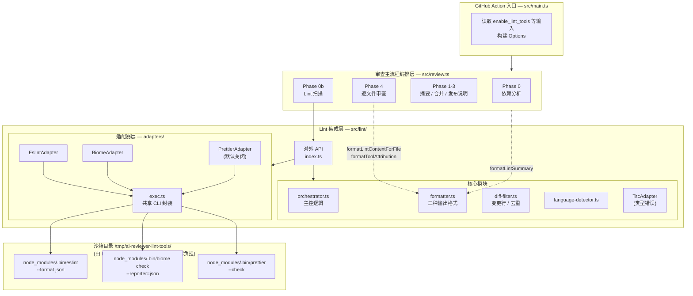
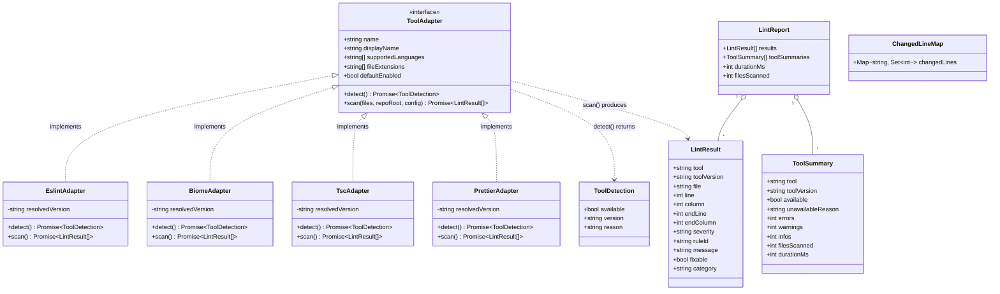
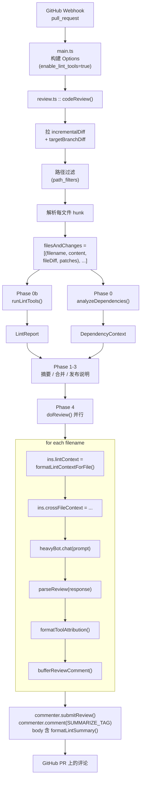
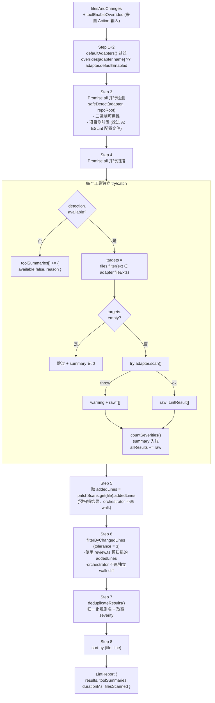
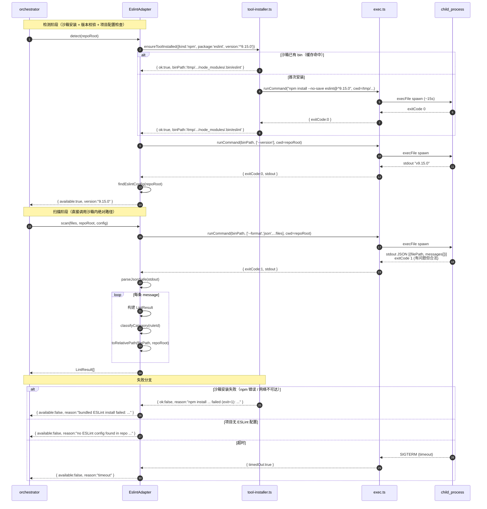
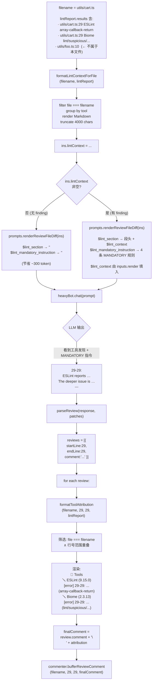
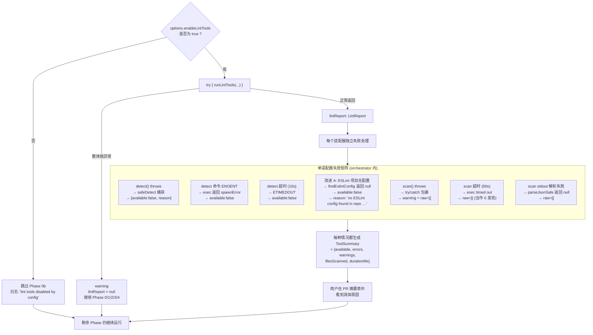
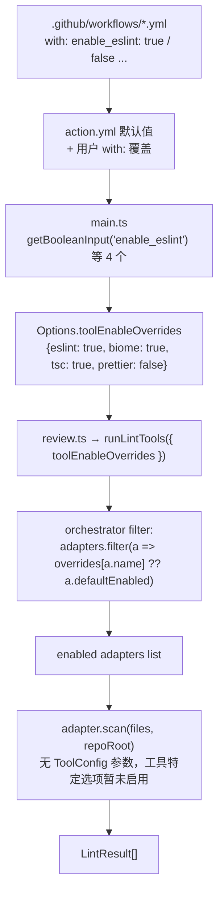
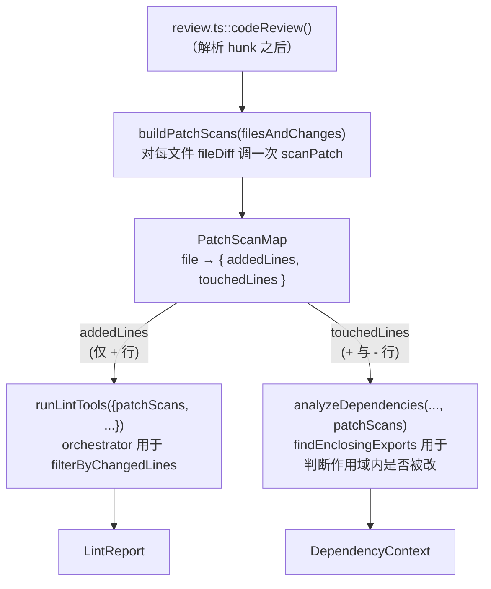

# 迭代三 Linter/SAST 集成 — 设计思路 / 架构 / 数据流

> 与 [06-iteration-linter-sast-design.md](./06-iteration-linter-sast-design.md) 互为补充：
> 06 偏 **实现细节与契约**，本文偏 **设计思路、架构视图、流程图**。
>
> 推荐阅读顺序：06 → 07（细节先于鸟瞰更易消化）。
>
> 本文中的图表使用 [Mermaid](https://mermaid.js.org/) 语法，可在 GitHub / mermaid.live
> 直接渲染。

---

## 第一部分 · 设计思路

### 1.1 问题背景

在迭代三之前，`ai-reviewer` 的代码审查完全依赖 LLM：

- LLM 擅长解释业务影响、捕捉跨文件逻辑问题
- 但 LLM **不可靠**于机械可判定的问题（拼写、类型、规则冲突），且每次推理都消耗 token
- 工具（ESLint / Biome / golangci-lint / Semgrep …）在这些机械问题上**确定性强、零成本**，且社区已积累了海量规则

**两者天然互补**。CodeRabbit 商业版的杀手锏正是 "AI + 40 + 工具" 的双重验证。本迭代要复刻这个能力，并搭好可扩展骨架。

### 1.2 设计目标（按优先级）

| # | 目标 | 度量 |
|:--|:-----|:-----|
| 1 | **可扩展骨架**优先于工具数量 | 新加一种语言工具 ≤ 1 个文件改动 |
| 2 | **失败容忍** | 单工具不可用 / 超时 / 解析失败都不阻塞审查 |
| 3 | **聚焦变更** | 仅保留 PR 变更行 ± N 行内的发现，不全文件刷屏 |
| 4 | **零新增 npm 依赖** | 复用 `js-yaml` / `child_process`，避免供应链负担 |
| 5 | **AI 与工具有机融合** | 工具结果注入 Prompt + 评论尾部标注 + 摘要统计表 |

### 1.3 关键决策与权衡

| 决策点 | 选择 | 备选 | 拒绝备选的原因 |
|:-------|:-----|:-----|:---------------|
| 工具调用方式 | 子进程 `execFile` 调 CLI | 通过 npm API 内嵌 | API 版本耦合、不同语言无统一接口、不便扩展到 Go/Python |
| **工具来源** | ai-reviewer **自带**（沙箱安装到 `/tmp`，多策略 dispatcher） | 要求待审查项目把 lint 工具写入 `package.json` | 项目侧零负担；不必为每个想接 ai-reviewer 的项目都开 PR 加 devDependencies |
| 工具发现 → AI 注入 | Prompt 中**条件**注入（杠杆 A） + 评论尾部标注 | 直接发布工具评论 / 总是注入 | 直接发评论会与 AI 评论错位，且 AI 无法交叉验证；总是注入则在无 finding 文件上浪费 ~300 token |
| 变更行过滤 | 在 orchestrator 里统一做 | 让每个适配器自己做 | 过滤逻辑应一次定义；适配器只关心解析 |
| diff 扫描位置 | 上提到 `src/changed-lines.ts`，`review.ts` 一次扫描全文件，按 `addedLines` / `touchedLines` 分发 | 各模块各扫一遍 | 历史上 review/dep-analyzer/diff-filter 三处都有 walker，是真实的 DRY 问题 |
| 跨工具去重 | 在 orchestrator 里做 | 不去重 | ESLint 与 Biome 大量规则重叠，不去重会出现"同一行两条几乎一样的评论" |
| ~~配置文件~~ **已废弃** | **全部走 GitHub Action 输入** | `.codesentinel.yaml` | 消费方零文件原则；workflow 的 `with:` 块比单独 YAML 更易发现；早期 `.codesentinel.yaml` 已删除 |
| 单工具失败处理 | 记入 ToolSummary，继续 | 整体失败 | "缺一个工具就不审查"对用户体验是灾难 |
| ESLint 项目配置缺失 | `detect()` 检测后标 `available=false`（改进 A） | 让 scan 静默返回 0 finding | ESLint 9 Flat Config 不内置规则；不检查会让用户面对"扫描了 N 文件，0 finding"，无从诊断 |
| Phase 1 范围 | JS/TS（ESLint+Biome+Prettier） | 一次铺开所有语言 | 先把骨架打牢；Phase 2-5 复用骨架 |

### 1.4 明确不做什么（反模式清单）

- ❌ 不实现 AST 级深度分析（交给工具自己）
- ❌ 不引入插件系统/动态加载（YAGNI；Phase 2-5 直接编辑 `defaultAdapters()`）
- ❌ 不做工具结果的"自动修复" patch 应用（迭代三只读不写）
- ❌ ~~不在适配器内做"工具自动安装"~~ → **已转为正向需求**：通过 `tool-installer.ts` 的多策略 dispatcher 在沙箱目录内自动安装，待审查项目侧零负担。Docker 镜像方案被取消，原因见 §1.3 决策表中"工具来源"行。
- ✅ ~~不为每个工具引入单独的 GitHub Action 输入~~ → **已转向**：消费方零文件原则下，每工具一个 `enable_<tool>` 输入是唯一可行的覆盖机制。`.codesentinel.yaml` 与 `src/lint/config.ts` 已删除。

---

## 第二部分 · 系统架构

### 2.1 分层架构图

### 2.2 组件职责矩阵（高内聚、低耦合）

| 组件 | 职责（做） | 不做 |
|:-----|:-----------|:-----|
| `types.ts` | 定义所有共享类型 | 任何运行逻辑 |
| `language-detector.ts` | 文件 → 语言枚举 | 工具选择（交给 orchestrator） |
| `diff-filter.ts` | 提取变更行 / 过滤 / 跨工具去重 | 调用工具、IO |
| `orchestrator.ts` | 编排：按 Action 输入选工具 → 跑工具 → 汇总 | 输出格式、Prompt 集成 |
| `formatter.ts` | 三种输出文本生成 | 任何 IO 或工具调用 |
| `adapters/exec.ts` | 子进程封装 + 解析辅助 | 知道任何具体工具 |
| `adapters/<tool>.ts` | 调单个 CLI + 解析输出 → LintResult | 过滤、去重、注入 Prompt |

### 2.3 核心类型契约关系

### 2.4 与既有系统的集成点

| 既有模块 | 改动 | 性质 |
|:---------|:-----|:-----|
| `src/review.ts` | 新增 Phase 0b 调 `runLintTools`；评论尾部追加 `🧰 Tools`；摘要尾部追加统计表 | 加法，无破坏 |
| `src/inputs.ts` | 新增字段 `lintContext`；`render()` 处理 `$lint_context` 占位符 | 加法，构造函数尾部参数 |
| `src/prompts.ts` | `reviewFileDiff` 模板中插入 `## Static analysis tool results` 区块 + MANDATORY 指令 | 加法 |
| `src/options.ts` | 新增 `enableLintTools` | 加法 |
| `src/main.ts` | 读取 `enable_lint_tools` 输入 | 加法 |
| `action.yml` | 新增同名输入，默认 `true` | 加法 |

> 🔑 **没有任何字段被删除/重命名**，因此对旧 workflow 完全向后兼容。

---

## 第三部分 · 数据流转

### 3.1 端到端主流程（从触发到 PR 评论）

### 3.2 Phase 0b 内部数据流（runLintTools 详图）

### 3.3 单工具适配器内部时序（以 ESLint 为例）

### 3.4 Phase 4 单文件审查的 lint 集成（含杠杆 A 条件注入）

> 💡 注意：`formatToolAttribution` 直接消费 `lintReport`，**不经过 LLM**，
> 因此即使在"无 finding 走 E1 路径"的文件上，依然能为有发现的其它文件保留
> 评论尾部的 `🧰 Tools` 卡片 — 杠杆 A 只省 prompt token，不省工具标注能力。

### 3.5 失败 / 容错路径

### 3.6 配置加载与生效时序（**Action 输入直传，无文件加载**）

> 早期此处描绘 `.codesentinel.yaml` → `loadConfig` → `ToolsConfig` 的多步加载/校验链。
> 当前版本完全移除该机制（`src/lint/config.ts` 已删除），所有开关都通过
> GitHub Action 输入直接传递。

> 💡 全链路只有 6 个节点 —— 没有 YAML 文件、没有 schema 校验、没有 fallback 树。
> 适配器若需要工具特定选项（如未来 Ruff 规则集），将通过新增 `_<tool>_xxx` 系列
> Action 输入扩展，仍保持消费方零配置文件原则。

### 3.7 单次 diff 扫描的复用拓扑

历史上 `review.ts` / `dependency-analyzer.ts` / `lint/diff-filter.ts` 各自实现了
几乎相同的 unified diff walker。重构后 `src/changed-lines.ts::scanPatch` 单次
walk 同时产出两份语义不同的集合，`review.ts` 在 Phase 0/0b 之前预扫描一次，
两个下游消费者按字段挑取所需。

> 💡 关键差异：lint 关心"新文件中有哪些行可被工具检查到"（仅 `+`），
> 依赖分析关心"导出函数作用域内有没有任何变更"（`+` 与 `-` 都算）。
> 单次 walk 产出两份集合，比两次 walk 各自产出更经济，也避免了语义漂移。

---

## 第四部分 · 设计回顾

### 4.1 满足的目标

| 目标 | 落地方式 | 证据 |
|:-----|:---------|:-----|
| 可扩展 | `ToolAdapter` 接口 + `defaultAdapters()` 注册表 + 多策略 `installSpec` | Phase 1 已落地 4 个适配器（ESLint/Biome/TypeScript/Prettier）；Phase 2 加 golangci-lint 仅需新增 1 个文件 + 声明 `installSpec.kind = 'binary'` |
| 失败容忍 | 三层 try/catch（safeDetect / scan / runLintTools 整体）+ 改进 A：ESLint 项目无配置时优雅降级 + 沙箱安装失败时优雅降级 | `lint-orchestrator.test.ts` 4 + `lint-eslint-config-detection.test.ts` 7 + `lint-tool-installer.test.ts` 7 |
| **项目侧零负担** | 多策略 `tool-installer.ts` 把 lint 工具装到 ai-reviewer 自管沙箱 `/tmp/ai-reviewer-lint-tools/`；待审查项目无需把工具写入 `package.json`，workflow 也无需 `npm install` 步骤 | `lint-tool-installer.test.ts` 覆盖 npm 策略与 binary 占位 |
| 聚焦变更 | `src/changed-lines.ts::scanPatch` 单次 walk → `review.ts` 预扫描 PatchScanMap → `runLintTools` 与 `analyzeDependencies` 共享 | `lint-diff-filter.test.ts`、`changed-lines.test.ts` 中 added/touched 双语义覆盖通过 |
| 零新增依赖 | 复用 `js-yaml` (require)、`child_process.execFile` | `package.json` 未改 |
| AI ↔ 工具有机融合 | Prompt **条件**注入（杠杆 A） + 评论标注 + 摘要表 三处协同 | `prompts.ts::renderReviewFileDiff` + `formatToolAttribution` + `lint-prompt-injection.test.ts` |

### 4.2 已知局限（留给下一迭代）

1. **Biome 输出位置字段**依赖 2.x 版本的 `line_start`/`column_start`；若 Biome 改版会需要适配
2. **Prettier 仅文件级问题**（行号统一为 1）；若需精确行号要切换到差异比较模式
3. **变更行容忍范围 N=3 写死**；后续可新增一个 `lint_changed_line_tolerance` Action 输入暴露
4. **不并发限制工具数量**；若未来工具数 > 10，需要引入 `pLimit`（与 `openaiConcurrencyLimit` 对齐）
5. **日志级别没有分级**（全部走 `info`/`warning`），后续若调试量大需要分模块日志开关

### 4.3 验收对应

详见 [06-iteration-linter-sast-design.md §11](./06-iteration-linter-sast-design.md) 与
[ai-reviewer-test/docs/07-iteration3-linter-sast-test-case.md §6](../../ai-reviewer-test/docs/07-iteration3-linter-sast-test-case.md)。
