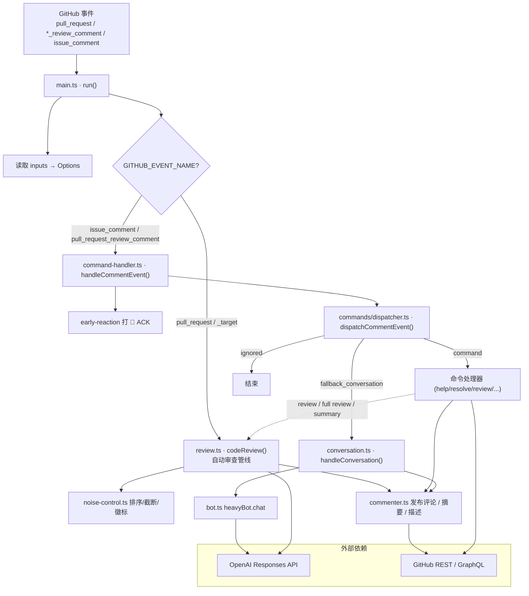
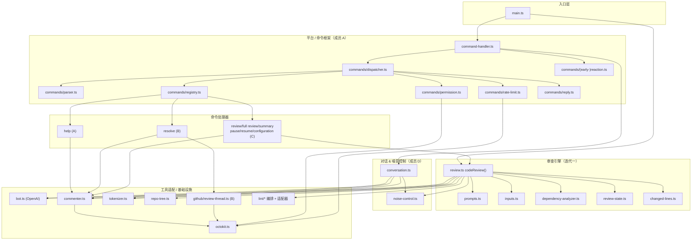
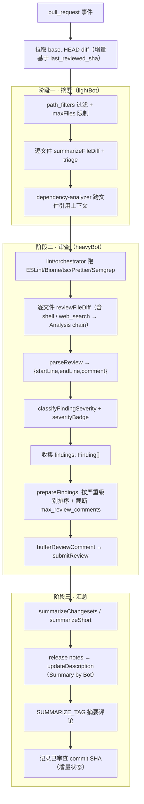
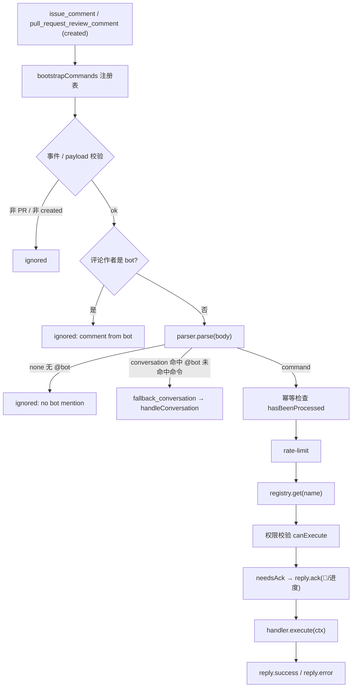
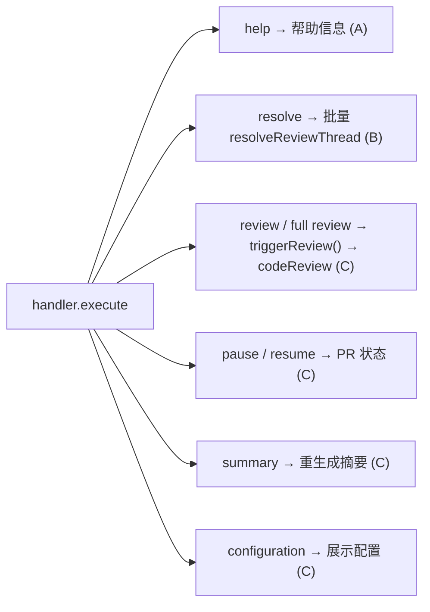
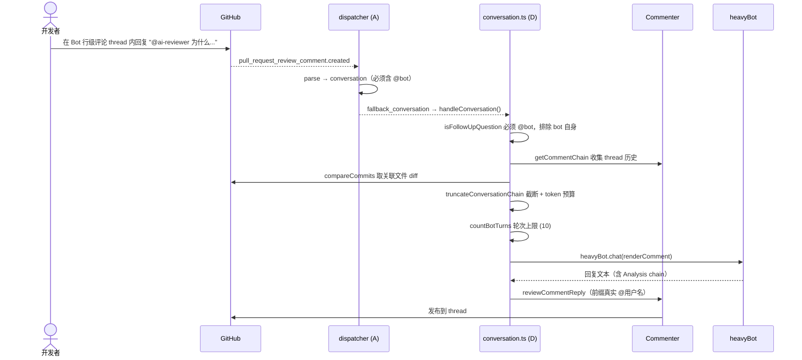
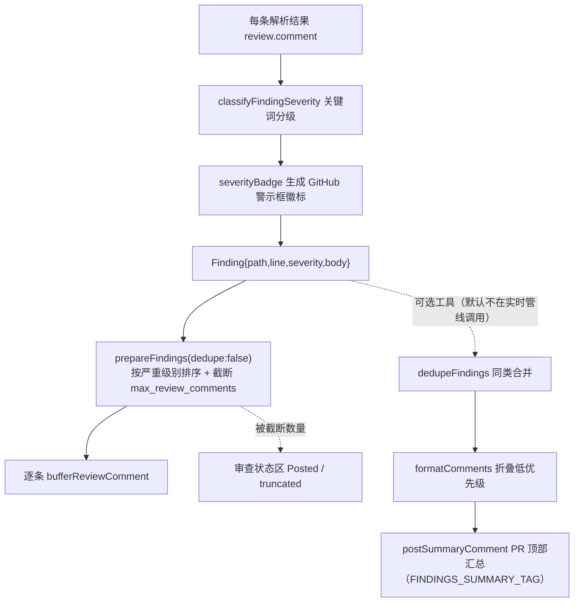
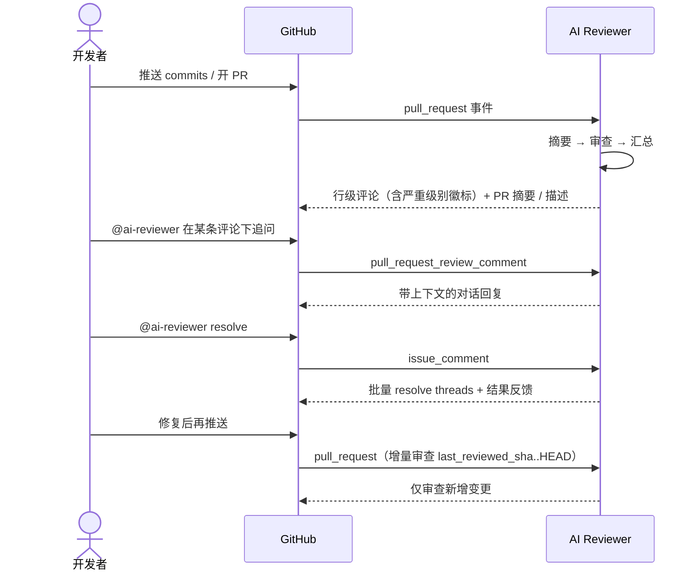

# AI Reviewer 系统架构与数据流

> 本文用 mermaid 图描述 **当前已合并功能**（迭代一智能分析管线 + 迭代二评论区交互）的整体架构、模块分层与各主要链路的数据流。
> 作为全局视图，细节实现见各成员设计文档（[A 命令框架](04-iteration-02-member-a-design.md) / [D 对话与噪音控制](04-iteration-02-member-d-design.md) 等）。

---

## 1. 系统总览

GitHub Action 启动后由 `main.ts` 按事件类型分流：**PR 事件**走自动审查管线，**评论事件**走命令调度。

---

## 2. 模块分层

---

## 3. 自动审查数据流（`codeReview`）

PR 事件触发，分三阶段：**摘要 → 逐文件审查 → 汇总**。

> 噪音控制（§6）已内嵌在阶段二：严重级别以 `severityBadge` 警示框置于每条行级评论顶部，发现按严重级别排序并截断到 `max_review_comments`（默认 20，`≤0` 不限制）。

---

## 4. 评论命令调度数据流（`dispatchCommentEvent`）

**命令路由：**

---

## 5. 对话式追问数据流（`handleConversation` · 成员 D）

---

## 6. 噪音控制数据流（`noise-control.ts` · 成员 D）

> 当前实时管线把严重级别**分散到每条行级评论**（徽标），不再单独发 PR 顶部汇总评论；`dedupeFindings` / `formatComments` / `postSummaryComment` 作为可选工具保留并有单测覆盖。

---

## 7. 端到端时序（开发者视角）

---

## 8. 关键支撑模块

| 模块 | 职责 |
| :--- | :--- |
| `bot.ts` | 封装 OpenAI Responses API；支持 web_search / 本地 shell（Analysis chain）与多轮上下文 |
| `commenter.ts` | PR 评论/审查评论/描述的增删改查；评论链组装；增量审查 commit 状态 |
| `octokit.ts` | GitHub REST/GraphQL 客户端（含 retry / throttling） |
| `prompts.ts` / `inputs.ts` | 提示词模板与 `$变量` 渲染容器 |
| `tokenizer.ts` | token 计数，控制各阶段上下文预算 |
| `dependency-analyzer.ts` / `repo-tree.ts` | 跨文件引用与仓库结构上下文 |
| `review-state.ts` / `changed-lines.ts` | 增量审查状态与变更行计算 |
| `lint/*` | Linter/SAST 编排与适配器（ESLint / Biome / tsc / Prettier / Semgrep） |
| `github/review-thread.ts` | review thread 的 GraphQL 查询与批量 resolve（成员 B） |
| `commands/*` | 命令解析 / 注册 / 路由 / 权限 / 限流 / 回复 / 表情（成员 A） |
