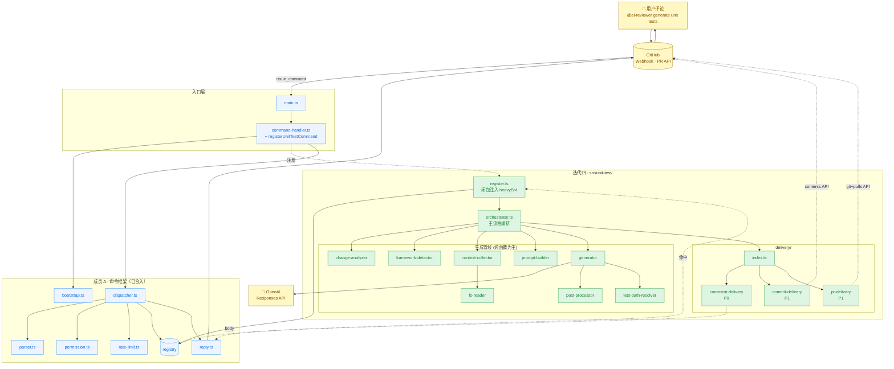
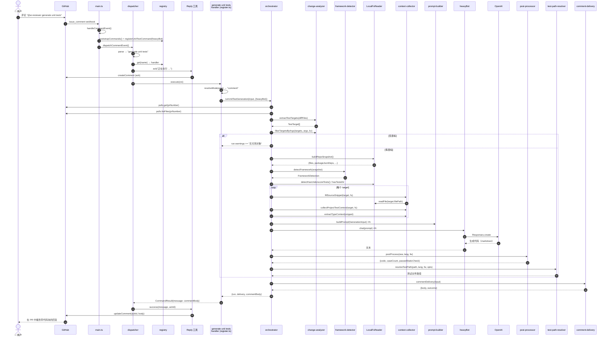
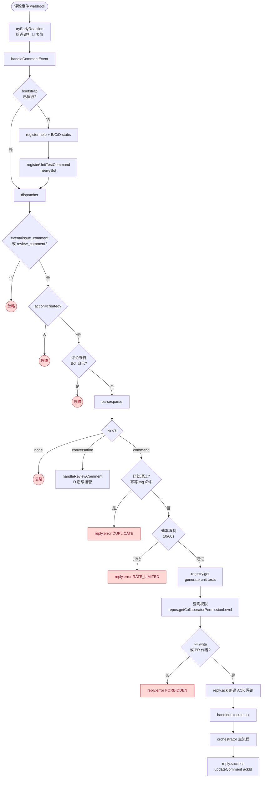
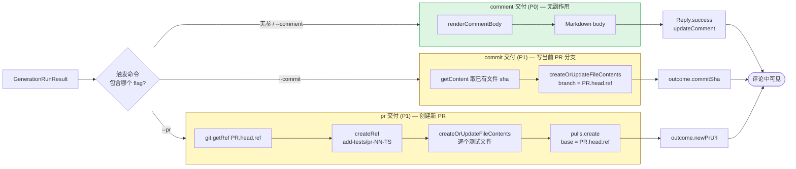
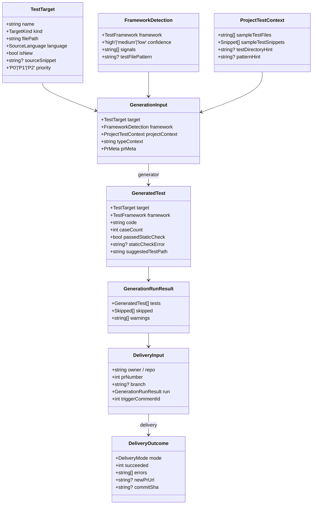
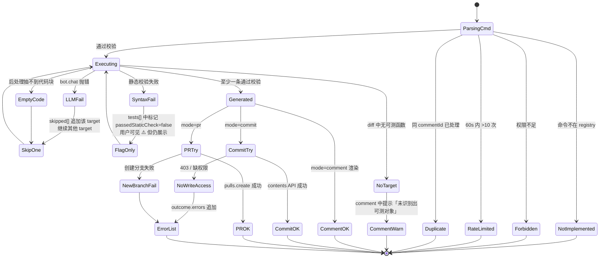

# 迭代四 — 单元测试自动生成 · 实现文档

> 对应需求文档：[06-iteration-unit-testing.md](https://github.com/CodesSentinels/codesentinel-docs/blob/main/docs/product-plan/06-iteration-unit-testing.md)
>
> 依赖说明：[06-iteration-04-unit-test-dependencies.md](./06-iteration-04-unit-test-dependencies.md)

---

## 1. 概述

本迭代在已合并的成员 A 命令框架之上实现 `@ai-reviewer generate unit tests` 命令，
按"分析 → 检测 → 收集 → 生成 → 后处理 → 交付"的管线把 PR 变更代码转化为可用的单元测试。

实现位置：`src/unit-test/`（新增）、`src/command-handler.ts`（+3 行接入点）。

### 1.1 设计目标

| 目标 | 说明 |
| :--- | :--- |
| **零侵入** | 不修改成员 A 的 CommandContext / dispatcher，不动 B/C/D 的 stubs |
| **可单测** | 所有"产生数据"的步骤为纯函数；IO/LLM 通过依赖注入 |
| **失败安全** | 任意目标失败不中断整体流程；进入 `skipped[]` 不抛 |
| **三种交付** | comment（P0）/ commit（P1）/ pr（P1）共享同一管线，只在末端分叉 |

---

## 2. 系统架构图



**图例**：

- 🟢 绿色：本迭代新增
- 🔵 蓝色：成员 A 已交付的命令框架
- 🟡 黄色：外部系统

---

## 3. 模块职责矩阵

### 3.1 接入层

| 模块 | 职责 | 关键 API | 单测 |
| :--- | :--- | :--- | :--- |
| `command-handler.ts` (改) | `bootstrap` 后调用 `registerUnitTestCommand(heavyBot)` | — | 通过既有 dispatcher 测试间接覆盖 |
| `register.ts` | 用闭包把 `heavyBot` 绑定到 CommandHandler，注册到 registry | `registerUnitTestCommand(bot)` | (与命令注册副作用相关，不直接测) |

### 3.2 引擎层

| 模块 | 职责 | 关键 API | 单测套件 |
| :--- | :--- | :--- | :--- |
| `change-analyzer.ts` | 从 PR diff 抽取 `TestTarget[]` | `extractTestTargets(files)`, `filterTargetsByArgs(...)` | `unit-test-change-analyzer.test.ts` (21) |
| `framework-detector.ts` | 仓库快照 → `FrameworkDetection` | `detectFramework(snapshot)` | `unit-test-framework-detector.test.ts` (12) |
| `context-collector.ts` | 注入式 FsReader + 抽取源码/类型/已有测试 | `fillSourceSnippet`, `collectProjectTestContext`, `extractTypeContext`, `extractBlock` | `unit-test-context-collector.test.ts` (19) |
| `fs-reader.ts` | LocalFsReader（process.cwd()） | `readFile`, `list`, `fileExists` | (IO，跳过) |
| `prompt-builder.ts` | 组装 Prompt（纯函数） | `buildPrompt(input)` | `unit-test-prompt-builder.test.ts` (8) |
| `generator.ts` | 串行调 LLM + 后处理 + 路径推断 | `generateTests(inputs, chat, opts)` | (注入 ChatFn stub) |
| `post-processor.ts` | 抽代码块、静态校验、计数 | `postProcess`, `extractCodeBlock`, `staticCheck`, `countTestCases` | `unit-test-post-processor.test.ts` (14) |
| `test-path-resolver.ts` | 推断测试文件路径 | `resolveTestPath(src, lang, fw, opts)` | `unit-test-test-path-resolver.test.ts` (8) |
| `orchestrator.ts` | 整链编排 | `runUnitTestGeneration(input, deps)` | (集成测) |

### 3.3 Delivery 层

| 模块 | mode | 副作用 | 单测 |
| :--- | :--- | :--- | :--- |
| `comment-delivery.ts` | `comment` | 纯渲染，副作用交给 Reply | `unit-test-comment-delivery.test.ts` (6) |
| `commit-delivery.ts` | `commit` | `repos.createOrUpdateFileContents` | (IO，跳过) |
| `pr-delivery.ts` | `pr` | `git.createRef` + `pulls.create` | (IO，跳过) |
| `delivery/index.ts` | dispatch | — | (薄层) |

---

## 4. 主数据流程图

下图描绘"用户敲 `@ai-reviewer generate unit tests` → 收到带测试代码的评论"全过程。



---

## 5. 数据模型流图

下图描绘从 GitHub PR diff 到最终评论体的数据转换链。

```mermaid
flowchart LR
    DF["DiffFile[]<br/>{filename, status, patch}"] --> CA[change-analyzer]
    CA --> TT["TestTarget[]<br/>{name, kind, lang, filePath, isNew}"]

    RS["FrameworkRepoSnapshot<br/>{files, deps, pyproject}"] --> FD[framework-detector]
    FD --> FW["FrameworkDetection<br/>{framework, confidence, signals}"]

    TT --> CC[context-collector]
    Fs[(LocalFsReader)] --> CC
    CC --> EFilled["TestTarget + sourceSnippet"]
    CC --> PC["ProjectTestContext<br/>{sampleFiles, snippets, hints}"]
    CC --> TC["typeContext (import lines)"]

    EFilled --> GI["GenerationInput<br/>{target, framework, projectContext, typeContext, prMeta}"]
    FW --> GI
    PC --> GI
    TC --> GI

    GI --> PB[prompt-builder]
    PB --> Prompt["string (User-side Prompt)"]
    Prompt --> Bot[heavyBot.chat]
    Bot --> Raw["LLM raw text"]
    Raw --> PP[post-processor]
    PP --> PPR["{code, caseCount,<br/>passedStaticCheck, ...}"]
    EFilled --> TPR[test-path-resolver]
    TPR --> Path["suggestedTestPath"]

    PPR --> GT["GeneratedTest"]
    Path --> GT
    GT --> GRR["GenerationRunResult<br/>{tests, skipped, warnings}"]

    GRR --> DI[delivery/index]
    DI -->|comment| DCm[comment-delivery]
    DI -->|commit| DCo[commit-delivery]
    DI -->|pr| DPr[pr-delivery]
    DCm --> Body[Markdown body]
    DCo --> CSha[commit sha]
    DPr --> NPr[new PR url]

    classDef data fill:#fff8c5,stroke:#9a6700,color:#7d4e00
    classDef func fill:#eef4ff,stroke:#218bff,color:#0969da
    classDef store fill:#dff5e3,stroke:#2da44e,color:#1a7f37
    class DF,TT,RS,FW,EFilled,PC,TC,GI,Prompt,Raw,PPR,Path,GT,GRR,Body,CSha,NPr data
    class CA,FD,CC,PB,Bot,PP,TPR,DI,DCm,DCo,DPr func
    class Fs store
```



---

## 6. 命令解析与权限流程



---

## 7. 三种交付方式对比



---

## 8. 类型流转



---

## 9. 错误与降级路径



**关键设计**：除四类"前置校验失败"外，所有运行时错误（LLM 失败、单个目标解析失败、commit 失败）都进入 `outcome.errors` 或 `run.skipped`，**不抛异常**、**不中断整体流程**。这保证一次命令至少能产出一条用户可读的反馈。

---

## 10. 文件清单与测试覆盖

```
src/unit-test/
├── types.ts                          (~148 LOC)
├── change-analyzer.ts                (~201 LOC) ◄ unit-test-change-analyzer.test.ts (21 cases)
├── framework-detector.ts             (~157 LOC) ◄ unit-test-framework-detector.test.ts (12 cases)
├── context-collector.ts              (~160 LOC) ◄ unit-test-context-collector.test.ts (19 cases)
├── fs-reader.ts                      (~ 99 LOC)
├── prompt-builder.ts                 (~115 LOC) ◄ unit-test-prompt-builder.test.ts (8 cases)
├── post-processor.ts                 (~186 LOC) ◄ unit-test-post-processor.test.ts (14 cases)
├── generator.ts                      (~111 LOC)
├── test-path-resolver.ts             (~ 73 LOC) ◄ unit-test-test-path-resolver.test.ts (8 cases)
├── orchestrator.ts                   (~248 LOC)
├── register.ts                       (~152 LOC)
└── delivery/
    ├── index.ts                      (~ 41 LOC)
    ├── comment-delivery.ts           (~131 LOC) ◄ unit-test-comment-delivery.test.ts (6 cases)
    ├── commit-delivery.ts            (~103 LOC)
    └── pr-delivery.ts                (~141 LOC)

src/command-handler.ts                (+3 LOC)   ◄ 已有测试间接覆盖
```

| 测试套件 | 用例数 | 类型 |
| :--- | ---: | :--- |
| `unit-test-change-analyzer` | 21 | 纯函数 |
| `unit-test-framework-detector` | 12 | 纯函数 |
| `unit-test-test-path-resolver` | 8 | 纯函数 |
| `unit-test-post-processor` | 14 | 纯函数 |
| `unit-test-prompt-builder` | 8 | 纯函数 |
| `unit-test-comment-delivery` | 6 | 含 `@actions/core` mock |
| `unit-test-context-collector` | 19 | 含 `@actions/core` mock；含 in-memory FsReader |
| **合计** | **86** | 100% PASS |

全套 `npm test` 通过：**14 suites · 268 cases**。

---

## 11. 与文档 §5 工作项的实现对照

### 5.1 核心引擎

| 工作项 | 实现位置 | 状态 |
| :--- | :--- | :--- |
| 变更代码分析器 | `change-analyzer.ts` | ✅ P0 |
| 测试框架检测器 | `framework-detector.ts` | ✅ P0 |
| 测试上下文收集器 | `context-collector.ts` + `fs-reader.ts` | ✅ P0 |
| 测试生成 Prompt 模板 | `prompt-builder.ts` | ✅ P0 |
| LLM 测试生成调用 | `generator.ts` + `bot.ts` 复用 | ✅ P0 |
| 生成代码后处理 | `post-processor.ts` | ✅ P0 |

### 5.2 交付方式

| 工作项 | 实现位置 | 状态 |
| :--- | :--- | :--- |
| 评论展示 | `delivery/comment-delivery.ts` | ✅ P0 |
| 提交到分支 | `delivery/commit-delivery.ts` | ✅ P1（骨架完整，需 `contents:write`） |
| 创建新 PR | `delivery/pr-delivery.ts` | ✅ P1（骨架完整，需 `pull-requests:write`） |
| 测试文件路径推断 | `test-path-resolver.ts` | ✅ P0 |

### 5.3 命令交互

| 工作项 | 实现位置 | 状态 |
| :--- | :--- | :--- |
| 命令解析 | 复用 A 的 parser（已支持 3-token） | ✅ P0 |
| 审查摘要中的入口 | — | ⏳ 等待成员 C `summary` 上线 |
| 进度反馈 | 复用 A 的 `Reply.ack` | ✅ P2 |

### 5.4 质量保障

| 工作项 | 实现位置 | 状态 |
| :--- | :--- | :--- |
| 语法校验 | `post-processor.ts staticCheck` | ✅ P0 |
| 执行验证（可选） | — | ⏳ P2 |
| 失败自动修复 | — | ⏳ P2 |
| 覆盖度分析 | `post-processor.countTestCases` + 评论覆盖表 | ✅ 简化版 |

---

## 12. 后续迭代建议

| 项 | 触发条件 | 改造范围 |
| :--- | :--- | :--- |
| 接入 C 的 PR meta 缓存 | 成员 C `triggerReview` 暴露公共接口后 | `orchestrator.ts` 一处 |
| pause 状态尊重 | 成员 C `isPaused()` 上线 | `register.ts` 在 execute 入口判断 |
| Summary 评论中的 CTA | 成员 C `summary` 命令上线 | 新增 `summary-cta.ts` 模块 |
| 执行验证（沙箱跑测试） | 独立 GitHub Action job 设计完成 | 新增 `executor/` 子目录 |
| Token 预算控制 | 单 PR 目标数 > 20 时遇到 OOM | `generator.ts` 引入 token 估算 + 分批 |
| 复用 D 的 `formatComments` | 当 D 的 formatter 通用性足够 | `comment-delivery.ts` 重构（P2） |

---

## 13. 代码评审反馈与修复记录

为帮助后续读者理解某些"看似过度防御"的代码模式，下表记录首轮 `/review` 反馈与对应修复。

| ID | 问题摘要 | 修复位置 | 体现 |
| :--- | :--- | :--- | :--- |
| R1+R2 | `re.exec + slice` 推进，零宽匹配存在死循环 | `change-analyzer.ts` | 三组正则统一加 `/g`，改用 `matchAll` |
| R3 | `_registered` 与 `_resetBootstrap` 失步 | `register.ts` | 双重校验（flag + `registry.has(name)`），注释明确协调约定 |
| R4 | `getContent` 的 symlink/submodule 返回值会被误覆盖 | `delivery/commit-delivery.ts` | 新增 `type === 'file'` 守卫；其他类型进入 errors |
| R5 | 提交全部失败 / create PR 失败时残留新分支 | `delivery/pr-delivery.ts` | 新增 `deleteBranchSafe`，两条失败路径都清理 |
| S1 | `listFiles` 仅取 100 项，大 PR 截断 | `orchestrator.ts` | 手动分页，上限 10 页（1000 文件）|
| S4 | `fs-reader.list` 仅 prune `node_modules`/`dist`，monorepo 慢 | `fs-reader.ts` | `SKIP_DIRS` 扩展为 11 项 |
| S5 | `prMeta.headSha.slice(0,7)` 在 issue_comment 路径输出空 | `prompt-builder.ts` | 新增 `shortSha()` 兜底 `'unknown'` |
| S6 | 硬编码 `@ai-reviewer` mention，与 parser 别名失同步风险 | `delivery/comment-delivery.ts` | 复用 `DEFAULT_BOT_MENTIONS[0]` |
| S7 | 同名 stub 误注册会让 `register` 抛 | `register.ts` | defensive `registry.has(name)` 检查 |
| 测试缺口 | `context-collector` 未覆盖 | `unit-test-context-collector.test.ts` | 新增 19 个用例 |

未修复（low priority follow-up）：

- **S2**：`isBalanced` 未处理模板字面量 `${...}` 中的括号。当前测试用例未触发；改造需引入 token-level parser。
- **S3**：generator 未在外层重试。经查 `Bot.chat` 内部已用 `pRetry` + 静默 APIError，LLM 失败 → 空 text → post-processor 走"code 为空"分支 → `skipped[]`，语义已正确，外层无需重复重试。
