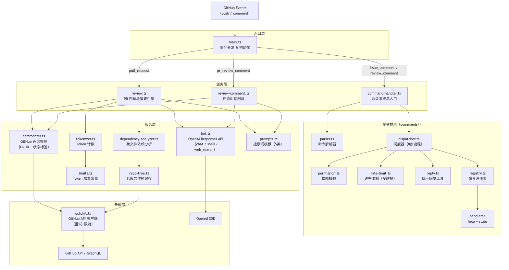
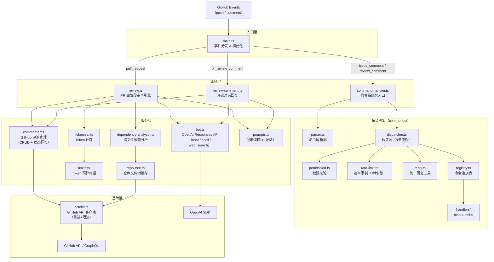
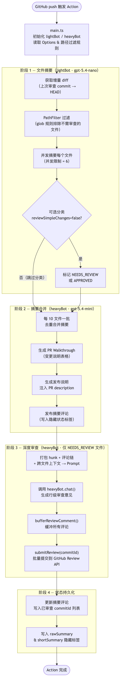
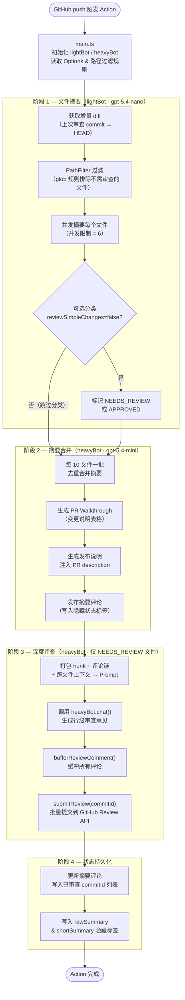
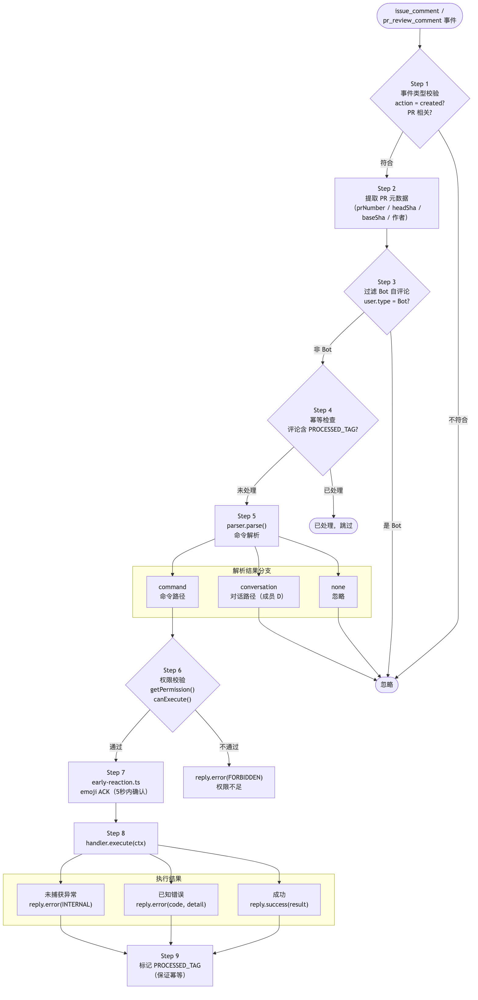
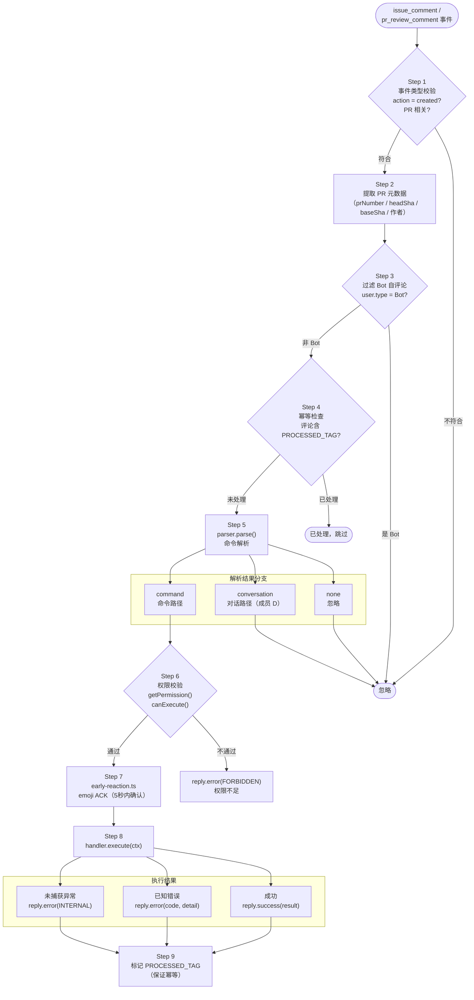
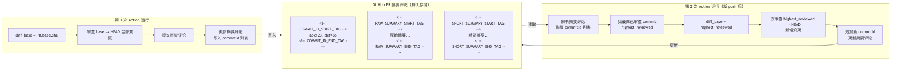
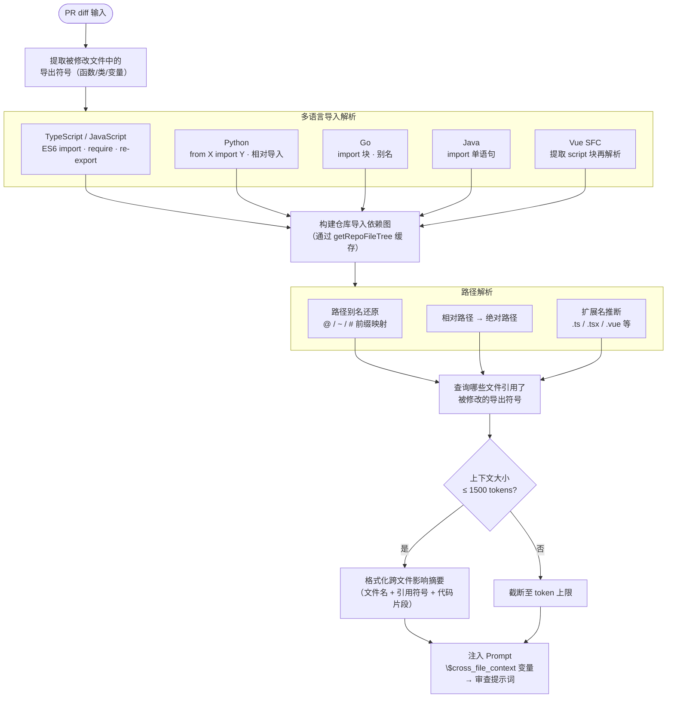
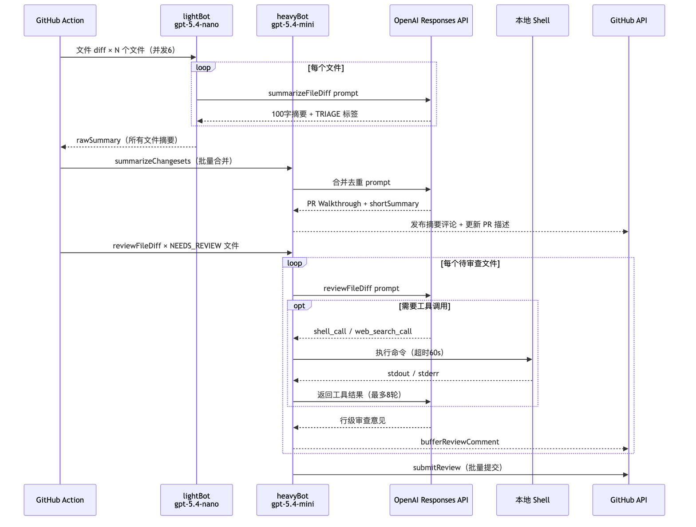
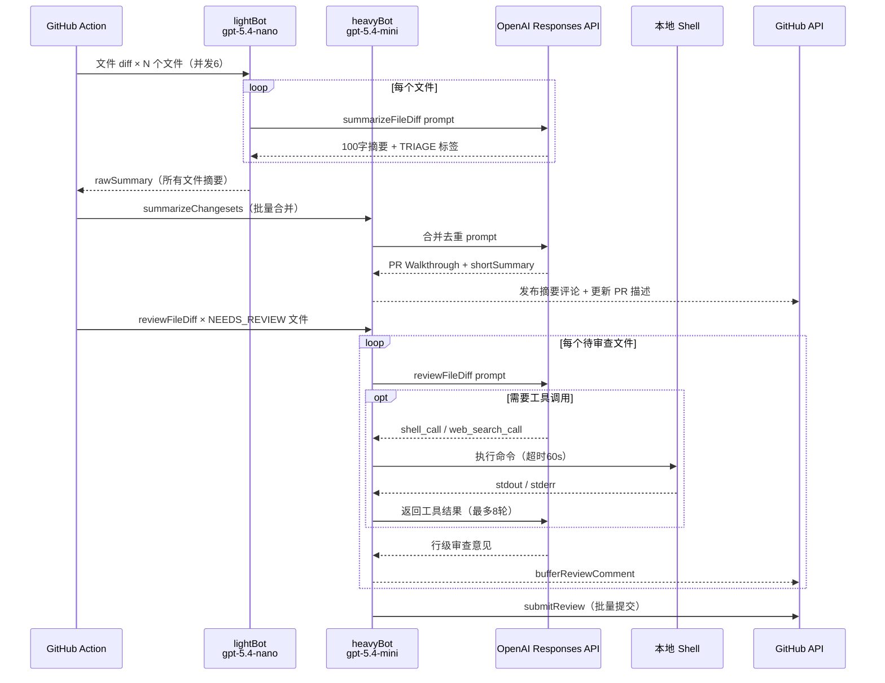

# CodeSentinel AI Reviewer — 架构流程图

---

## 一、整体分层架构

```mermaid
graph TD
    GH["GitHub Events\n（push / comment）"]

    subgraph Entry["入口层"]
        MAIN["main.ts\n事件分发 & 初始化"]
    end

    subgraph Business["业务层"]
        REV["review.ts\nPR 四阶段审查引擎"]
        RC["review-comment.ts\n评论对话回复"]
        CH["command-handler.ts\n命令系统总入口"]
    end

    subgraph CommandFW["命令框架（commands/）"]
        PARSER["parser.ts\n命令解析器"]
        DISPATCH["dispatcher.ts\n调度器（8步流程）"]
        PERM["permission.ts\n权限校验"]
        RL["rate-limit.ts\n速率限制（令牌桶）"]
        REPLY["reply.ts\n统一回复工具"]
        REG["registry.ts\n命令注册表"]
        HANDLERS["handlers/\nhelp + stubs"]
    end

    subgraph Services["服务层"]
        BOT["bot.ts\nOpenAI Responses API\n（chat / shell / web_search）"]
        COMM["commenter.ts\nGitHub 评论管理\n（CRUD + 状态标签）"]
        DEP["dependency-analyzer.ts\n跨文件依赖分析"]
        TREE["repo-tree.ts\n仓库文件树缓存"]
        TOK["tokenizer.ts\nToken 计数"]
        PROMPTS["prompts.ts\n提示词模板（5类）"]
        LIMITS["limits.ts\nToken 预算常量"]
    end

    subgraph Foundation["基础层"]
        OCT["octokit.ts\nGitHub API 客户端\n（重试+限流）"]
        OAI["OpenAI SDK"]
        GHA["GitHub API / GraphQL"]
    end

    GH --> MAIN
    MAIN -- "pull_request" --> REV
    MAIN -- "pr_review_comment" --> RC
    MAIN -- "issue_comment / review_comment" --> CH

    REV --> BOT
    REV --> COMM
    REV --> DEP
    REV --> PROMPTS
    REV --> TOK

    RC --> BOT
    RC --> COMM
    RC --> PROMPTS

    CH --> PARSER
    CH --> DISPATCH
    DISPATCH --> PERM
    DISPATCH --> RL
    DISPATCH --> REPLY
    DISPATCH --> REG
    REG --> HANDLERS

    BOT --> OAI
    COMM --> OCT
    DEP --> TREE
    TREE --> OCT
    OCT --> GHA
    TOK --> LIMITS
```

---

## 二、PR 自动审查四阶段流水线

```mermaid
flowchart TD
    START(["GitHub push 触发 Action"])

    INIT["main.ts\n初始化 lightBot / heavyBot\n读取 Options & 路径过滤规则"]

    subgraph Phase1["阶段 1 — 文件摘要（lightBot · gpt-5.4-nano）"]
        P1A["获取增量 diff\n（上次审查 commit → HEAD）"]
        P1B["PathFilter 过滤\n（glob 规则排除不需审查的文件）"]
        P1C["并发摘要每个文件\n（并发限制 = 6）"]
        P1D{"可选分类\nreviewSimpleChanges=false?"}
        P1E["标记 NEEDS_REVIEW\n或 APPROVED"]
    end

    subgraph Phase2["阶段 2 — 摘要合并（heavyBot · gpt-5.4-mini）"]
        P2A["每 10 文件一批\n去重合并摘要"]
        P2B["生成 PR Walkthrough\n（变更说明表格）"]
        P2C["生成发布说明\n注入 PR description"]
        P2D["发布摘要评论\n（写入隐藏状态标签）"]
    end

    subgraph Phase3["阶段 3 — 深度审查（heavyBot · 仅 NEEDS_REVIEW 文件）"]
        P3A["打包 hunk + 评论链\n+ 跨文件上下文 → Prompt"]
        P3B["调用 heavyBot.chat()\n生成行级审查意见"]
        P3C["bufferReviewComment()\n缓冲所有评论"]
        P3D["submitReview(commitId)\n批量提交到 GitHub Review API"]
    end

    subgraph Phase4["阶段 4 — 状态持久化"]
        P4A["更新摘要评论\n写入已审查 commitId 列表"]
        P4B["写入 rawSummary\n& shortSummary 隐藏标签"]
    end

    END(["Action 完成"])

    START --> INIT --> P1A --> P1B --> P1C --> P1D
    P1D -- "是" --> P1E
    P1D -- "否（跳过分类）" --> P2A
    P1E --> P2A
    P2A --> P2B --> P2C --> P2D
    P2D --> P3A --> P3B --> P3C --> P3D
    P3D --> P4A --> P4B --> END
```

---

## 三、命令调度 8 步标准流程

```mermaid
flowchart TD
    EVT(["issue_comment /\npr_review_comment 事件"])

    S1{"Step 1\n事件类型校验\naction = created?\nPR 相关?"}
    S2["Step 2\n提取 PR 元数据\n（prNumber / headSha / baseSha / 作者）"]
    S3{"Step 3\n过滤 Bot 自评论\nuser.type = Bot?"}
    S4{"Step 4\n幂等检查\n评论含 PROCESSED_TAG?"}
    S5["Step 5\nparser.parse()\n命令解析"]

    subgraph ParseResult["解析结果分支"]
        R1["command\n命令路径"]
        R2["conversation\n对话路径（成员 D）"]
        R3["none\n忽略"]
    end

    S6{"Step 6\n权限校验\ngetPermission()\ncanExecute()"}
    S7["Step 7\nearly-reaction.ts\nemoji ACK（5秒内确认）"]
    S8["Step 8\nhandler.execute(ctx)"]

    subgraph ExecResult["执行结果"]
        OK["成功\nreply.success(result)"]
        KNOWN["已知错误\nreply.error(code, detail)"]
        ERR["未捕获异常\nreply.error(INTERNAL)"]
    end

    S9["Step 9\n标记 PROCESSED_TAG\n（保证幂等）"]

    SKIP1(["忽略"])
    SKIP2(["已处理，跳过"])
    FORBIDDEN["reply.error(FORBIDDEN)\n权限不足"]

    EVT --> S1
    S1 -- "不符合" --> SKIP1
    S1 -- "符合" --> S2 --> S3
    S3 -- "是 Bot" --> SKIP1
    S3 -- "非 Bot" --> S4
    S4 -- "已处理" --> SKIP2
    S4 -- "未处理" --> S5
    S5 --> R1 & R2 & R3
    R3 --> SKIP1
    R2 --> SKIP1
    R1 --> S6
    S6 -- "不通过" --> FORBIDDEN
    S6 -- "通过" --> S7 --> S8
    S8 --> OK & KNOWN & ERR
    OK & KNOWN & ERR --> S9
```

---

## 四、增量审查状态持久化机制

```mermaid
flowchart LR
    subgraph Run1["第 1 次 Action 运行"]
        A1["diff_base = PR.base.sha"]
        A2["审查 base → HEAD 全部变更"]
        A3["提交审查评论"]
        A4["更新摘要评论\n写入 commitId 列表"]
    end

    subgraph Comment["GitHub PR 摘要评论（持久存储）"]
        C1["&lt;!-- COMMIT_ID_START_TAG --&gt;\nabc123, def456\n&lt;!-- COMMIT_ID_END_TAG --&gt;"]
        C2["&lt;!-- RAW_SUMMARY_START_TAG --&gt;\n原始摘要...\n&lt;!-- RAW_SUMMARY_END_TAG --&gt;"]
        C3["&lt;!-- SHORT_SUMMARY_START_TAG --&gt;\n精简摘要...\n&lt;!-- SHORT_SUMMARY_END_TAG --&gt;"]
    end

    subgraph Run2["第 2 次 Action 运行（新 push 后）"]
        B1["解析摘要评论\n恢复 commitId 列表"]
        B2["找最高已审查 commit\nhighest_reviewed"]
        B3["diff_base = highest_reviewed"]
        B4["仅审查 highest_reviewed → HEAD\n新增变更"]
        B5["追加新 commitId\n更新摘要评论"]
    end

    A1 --> A2 --> A3 --> A4
    A4 -->|写入| Comment
    Comment -->|读取| B1
    B1 --> B2 --> B3 --> B4 --> B5
    B5 -->|更新| Comment
```

---

## 五、跨文件依赖分析流程

```mermaid
flowchart TD
    START(["PR diff 输入"])

    E1["提取被修改文件中的\n导出符号（函数/类/变量）"]

    subgraph LangParse["多语言导入解析"]
        L1["TypeScript / JavaScript\nES6 import · require · re-export"]
        L2["Python\nfrom X import Y · 相对导入"]
        L3["Go\nimport 块 · 别名"]
        L4["Java\nimport 单语句"]
        L5["Vue SFC\n提取 script 块再解析"]
    end

    E2["构建仓库导入依赖图\n（通过 getRepoFileTree 缓存）"]

    subgraph PathResolve["路径解析"]
        P1["路径别名还原\n@ / ~ / # 前缀映射"]
        P2["相对路径 → 绝对路径"]
        P3["扩展名推断\n.ts / .tsx / .vue 等"]
    end

    E3["查询哪些文件引用了\n被修改的导出符号"]

    E4{"上下文大小\n≤ 1500 tokens?"}

    E5["格式化跨文件影响摘要\n（文件名 + 引用符号 + 代码片段）"]
    E6["截断至 token 上限"]

    E7["注入 Prompt\n\$cross_file_context 变量\n→ 审查提示词"]

    START --> E1
    E1 --> LangParse
    L1 & L2 & L3 & L4 & L5 --> E2
    E2 --> PathResolve
    P1 & P2 & P3 --> E3
    E3 --> E4
    E4 -- "是" --> E5 --> E7
    E4 -- "否" --> E6 --> E7
```

---

## 六、双模型调用链路

```mermaid
sequenceDiagram
    participant Action as GitHub Action
    participant Light as lightBot<br/>gpt-5.4-nano
    participant Heavy as heavyBot<br/>gpt-5.4-mini
    participant OAI as OpenAI Responses API
    participant Shell as 本地 Shell
    participant GH as GitHub API

    Action->>Light: 文件 diff × N 个文件（并发6）
    loop 每个文件
        Light->>OAI: summarizeFileDiff prompt
        OAI-->>Light: 100字摘要 + TRIAGE 标签
    end
    Light-->>Action: rawSummary（所有文件摘要）

    Action->>Heavy: summarizeChangesets（批量合并）
    Heavy->>OAI: 合并去重 prompt
    OAI-->>Heavy: PR Walkthrough + shortSummary
    Heavy-->>GH: 发布摘要评论 + 更新 PR 描述

    Action->>Heavy: reviewFileDiff × NEEDS_REVIEW 文件
    loop 每个待审查文件
        Heavy->>OAI: reviewFileDiff prompt
        opt 需要工具调用
            OAI-->>Heavy: shell_call / web_search_call
            Heavy->>Shell: 执行命令（超时60s）
            Shell-->>Heavy: stdout / stderr
            Heavy->>OAI: 返回工具结果（最多8轮）
        end
        OAI-->>Heavy: 行级审查意见
        Heavy-->>GH: bufferReviewComment
    end
    Heavy->>GH: submitReview（批量提交）
```
