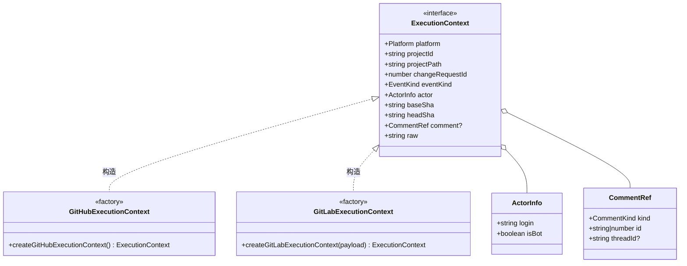
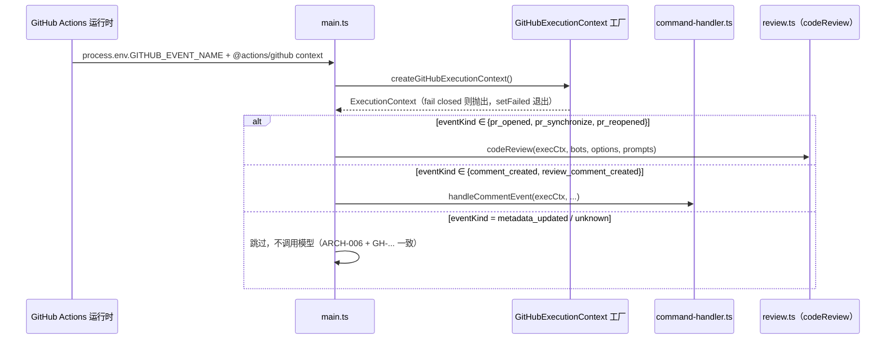
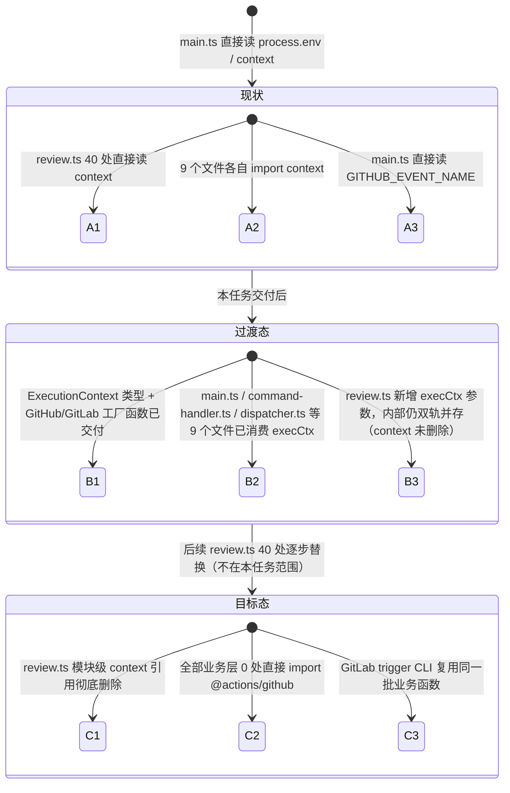

# ExecutionContext 设计文档（ARCH-001 ~ ARCH-006）

> **状态**：🚧 设计阶段（尚未开始代码开发）
> **优先级**：P0 —— GitHub↔GitLab 双平台兼容 [工作流 A](#参考文档) 关键路径的第一个子任务（A1 的前半部分）
> **范围**：仅 `ARCH-001` ~ `ARCH-006`（ExecutionContext 定义 + 双平台实现 + 消费改造 + fail-closed）
> **不在本任务范围**：`ConfigProvider`（ARCH-007~011，配置抽象）、`Logger`（ARCH-012~015）、`IGitPlatform`（ARCH-016~024，API 调用抽象）、GitLab trigger CLI 真实事件解析（EVENT-001~005）。这些是同一工作流 A 下的独立子任务，ExecutionContext 只对外暴露"这次运行是谁在哪个平台对哪个 PR/MR 做了什么"，不涉及"怎么调用平台 API""怎么读配置"。

---

## 0. 参考文档

本设计文档提炼自 `CodesSentinels/codesentinel-docs` 仓库 `docs/migration-plan/` 下三份文档，实施依据以其中标注为"当前 gitlab.com Free MVP 有效"的章节为准：

- `github-gitlab-compatibility-todo.md`（v2.5）—— 第 4.1 节 `ARCH-001`~`ARCH-006` 原始条目
- `github-to-gitlab-migration-plan.md`（v1.9）—— 0.7 节 MVP 运行契约、第二十三章 WBS（工作流 A / A1）
- `github-vs-gitlab-runtime-differences.md`（v1.4）—— 第一节运行架构对比、GitLab MR Hook / Note Hook 字段

仓库内相关记忆：`memory/gitlab_migration_plan.md`、`memory/gitlab_migration_docs_source.md`。

---

## 1. 背景与问题

当前代码库是纯 GitHub Action 形态，业务层直接依赖 `@actions/github` 的全局 `context` 对象和 `process.env.GITHUB_EVENT_NAME`，而不是通过参数传递的、平台无关的执行上下文。实扫结果（2026-07-23 复核，与迁移方案 0.4 节一致）：

| 文件 | 直接引用 `@actions/github` context | 说明 |
|:---|:---:|:---|
| `src/review.ts` | **40 处** | 模块级 `const context = github_context`，审查引擎全程直接读取 `context.payload.pull_request.*`、`context.eventName`、`context.repo` |
| `src/commenter.ts` | 8 处 | 评论 CRUD，读取 `context.repo`、`context.payload.pull_request` |
| `src/commands/dispatcher.ts` | 6 处 | 命令调度器，读取评论事件 payload |
| `src/commands/early-reaction.ts` | 4 处 | ACK 表情，读取评论 payload |
| `src/conversation.ts` | 4 处 | 对话式追问，读取 review comment payload |
| `src/dependency-analyzer.ts` | 2 处 | 跨文件依赖分析，读取 `context.payload.pull_request.head.sha` |
| `src/repo-tree.ts` | 1 处 | 仓库文件树缓存 key |
| `src/review-state.ts` | 1 处 | pause/resume 状态判断 |
| `src/command-handler.ts` | 1 处 | 评论事件入口分发 |
| `src/main.ts` | 直接读 `process.env.GITHUB_EVENT_NAME`（5 处）| 事件类型分发，未经过 `context` 对象但同样是 GitHub 专有环境变量 |

这种耦合意味着：**同一套 `codeReview()` / 命令调度逻辑无法在 GitLab MR 上运行**——不是因为业务逻辑不通用，而是因为它在十个不同的位置分别去读一个只有 GitHub Action 运行时才存在的全局对象。GitLab trigger job 运行时既没有 `@actions/github` 的 `context`，也没有 `GITHUB_EVENT_NAME`，只有 `TRIGGER_PAYLOAD` 文件。

`ExecutionContext` 就是要在事件入口处把"这是哪个平台、哪个项目、哪个 PR/MR、谁触发的、SHA 是什么"收敛成一个平台无关的普通对象，业务层只认这个对象，不认 `@actions/github`。

---

## 2. 目标（对应 TODO 条目）

| 编号 | 内容 | 本设计如何满足 |
|:---|:---|:---|
| `ARCH-001` | 定义平台无关 `ExecutionContext` | 第 3 节接口定义 |
| `ARCH-002` | 至少包含：平台、项目/仓库、PR/MR 编号、事件类型、actor、base/head SHA、评论/note/thread ID | 第 3 节字段表 |
| `ARCH-003` | 实现 `GitHubExecutionContext`，兼容现有 GitHub payload 和环境变量 | 第 4 节 |
| `ARCH-004` | 实现 `GitLabExecutionContext`，支持 MR Hook 和 Note Hook payload | 第 5 节 |
| `ARCH-005` | 消除共享业务层对 `GITHUB_EVENT_NAME`、GitHub context 和 GitLab 原始 payload 字段的直接读取 | 第 6 节迁移策略 + 文件级改造清单 |
| `ARCH-006` | payload 缺失、格式错误或事件未知时 fail closed | 第 7 节 |

---

## 3. `ExecutionContext` 接口设计



```typescript
// src/platform/execution-context.ts（新增）

export type Platform = 'github' | 'gitlab'

/**
 * 归一化事件类型，与具体平台事件名解耦。
 * - pr_opened/pr_synchronize/pr_reopened  → 触发自动增量/全量审查
 * - comment_created                        → 顶层评论（issue_comment / MR note）
 * - review_comment_created                 → 行级评论回复（review comment / diff discussion note）
 * - metadata_updated                       → 标题/label/assignee 等，不触发模型调用
 * - unknown                                → fail closed（见第 7 节）
 */
export type EventKind =
  | 'pr_opened'
  | 'pr_synchronize'
  | 'pr_reopened'
  | 'comment_created'
  | 'review_comment_created'
  | 'metadata_updated'
  | 'unknown'

export interface ActorInfo {
  /** GitHub login 或 GitLab username */
  login: string
  /** 是否为 bot/system 账号自身触发（用于反馈循环过滤，ARCH-005 消费方之一） */
  isBot: boolean
}

export type CommentKind = 'top_level' | 'review_thread'

export interface CommentRef {
  kind: CommentKind
  /** GitHub: comment.id（number）；GitLab: note.id（number，两平台均为 number，类型统一） */
  id: number
  /** GitHub: review thread node ID（GraphQL）；GitLab: discussion_id（string） */
  threadId?: string
}

/**
 * 平台无关执行上下文。
 *
 * 业务层（review.ts / commenter.ts / commands/**）只允许通过这个对象
 * 获取"这次运行是谁在哪个平台对哪个 PR/MR 做了什么"，不得直接 import
 * `@actions/github` 或读取 `process.env.GITHUB_EVENT_NAME` /
 * `process.env.TRIGGER_PAYLOAD`。平台专有细节一律封装进 `raw`，仅供
 * 对应 adapter（GitHub adapter / GitLab adapter，ARCH-016+ 任务）内部使用。
 */
export interface ExecutionContext {
  platform: Platform

  /** GitHub: "owner/repo"；GitLab: 项目路径（不是 project_id 数字） */
  projectPath: string
  /** GitHub: "owner/repo"（与 projectPath 相同，保留字段用于兼容 octokit 调用签名）；GitLab: project_id（数字，转成字符串） */
  projectId: string

  /** PR number（GitHub）/ MR iid（GitLab）——注意 GitLab 还有一个跨项目唯一的 MR id，两者不可混用，本字段固定用 iid */
  changeRequestId: number

  eventKind: EventKind
  actor: ActorInfo

  baseSha: string
  headSha: string

  /** 仅评论类事件（comment_created / review_comment_created）存在 */
  comment?: CommentRef

  /**
   * 平台原始 payload 的 JSON 快照，仅供本平台的 adapter 层读取，
   * 共享业务层禁止访问（架构测试见 ARCH-023，本任务不实现该测试，
   * 由后续 ARCH-023 任务负责用 eslint/dependency-cruiser 规则强制）。
   */
  raw: unknown
}

export class ExecutionContextError extends Error {
  constructor(
    message: string,
    public readonly platform: Platform,
    public readonly reason:
      | 'missing_payload'
      | 'malformed_payload'
      | 'unknown_event'
      | 'missing_required_field'
  ) {
    super(message)
    this.name = 'ExecutionContextError'
  }
}
```

**字段取舍说明**：

- 沿用现有 `CommandContext`（`src/commands/types.ts`）里已经验证过的字段命名习惯（`owner`/`repo`/`prNumber`/`headSha`/`baseSha`/`commentId`/`commentNodeId`/`threadNodeId`），但把 `owner`+`repo` 合并为 `projectPath`/`projectId` 两个字段——GitLab 没有 `owner/repo` 两段式概念，只有 project path 和 project id，强行拆成 owner/repo 会在 GitLab 侧产生无意义的字段。`CommandContext` 后续在 ARCH-005 消费阶段会重构为直接持有一个 `ExecutionContext`（见第 6 节）。
- 不在 `ExecutionContext` 里放 PR/MR 的 `title`、`body`、`diff` 等内容型数据——这些属于 `IGitPlatform`（ARCH-016+）的读取能力，`ExecutionContext` 只描述"事件坐标"，不做数据抓取，避免 GitHub/GitLab 两个工厂函数在构造阶段各自发起不对等的 API 调用。

---

## 4. `GitHubExecutionContext`（ARCH-003）

### 4.1 数据来源与事件映射

```typescript
// src/platform/github-execution-context.ts（新增）
import {context as githubContext} from '@actions/github'

const EVENT_MAP: Record<string, (payload: any) => EventKind> = {
  pull_request: mapPullRequestAction,
  pull_request_target: mapPullRequestAction,
  issue_comment: () => 'comment_created',
  pull_request_review_comment: () => 'review_comment_created'
}

function mapPullRequestAction(payload: any): EventKind {
  switch (payload.action) {
    case 'opened':
      return 'pr_opened'
    case 'synchronize':
      return 'pr_synchronize'
    case 'reopened':
      return 'pr_reopened'
    default:
      // title/label/assignee 等元数据更新（GH-... 系列要求不得触发模型调用）
      return 'metadata_updated'
  }
}

export function createGitHubExecutionContext(): ExecutionContext {
  const eventName = process.env.GITHUB_EVENT_NAME
  if (eventName == null || eventName === '') {
    throw new ExecutionContextError(
      'GITHUB_EVENT_NAME is not set',
      'github',
      'missing_payload'
    )
  }

  const mapper = EVENT_MAP[eventName]
  if (mapper == null) {
    throw new ExecutionContextError(
      `Unsupported GitHub event: ${eventName}`,
      'github',
      'unknown_event'
    )
  }

  const {owner, repo} = githubContext.repo
  const eventKind = mapper(githubContext.payload)

  // pull_request* 事件
  if (eventKind !== 'comment_created' && eventKind !== 'review_comment_created') {
    const pr = githubContext.payload.pull_request
    if (pr == null) {
      throw new ExecutionContextError(
        'pull_request payload missing',
        'github',
        'missing_required_field'
      )
    }
    return {
      platform: 'github',
      projectPath: `${owner}/${repo}`,
      projectId: `${owner}/${repo}`,
      changeRequestId: pr.number,
      eventKind,
      actor: {login: githubContext.actor, isBot: /\[bot\]$/.test(githubContext.actor)},
      baseSha: pr.base.sha,
      headSha: pr.head.sha,
      raw: githubContext.payload
    }
  }

  // issue_comment / pull_request_review_comment 事件
  const comment = githubContext.payload.comment
  const prNumber =
    githubContext.payload.issue?.number ?? githubContext.payload.pull_request?.number
  if (comment == null || prNumber == null) {
    throw new ExecutionContextError(
      'comment payload missing required fields',
      'github',
      'missing_required_field'
    )
  }
  return {
    platform: 'github',
    projectPath: `${owner}/${repo}`,
    projectId: `${owner}/${repo}`,
    changeRequestId: prNumber,
    eventKind,
    actor: {login: comment.user.login, isBot: /\[bot\]$/.test(comment.user.login)},
    // PR 事件的 base/head SHA 在评论事件里默认取不到，交由调用方（command-handler）
    // 在需要时另行通过 IGitPlatform 查询当前 HEAD；此处先留空字符串，ARCH-006 fail-closed
    // 不对评论事件强制要求 SHA 非空（与现状行为一致：resolve/summary 等命令本就在执行时重新查询 HEAD）
    baseSha: '',
    headSha: '',
    comment: {
      kind: eventKind === 'review_comment_created' ? 'review_thread' : 'top_level',
      id: comment.id,
      threadId: githubContext.payload.comment?.node_id
    },
    raw: githubContext.payload
  }
}
```

### 4.2 向后兼容承诺

- `action.yml`、`GITHUB_TOKEN`、Action inputs 读取方式（`@actions/core` 的 `getInput` 系列）完全不受影响——`ExecutionContext` 只替代"读事件坐标"这一层，不碰配置读取（那是 ARCH-007 `ConfigProvider` 的范围）。
- `raw` 字段原样保留完整 `githubContext.payload`，迁移期内尚未来得及改造的调用点可以过渡性地从 `execCtx.raw` 读取，不强制一次性重写所有 40+ 处调用（见第 6 节迁移策略的分阶段安排）。

---

## 5. `GitLabExecutionContext`（ARCH-004）

> ⚠️ **边界说明**：GitLab trigger CLI 目前完全不存在（EVENT-001~005 尚未开始），因此本任务交付的是**类型定义 + 从"已解析 payload 对象"构造 `ExecutionContext` 的纯函数**，不包含读取 `TRIGGER_PAYLOAD` 文件、校验 project ID/HEAD SHA、CLI 入口本身。这些属于 `EVENT-002`/`EVENT-003` 任务。本节的产出是让 `EVENT-*` 任务未来只需要"解析出 payload JSON 后调用这个函数"，不需要重新设计字段映射。

### 5.1 GitLab Webhook 字段映射（依据 GitLab 官方 Webhook events 文档，实现时需核对当时最新 schema）

**Merge Request Hook**（`object_kind: "merge_request"`）：

| GitLab payload 字段 | ExecutionContext 字段 |
|:---|:---|
| `project.path_with_namespace` | `projectPath` |
| `project.id` | `projectId`（转字符串） |
| `object_attributes.iid` | `changeRequestId` |
| `object_attributes.action`（`open`/`reopen`/`update`） | `eventKind`（见下表映射，`update` 需结合 `changes` 判断是否为 HEAD SHA 变化） |
| `user.username` | `actor.login` |
| `object_attributes.target_branch` 对应 commit / `object_attributes.last_commit.id` | `headSha` |
| `object_attributes.oldrev`（如有）或需另行查询 diff version 的 `base_sha` | `baseSha`（MVP 阶段可能需要 `IGitPlatform` 二次查询，見 EVENT-003 待办） |

| `object_attributes.action` | `changes` 中是否含 SHA 变化 | `EventKind` |
|:---|:---|:---|
| `open` | — | `pr_opened` |
| `reopen` | — | `pr_reopened` |
| `update` | 含 `last_commit`/SHA 变化 | `pr_synchronize` |
| `update` | 仅 `title`/`labels`/`assignees` 等 | `metadata_updated` |

**Note Hook**（`object_kind: "note"`）：

| GitLab payload 字段 | ExecutionContext 字段 |
|:---|:---|
| `project.path_with_namespace` / `project_id` | `projectPath` / `projectId` |
| `merge_request.iid` | `changeRequestId` |
| `user.username` | `actor.login` |
| `object_attributes.noteable_type === 'MergeRequest'` 且 `object_attributes.action === 'create'` | `eventKind = 'comment_created'`（顶层）或 `'review_comment_created'`（`object_attributes.discussion_id` 存在时，即回复行级 discussion） |
| `object_attributes.id` | `comment.id` |
| `object_attributes.discussion_id` | `comment.threadId` |
| `merge_request.diff_head_sha` | `headSha` |

### 5.2 工厂函数

```typescript
// src/platform/gitlab-execution-context.ts（新增）

/**
 * 输入为已由 EVENT-002 任务解析出的 GitLab webhook payload 对象
 * （对应 TRIGGER_PAYLOAD 文件反序列化后的 JSON）。本函数不做文件 IO。
 */
export function createGitLabExecutionContext(payload: unknown): ExecutionContext {
  if (payload == null || typeof payload !== 'object') {
    throw new ExecutionContextError(
      'TRIGGER_PAYLOAD is empty or not an object',
      'gitlab',
      'missing_payload'
    )
  }
  const p = payload as Record<string, any>
  const kind = p.object_kind

  if (kind === 'merge_request') {
    return buildFromMergeRequestHook(p)
  }
  if (kind === 'note') {
    return buildFromNoteHook(p)
  }
  throw new ExecutionContextError(
    `Unsupported GitLab object_kind: ${String(kind)}`,
    'gitlab',
    'unknown_event'
  )
}

function buildFromMergeRequestHook(p: Record<string, any>): ExecutionContext {
  const attrs = p.object_attributes
  const project = p.project
  if (attrs == null || project == null || attrs.iid == null) {
    throw new ExecutionContextError(
      'merge_request payload missing object_attributes/project/iid',
      'gitlab',
      'missing_required_field'
    )
  }
  const eventKind = mapMergeRequestAction(attrs, p.changes)
  return {
    platform: 'gitlab',
    projectPath: project.path_with_namespace,
    projectId: String(project.id),
    changeRequestId: attrs.iid,
    eventKind,
    actor: {login: p.user?.username ?? '', isBot: false},
    baseSha: attrs.oldrev ?? '',
    headSha: attrs.last_commit?.id ?? '',
    raw: p
  }
}

function buildFromNoteHook(p: Record<string, any>): ExecutionContext {
  const attrs = p.object_attributes
  const mr = p.merge_request
  if (attrs == null || mr == null || attrs.action !== 'create') {
    throw new ExecutionContextError(
      'note payload missing required fields or not a create action',
      'gitlab',
      'missing_required_field'
    )
  }
  if (attrs.noteable_type !== 'MergeRequest') {
    throw new ExecutionContextError(
      `Unsupported noteable_type: ${attrs.noteable_type}`,
      'gitlab',
      'unknown_event'
    )
  }
  return {
    platform: 'gitlab',
    projectPath: p.project?.path_with_namespace ?? '',
    projectId: String(p.project_id ?? p.project?.id ?? ''),
    changeRequestId: mr.iid,
    eventKind: attrs.discussion_id ? 'review_comment_created' : 'comment_created',
    actor: {login: p.user?.username ?? '', isBot: false},
    baseSha: '',
    headSha: mr.diff_head_sha ?? '',
    comment: {
      kind: attrs.discussion_id ? 'review_thread' : 'top_level',
      id: attrs.id,
      threadId: attrs.discussion_id
    },
    raw: p
  }
}

function mapMergeRequestAction(attrs: Record<string, any>, changes: any): EventKind {
  if (attrs.action === 'open') return 'pr_opened'
  if (attrs.action === 'reopen') return 'pr_reopened'
  if (attrs.action === 'update') {
    const headChanged = changes?.last_commit != null || changes?.source_branch != null
    return headChanged ? 'pr_synchronize' : 'metadata_updated'
  }
  return 'unknown'
}
```

`isBot` 恒为 `false`：GitLab MVP 使用个人 PAT 身份评论（见运行差异文档 4.3 节），没有天然的 bot 账号标记；真正的自反馈过滤需要将 `actor.login` 与配置好的 PAT 用户名比较，属于 `EVENT-018`（GitLab adapter 消费层任务），不在 `ExecutionContext` 构造阶段判断。

---

## 6. 消费改造 / 迁移策略（ARCH-005）

### 6.1 入口层改造（本任务必做）



未来 GitLab trigger CLI（`EVENT-001`）会是上图中 `Main` 的平行入口，构造 `createGitLabExecutionContext(payload)` 后调用**同一个** `codeReview()` / `handleCommentEvent()`——这正是本任务要达成的效果：业务函数的签名从"隐式读全局 context"变成"显式接收 `ExecutionContext` 参数"，才能被两个入口复用。

### 6.2 文件级改造清单

| 文件 | 当前直接引用数 | 改造方式 | 风险/工作量 |
|:---|:---:|:---|:---|
| `src/main.ts` | 5（`GITHUB_EVENT_NAME`） | 用 `createGitHubExecutionContext()` 替换事件类型分发逻辑；构造出的 `ExecutionContext` 传给 `codeReview()`/`handleCommentEvent()` | 低，改动集中 |
| `src/commands/types.ts` | — | `CommandContext` 新增 `execCtx: ExecutionContext` 字段（过渡期保留现有 `owner`/`repo`/`prNumber` 等字段不删，避免一次性破坏 9 个 command handler 文件的签名） | 低，纯新增字段 |
| `src/command-handler.ts` | 1 | 从 `execCtx` 派生 `owner`/`repo`/`prNumber`，不再直接 import `context` | 低 |
| `src/commands/dispatcher.ts` | 6 | 同上，事件坐标一律从 `execCtx` 取 | 中 |
| `src/commands/early-reaction.ts` | 4 | 同上 | 低 |
| `src/review-state.ts` | 1 | pause/resume 判断逻辑不变，只是 PR body 来源函数改为接收参数而非隐式读 `context` | 低 |
| `src/repo-tree.ts` | 1 | 缓存 key 从 `execCtx.projectId + ref` 构造（对齐 `DEP-003` 要求的"缓存键必须包含 platform + project identity + ref"，为后续依赖分析双平台任务打基础） | 低 |
| `src/dependency-analyzer.ts` | 2 | 同上，`headSha` 改为参数传入 | 低 |
| `src/conversation.ts` | 4 | 对话上下文读取 PR/comment 坐标改为参数 | 中 |
| `src/commenter.ts` | 8 | 评论 CRUD 的 `owner`/`repo`/`prNumber` 改为参数；**不改动其 GitHub REST/GraphQL 调用本身**（那是 `IGitPlatform`/ARCH-016 的范围） | 中 |
| `src/review.ts` | **40** | **拆成独立子任务**，见 6.3 | **高，需单独排期** |

> 改造原则：本任务只做"**把事件坐标从全局读取改成参数传递**"，**不改变**任何一个文件里调用 GitHub REST/GraphQL API 的方式——那些调用继续走现有 `octokit.ts`，直到 `IGitPlatform`（ARCH-016+）任务把它们收敛到 adapter 层。两件事分开做，避免这次改造范围失控。

### 6.3 `review.ts` 迁移方案（40 处，风险最高，单列子任务）

`review.ts` 头部 `const context = github_context` 后接 `const repo = context.repo`，随后审查引擎的几乎每个内部函数（`codeReview`、增量 SHA 判断、diff 获取、评论发布前置检查等）都直接引用这两个模块级常量。直接一次性替换 40 处调用有较高回归风险（该文件是全仓库单文件测试覆盖面最大、耦合最深的核心审查引擎，[[member_b_resolve]] 记忆中也把它列为高风险文件）。采用**签名改造 + 内部零散替换两步走**：

1. **第一步（本任务交付）**：`codeReview()` 函数签名新增 `execCtx: ExecutionContext` 首参数；函数体内部**新增**局部变量 `const owner = execCtx.projectPath.split('/')[0]` 等，**保留**原有 `context`/`repo` 模块级引用不删除，两者并存，靠单元测试（见第 9 节）保证两套来源在同一次运行中取值一致。这一步保证 `main.ts` 可以立即传入 `ExecutionContext`，不阻塞入口层改造。
2. **第二步（后续任务，不在本任务工时内）**：逐函数把 40 处 `context.xxx` 替换为 `execCtx.xxx`，最终删除模块级 `const context = github_context`。建议按函数拆成 3~4 个独立小 PR（如"SHA/增量判断相关"“diff 获取相关”“评论发布前置检查相关”各一个 PR），每个 PR 独立跑现有测试套件，降低单次改动面。

> 该分阶段安排会体现在第 9 节任务列表中，作为「阶段二（后续排期）」单独列出，不计入本任务的验收范围，但设计文档需要先讲清楚，避免后来者重新纠结怎么切。

---

## 7. Fail-closed 设计（ARCH-006）

| 场景 | 处理方式 |
|:---|:---|
| `GITHUB_EVENT_NAME` 未设置 / `TRIGGER_PAYLOAD` 为空 | 抛 `ExecutionContextError(reason: 'missing_payload')` |
| 事件类型不在 `EVENT_MAP` 内（GitHub）/ `object_kind` 不是 `merge_request`\|`note`（GitLab） | 抛 `ExecutionContextError(reason: 'unknown_event')` |
| payload 结构不完整（如 `pull_request` 事件缺 `pull_request` 字段、GitLab note 缺 `object_attributes`） | 抛 `ExecutionContextError(reason: 'malformed_payload' \| 'missing_required_field')` |
| GitLab note `action !== 'create'`（编辑/删除/系统 note） | 同样抛错而非静默跳过——**调用方**（`main.ts` / trigger CLI）负责区分"预期内的忽略"（记日志后 exit 0，不算失败）和"数据损坏"（fail closed 并 setFailed / 非零退出）。`ExecutionContext` 工厂函数本身不做这个区分，只负责"构造不出合法上下文就抛错"，语义分类留给调用方，避免构造函数里混入过多业务判断 |

`main.ts` 侧统一 catch：

```typescript
try {
  const execCtx = createGitHubExecutionContext()
  // ... 分发
} catch (e) {
  if (e instanceof ExecutionContextError && e.reason === 'unknown_event') {
    warning(`Skipped: ${e.message}`) // 非致命，正常退出（对应现有 "only support pull_request event" 逻辑）
    return
  }
  setFailed(`Failed to build ExecutionContext: ${e.message}`) // 致命，fail closed
}
```

这与现状行为保持一致（`review.ts` 目前对非 `pull_request`/`pull_request_target` 事件也是 `warning` + 提前返回，不是硬失败），因此本任务**不引入新的用户可见行为变化**，只是把判断逻辑从"分散在 review.ts/main.ts 各处的 if"收敛成"构造 ExecutionContext 时的统一异常路径"。

---

## 8. 迁移前后对比（状态图）



---

## 9. 任务拆分

### 9.1 阶段一：代码开发（本任务范围）

| # | 任务 | 依赖 | 预估工时 |
|:---|:---|:---|:---:|
| T1 | 新建 `src/platform/execution-context.ts`：`ExecutionContext`/`ActorInfo`/`CommentRef`/`EventKind`/`ExecutionContextError` 类型定义 | 无 | 2h |
| T2 | 新建 `src/platform/github-execution-context.ts`：`createGitHubExecutionContext()` + 事件映射表 | T1 | 4h |
| T3 | 新建 `src/platform/gitlab-execution-context.ts`：`createGitLabExecutionContext(payload)` + MR/Note Hook 映射函数（含 fixture 数据） | T1 | 5h |
| T4 | 改造 `src/main.ts`：用工厂函数替换 `GITHUB_EVENT_NAME` 分发逻辑，`execCtx` 传入下游 | T2 | 3h |
| T5 | `src/commands/types.ts` 的 `CommandContext` 新增 `execCtx` 字段；`command-handler.ts`/`dispatcher.ts`/`early-reaction.ts` 改为消费 `execCtx` | T4 | 6h |
| T6 | `review-state.ts`/`repo-tree.ts`/`dependency-analyzer.ts`/`conversation.ts`/`commenter.ts` 五个文件的坐标读取改为参数传入 | T4 | 8h |
| T7 | `review.ts` 的 `codeReview()` 新增 `execCtx` 首参数（过渡态，双轨并存，不删旧引用） | T4, T6 | 6h |
| T8 | fail-closed 异常处理接入 `main.ts`（第 7 节 catch 逻辑） | T4 | 2h |

**阶段一合计：约 36h（4.5 个工作日）**

### 9.2 阶段二：单元测试

| # | 任务 | 预估工时 |
|:---|:---|:---:|
| U1 | `createGitHubExecutionContext()`：4 种 GitHub 事件（opened/synchronize/reopened/metadata）+ issue_comment + pull_request_review_comment + 缺字段 fail-closed，共 ≥8 用例 | 4h |
| U2 | `createGitLabExecutionContext()`：MR open/reopen/update(HEAD变化)/update(仅元数据) + Note create(top-level)/create(discussion reply)/非 create 动作/未知 object_kind，共 ≥8 用例 | 4h |
| U3 | `ExecutionContextError` 的三种 reason 分类断言 | 1h |
| U4 | `command-handler.ts`/`dispatcher.ts` 消费 `execCtx` 后的既有测试套件回归（确保迁移不改变现有行为，对齐 TODO `TEST-001` GitHub payload → ExecutionContext fixtures） | 3h |
| U5 | `review.ts` 双轨并存断言：同一次运行中 `execCtx.headSha === context.payload.pull_request.head.sha` 等一致性测试，防止过渡期两套数据源漂移 | 2h |

**阶段二合计：约 14h（约 2 个工作日）**

### 9.3 阶段三：集成测试

| # | 任务 | 预估工时 |
|:---|:---|:---:|
| I1 | 用真实历史 GitHub webhook payload fixture（`pull_request`/`issue_comment`/`pull_request_review_comment`）跑通 `main.ts → ExecutionContext → codeReview`/`handleCommentEvent` 全链路，断言行为与改造前一致 | 4h |
| I2 | 用文档中的 GitLab MR/Note Hook payload 结构手工构造 fixture，验证 `createGitLabExecutionContext` 产出的字段符合预期（**不接真实 GitLab**，因为 trigger CLI 尚未存在） | 3h |
| I3 | `GitHub-only` 回归：不提供任何 GitLab 相关环境变量，跑一遍现有 `__tests__/` 全量测试套件，确认零回归（对齐 TODO `GH-016`） | 2h |

**阶段三合计：约 9h（约 1 个工作日）**

### 9.4 阶段四（后续排期，不计入本任务工时）

- `review.ts` 40 处直接引用的逐函数替换（第 6.3 节第二步，建议拆 3~4 个独立 PR）
- `ARCH-023` 架构测试：用 lint 规则/dependency-cruiser 强制共享业务层禁止 `import ... from '@actions/github'`
- `EVENT-001`~`EVENT-005`：GitLab trigger CLI 真正读取 `TRIGGER_PAYLOAD` 文件并调用本任务交付的 `createGitLabExecutionContext`

---

## 10. 验收标准

- [ ] `ExecutionContext`/`ActorInfo`/`CommentRef`/`EventKind` 类型定义完成，字段覆盖 ARCH-002 要求的全部六项（平台、项目、PR/MR 编号、事件类型、actor、SHA、评论/note/thread ID）
- [ ] `createGitHubExecutionContext()` 对现有 4 类 GitHub 事件（PR 开启/更新/重开、顶层评论、行级评论）均能正确构造，且不改变 `action.yml`/Action inputs 行为
- [ ] `createGitLabExecutionContext(payload)` 对 MR Hook（open/reopen/update）和 Note Hook（create，含顶层与 discussion 回复）均能正确构造，并有对应 fixture 测试
- [ ] `main.ts`、`command-handler.ts`、`commands/dispatcher.ts`、`commands/early-reaction.ts`、`review-state.ts`、`repo-tree.ts`、`dependency-analyzer.ts`、`conversation.ts`、`commenter.ts` 九个文件不再直接 `import {context} from '@actions/github'` 或读取 `process.env.GITHUB_EVENT_NAME`（`review.ts` 除外，见阶段四）
- [ ] payload 缺失/格式错误/未知事件三种场景均有对应 `ExecutionContextError.reason` 分类，`main.ts` 能区分"正常跳过"与"fail closed"
- [ ] 单元测试 + 集成测试全部通过，`npm test` 全量回归无新增失败
- [ ] `GitHub-only`（不提供任何 GitLab 配置）场景下现有全部功能测试通过，无回归（对齐 TODO `GH-016`/`TEST-016`）

---

## 11. 风险与未决问题

| 风险/问题 | 说明 | 处理方式 |
|:---|:---|:---|
| `review.ts` 40 处调用只做签名改造、不做内部替换 | 过渡期存在"两套数据源并存"的隐患，如果后续有人误改其中一套而没同步另一套，会引入难以察觉的 bug | 9.2 节 U5 加一致性断言测试兜底；阶段四任务需尽快排期，不宜长期维持双轨 |
| GitLab Webhook 字段映射未经真实环境验证 | 第 5.1 节字段表基于 GitLab 官方文档整理，`ai-reviewer-test` 项目尚未接入真实 Webhook | 标注为"待确认"，`EVENT-002` 任务对接真实 Webhook 时需用真实 payload 复核字段名，如有出入回填本文档 |
| `changes` 字段判断 `update` 是否为 HEAD SHA 变化的具体结构未经验证 | GitLab `merge_request` Hook 的 `changes` 对象字段因 GitLab 版本/配置可能有差异 | 同上，列入 `EVENT-002` 待确认事项，不阻塞本任务（本任务只需类型和骨架，非最终生产实现） |
| `CommandContext` 同时保留旧字段和新 `execCtx` 字段 | 存在字段冗余，9 个 command handler 文件短期内可能有的用旧字段有的用新字段，风格不统一 | 阶段四统一收口，删除 `CommandContext` 旧字段，全部改用 `execCtx.*`；本任务只新增不删除，避免一次性破坏 handler 签名 |

---

## 12. 文件结构变更清单

```
src/
  platform/                         ← 新增目录
    execution-context.ts            ← 新增（类型定义）
    github-execution-context.ts     ← 新增
    gitlab-execution-context.ts     ← 新增
  main.ts                           ← 修改（事件分发改用 ExecutionContext 工厂）
  command-handler.ts                ← 修改
  review-state.ts                   ← 修改
  repo-tree.ts                      ← 修改
  dependency-analyzer.ts            ← 修改
  conversation.ts                   ← 修改
  commenter.ts                      ← 修改
  review.ts                         ← 修改（仅新增 execCtx 参数，内部逻辑本任务不动）
  commands/
    types.ts                        ← 修改（CommandContext 新增 execCtx 字段）
    dispatcher.ts                   ← 修改
    early-reaction.ts               ← 修改
__tests__/
  execution-context.test.ts         ← 新增
  github-execution-context.test.ts  ← 新增
  gitlab-execution-context.test.ts  ← 新增
  fixtures/
    gitlab-mr-hook-open.json        ← 新增
    gitlab-mr-hook-update-sha.json  ← 新增
    gitlab-mr-hook-update-meta.json ← 新增
    gitlab-note-hook-toplevel.json  ← 新增
    gitlab-note-hook-discussion.json ← 新增
```
