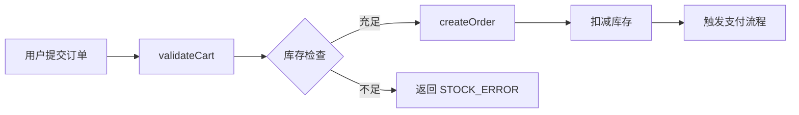

# Expert Explain Mode — 调研与设计

> 关联 Issue: [#34](https://github.com/CodesSentinels/ai-reviewer/issues/34)
> 分支: `feat/expert-explain-mode`

## 背景

当 PR 包含复杂业务逻辑时，Code Reviewer 需要花大量时间理解代码意图，才能有效 Review。现有 Bot 专注于找 bug / 安全问题，缺少"帮人理解代码"的能力。

## 目标

引入 `@codesentinel explain` 命令，让 Bot 切换为**专家讲解模式**：不找问题，改为提炼核心业务逻辑，输出数据流图 + 文字解释，帮助 CR 人员快速建立代码心智模型。

---

## 方案对比

### 方案 A：Mermaid 图内嵌 GitHub 评论（推荐先实现）

直接在 PR 评论中输出 Mermaid 代码块，GitHub 原生渲染。

**优点**
- 零基础设施：所有人在 PR 页面直接看到图
- 实现成本低：新增一个 prompt + command handler
- 可迭代：先跑通链路，图的质量可以持续优化

**缺点**
- 静态图，无法交互（缩放 / 筛选节点）
- 复杂流程节点过多时图会很长

**输出示意**

````markdown
## 业务逻辑说明（Expert Explain Mode）

### 核心数据流



### 关键设计点

- **乐观锁时序**：库存扣减在 `createOrder` 之后，存在超卖窗口期
- **状态机入口**：`OrderStatus` 由 `PENDING → CONFIRMED → PAID` 单向流转
- **副作用隔离**：支付触发通过事件总线异步分发，主流程不等待
````

---

### 方案 B：集成 review-visualizer（后续扩展）

AI 输出标准化节点/边 JSON → visualizer 渲染为可交互的 React Flow 图，评论中附 Deep Link。

**优点**
- 可拖拽 / 缩放 / 按层级展开
- 支持多层次关联（调用链、依赖链、数据流并排）

**缺点**
- 需要 host 一个 web 服务（或 GitHub Pages）
- 数据传递需要标准化 Schema：AI 输出 → JSON → URL encode → visualizer 读取
- 工程量较大，适合方案 A 验证后再做

---

## 实现路径（分阶段）

### Phase 1 — 命令入口 + Mermaid 输出 ✅

1. **新增 prompt**：`src/prompts.ts` 新增 `explainBusinessLogic` 模板 + `renderExplainBusinessLogic()` 方法
   - 聚焦业务语义（入口 → 状态变更 → 出口/副作用），不找 bug
   - Mermaid 规则：最多 12 节点、subgraph 隔离子系统、节点用业务概念命名
2. **新增 handler**：`src/commands/handlers/explain.ts`
   - `@codesentinel explain` 命令，minPermission: `read`
   - 拉取 PR base→head 完整 diff（`compareCommits`）
   - 超 80k 字符自动截断
   - 调用 heavyBot，通过 `ctx.reply` 发布 Mermaid 评论
3. **注册命令**：`stubs.ts` → `ALL_STUBS` → `bootstrapCommands()` 自动注册
4. **单元测试**：`__tests__/command-explain.test.ts`，10 个测试覆盖正常流程、边界情况、失败降级
5. **端到端验证**：[ai-reviewer-test PR #253](https://github.com/CodesSentinels/ai-reviewer-test/pull/253) — 购物车结算流程，待验证 Mermaid 输出质量

### Phase 2 — 质量提升

- 大 PR 分文件 explain，每组相关文件单独出图
- 支持 `@codesentinel explain src/order/` 指定范围

### Phase 3 — visualizer 集成（可选）

- 定义节点/边 JSON Schema
- AI 输出双份：Mermaid（评论展示） + JSON（visualizer deep link）
- visualizer 新增 `ExplainMode` tab，支持从 URL 参数加载数据

---

## Prompt 设计草稿

```
You are a senior engineer explaining code to a new team member.

Given the following PR diff and related file context, extract the BUSINESS LOGIC — not bugs, not style issues.

Output:
1. A Mermaid flowchart showing: entry points → key state transitions → outputs/side effects
   - Max 12 nodes. Group low-level details into single labeled nodes.
   - Use subgraph for distinct subsystems.
2. 3–5 bullet points highlighting non-obvious design decisions, timing constraints, or state machine invariants.

Rules:
- Focus on WHAT the business logic does and WHY, not HOW the code is written.
- If the PR spans multiple subsystems, show one flowchart per subsystem.
- Do NOT mention bugs, security issues, or style problems.
```

---

## 开放问题

- [ ] explain 命令是否需要权限控制（仅 CODEOWNER / 所有人可触发）？
- [ ] 大 PR（100+ 文件）如何分组？按目录 or 按调用链聚类？
- [ ] Mermaid 节点数上限：GitHub 渲染超过 ~20 节点会变糊，需要分图还是折叠？
- [ ] 是否在 Phase 1 同时输出 `summary` 类的 review comment 还是独立 reply？

---

## 参考

- [现有命令框架](../../src/commands/dispatcher.ts)
- [依赖分析入口](../../src/dependency-analyzer.ts)
- [prompts 模板](../../src/prompts.ts)
- [review-visualizer](../../tools/review-visualizer/)
