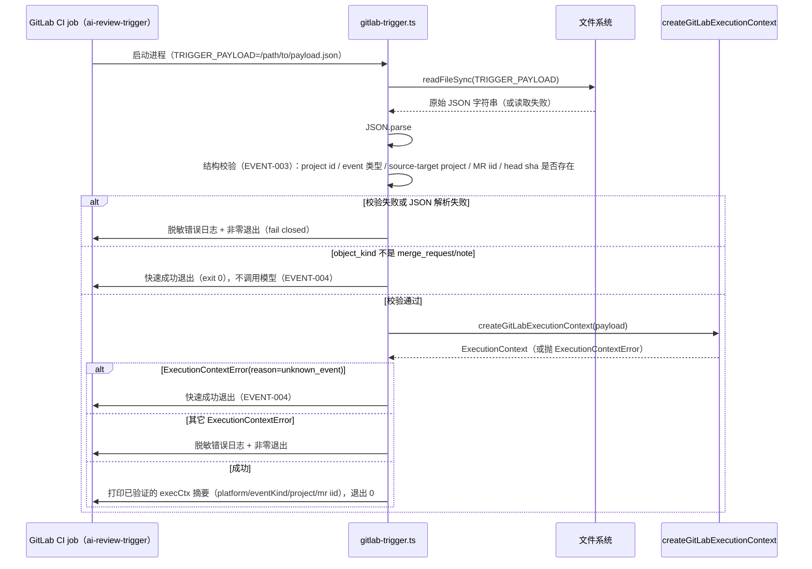

# GitLab Trigger CLI 设计文档（EVENT-001 ~ EVENT-005）

> **状态**：✅ 阶段一~三已完成（代码开发 + 单元测试 + 集成测试），见 PR #67；阶段四未开始
> **优先级**：P0 —— GitHub↔GitLab 双平台兼容工作流 A 的第二个子任务（A5 的前半部分）
> **依赖**：#62 / PR #63 交付的 `createGitLabExecutionContext()`（当前只存在于 `feat/execution-context` 分支，尚未合并 `main`）
> **范围**：仅 `EVENT-001`~`EVENT-005`（CLI 入口 + payload 解析 + 结构校验 + 无关事件快速退出 + 日志脱敏）
> **不在本任务范围**：`EVENT-006`~`EVENT-021`（MR/Note Hook 具体业务规则，如 fork 拒绝、幂等键、命令触发）、`GLAPI-*`（GitLab REST API adapter）、`CMD-*`（GitLab 命令框架接入）、`BUILD-*`/`CI-*`（双入口打包、`.gitlab-ci.yml`）

---

## 0. 参考文档

- `codesentinel-docs` 仓库 `docs/migration-plan/github-gitlab-compatibility-todo.md` 第 6.1 节（`EVENT-001`~`EVENT-005` 原始条目）
- 本仓库 `docs/tasks/execution-context-design.md`（`ExecutionContext`/`createGitLabExecutionContext` 的字段设计）
- 仓库内记忆：`memory/gitlab_migration_plan.md`

---

## 1. 背景与问题

当前仓库是纯 GitHub Action 形态，`src/main.ts` 是唯一入口，通过 `@actions/github` 的 `context` 和 `process.env.GITHUB_EVENT_NAME` 读取事件。GitLab 侧完全没有对应入口——没有 CLI、没有 `.gitlab-ci.yml`、没有 Webhook 接入。

按迁移方案 0.7 节 MVP 运行契约，GitLab 侧的事件流程是：

```
GitLab Project Webhook（MR Hook / Note Hook）
  → Pipeline Trigger API（固定 ref = protected main）
  → protected main 的 ai-review-trigger job
  → 该 job 从 file-type CI 变量 TRIGGER_PAYLOAD 读取原始事件文件路径
  → 本任务交付的 CLI 入口在这里开始工作
```

`TRIGGER_PAYLOAD` 是 GitLab CI 的 **file-type variable**：CI 环境变量的值不是 payload 内容本身，而是一个**文件路径**，job 需要自己读文件、解析 JSON——这一点和 GitHub Actions 把 payload 直接放进 `context.payload`（内存对象）不同，是本任务与 `main.ts`（ARCH-003/T4）最大的结构性差异。

---

## 2. 目标（对应 TODO 条目）

| 编号 | 内容 | 本设计如何满足 |
|:---|:---|:---|
| `EVENT-001` | 新增 GitLab trigger CLI 源入口 | 第 3 节：`src/gitlab-trigger.ts` |
| `EVENT-002` | CLI 从 file-type `TRIGGER_PAYLOAD` 路径读取原始 payload | 第 3.1 节 |
| `EVENT-003` | CLI 校验 project ID、事件类型、source/target project、MR IID 和 HEAD SHA | 第 4 节 |
| `EVENT-004` | 无关事件快速成功退出，不调用模型、不写评论 | 第 5 节 |
| `EVENT-005` | 所有错误日志脱敏，不输出完整 payload 或 Token | 第 6 节 |

---

## 3. CLI 架构



> 本任务的 CLI 在"成功构造 `ExecutionContext`"之后**只打印摘要日志，不调用模型、不写 GitLab note/discussion**——真正的审查/评论动作需要 `GLAPI-*`（GitLab REST API adapter）才能发起网络调用，那是 ARCH-016+ 的范围，明确不在本任务内。这与 `main.ts`（GitHub 侧，已有 `IGitPlatform` 实现即 Octokit adapter）形成对照：GitHub 侧 T4 完成后 CLI 能触发完整审查，GitLab 侧本任务完成后 CLI 只能"验证事件、构造上下文"，尚不能真正动作。

### 3.1 CLI 入口骨架

```typescript
// src/gitlab-trigger.ts（新增，EVENT-001/002）
import {readFileSync} from 'fs'
import {
  createGitLabExecutionContext
} from './platform/gitlab-execution-context'
import {ExecutionContextError} from './platform/execution-context'
import {validateTriggerPayload} from './gitlab-trigger-validation'
import {redact} from './gitlab-trigger-redact'

// 注：不 import @actions/core / @actions/github——GitLab-only 启动不得
// 依赖 GitHub 专有运行时（对齐 ARCH-015，Logger 抽象本身是 ARCH-012~015
// 的范围，本文件暂时直接用 console，等 Logger 任务落地后切换）。

async function run(): Promise<void> {
  const payloadPath = process.env.TRIGGER_PAYLOAD
  if (payloadPath == null || payloadPath === '') {
    console.error('TRIGGER_PAYLOAD is not set')
    process.exitCode = 1
    return
  }

  let raw: string
  try {
    raw = readFileSync(payloadPath, 'utf8')
  } catch (e) {
    console.error(`Failed to read TRIGGER_PAYLOAD file: ${redact(String(e))}`)
    process.exitCode = 1
    return
  }

  let parsed: unknown
  try {
    parsed = JSON.parse(raw)
  } catch {
    // 不打印 raw 内容本身——即使只是"JSON 解析失败"也可能包含敏感字段
    console.error('TRIGGER_PAYLOAD content is not valid JSON')
    process.exitCode = 1
    return
  }

  const validation = validateTriggerPayload(parsed)
  if (!validation.ok) {
    console.error(`TRIGGER_PAYLOAD failed validation: ${validation.reason}`)
    process.exitCode = 1
    return
  }
  if (validation.sourceTargetMismatch) {
    // EVENT-003 只做结构校验 + 记录；是否拒绝 fork MR 是 EVENT-010，不在本任务实现
    console.log(
      'Note: source_project_id != target_project_id (fork MR) — rejection logic is EVENT-010, not yet implemented'
    )
  }

  let execCtx
  try {
    execCtx = createGitLabExecutionContext(parsed)
  } catch (e) {
    if (e instanceof ExecutionContextError && e.reason === 'unknown_event') {
      // EVENT-004：无关事件快速成功退出
      console.log(`Skipped: ${e.message}`)
      return
    }
    console.error(
      `Failed to build ExecutionContext: ${redact(
        e instanceof Error ? e.message : String(e)
      )}`
    )
    process.exitCode = 1
    return
  }

  console.log(
    `GitLab event validated: platform=${execCtx.platform} eventKind=${execCtx.eventKind} project=${execCtx.projectPath} mr=${execCtx.changeRequestId}`
  )
  // 真正的审查/评论动作需要 GLAPI-*（GitLab REST API adapter），本任务不实现。
}

void run()
```

---

## 4. 结构校验设计（EVENT-003）

`createGitLabExecutionContext` 已经校验了它需要的字段（`object_attributes.iid`、`project`、`noteable_type` 等，缺失时抛 `ExecutionContextError`）。但它**不读取、不校验** `source_project_id`/`target_project_id`——这两个字段只用于 fork 检测（`EVENT-010`，本任务不实现拒绝逻辑），当前 `ExecutionContext` 类型也没有为它们单独建字段（只有一个 `projectId`/`projectPath`，对应 webhook 顶层 `project`，在 MVP 语义下即 target project）。

因此本任务在 `createGitLabExecutionContext` 之外，新增一个轻量结构校验函数，只负责"这些字段存不存在、类型对不对"，不做业务判断：

```typescript
// src/gitlab-trigger-validation.ts（新增，EVENT-003）

export interface TriggerPayloadValidation {
  ok: boolean
  reason?: string
  sourceTargetMismatch?: boolean
}

export function validateTriggerPayload(payload: unknown): TriggerPayloadValidation {
  if (payload == null || typeof payload !== 'object') {
    return {ok: false, reason: 'payload is not an object'}
  }
  const p = payload as Record<string, any>

  if (p.object_kind !== 'merge_request' && p.object_kind !== 'note') {
    // 未知 object_kind 的处理交给 createGitLabExecutionContext 的 unknown_event 分支
    // （EVENT-004 快速退出），这里只做"是不是我们认识的两种事件"的粗过滤
    return {ok: true}
  }

  const project = p.project
  if (project?.id == null) {
    return {ok: false, reason: 'missing project.id'}
  }

  if (p.object_kind === 'merge_request') {
    const attrs = p.object_attributes
    if (attrs?.iid == null) return {ok: false, reason: 'missing object_attributes.iid'}
    if (attrs?.source_project_id == null || attrs?.target_project_id == null) {
      return {ok: false, reason: 'missing source_project_id/target_project_id'}
    }
    return {
      ok: true,
      sourceTargetMismatch: attrs.source_project_id !== attrs.target_project_id
    }
  }

  // note
  const attrs = p.object_attributes
  const mr = p.merge_request
  if (attrs?.id == null) return {ok: false, reason: 'missing object_attributes.id'}
  if (mr?.iid == null) return {ok: false, reason: 'missing merge_request.iid'}
  return {ok: true}
}
```

> `source_project_id`/`target_project_id` 字段名依据 GitLab 官方 Webhook events 文档整理，**尚未经真实 Webhook 验证**——与 `createGitLabExecutionContext` 的字段映射一样，需要在真实环境接入（本任务不含）时用真实 payload 复核。

---

## 5. 无关事件快速退出设计（EVENT-004）

两层快速退出，职责分开：

1. **`validateTriggerPayload` 内的粗过滤**：`object_kind` 不是 `merge_request`/`note` 时直接放行到下一步（不在这里报错），因为"这是不认识的事件"本身不是校验失败，而是"不需要处理"。
2. **`createGitLabExecutionContext` 的 `unknown_event`**：真正确认"这不是我们支持的事件"后，CLI 捕获该 reason，打印一行日志，`return`（不设置非零 `exitCode`）。

两层都不得调用模型、不得尝试写 GitLab note/discussion——本任务这一步 GLAPI-* 尚不存在，天然不可能误触发网络调用，但设计上仍要求未来 `GLAPI-*` 接入后，模型调用必须在"无关事件"分支**之后**才可能触达，不能反过来。

---

## 6. 日志脱敏设计（EVENT-005）

| 场景 | 处理方式 |
|:---|:---|
| 文件读取失败（`readFileSync` 抛错） | 只打印脱敏后的错误信息（`redact()`），不打印 `payloadPath` 完整路径之外的文件内容 |
| JSON 解析失败 | 只打印"不是合法 JSON"，**不打印 `raw` 原始内容**（原始内容可能含真实 note 正文/用户信息） |
| 结构校验失败 | 只打印字段名（如 `missing object_attributes.iid`），不打印整个 payload |
| `ExecutionContextError` | 只打印 `e.message`（已经是不含 payload 内容的字符串）经 `redact()` 处理 |
| 成功路径的摘要日志 | 只打印 `platform`/`eventKind`/`projectPath`/`changeRequestId` 四个字段，不打印 `execCtx.raw` |

```typescript
// src/gitlab-trigger-redact.ts（新增，EVENT-005）

/**
 * 脱敏错误信息里可能出现的 token/PAT 特征片段。
 * 覆盖：GitLab PAT（glpat-）、Bearer token、URL query 中的 token 参数。
 */
export function redact(input: string): string {
  return input
    .replace(/glpat-[A-Za-z0-9_-]+/g, 'glpat-***')
    .replace(/Bearer\s+[A-Za-z0-9._-]+/gi, 'Bearer ***')
    .replace(/([?&]token=)[^&\s]+/gi, '$1***')
    .replace(/([?&]private_token=)[^&\s]+/gi, '$1***')
}
```

> 这是本任务范围内的最小脱敏实现，覆盖当前已知会出现在错误信息里的 token 形态。更完整的脱敏工具（覆盖 HTTP Header、环境变量、异常对象任意嵌套字段）是 `SEC-008` 的范围，不在本任务内——本函数只处理字符串形态的错误信息，不是通用脱敏框架。

---

## 7. 文件结构变更清单

```
src/
  gitlab-trigger.ts             ← 新增（CLI 入口，EVENT-001/002）
  gitlab-trigger-validation.ts  ← 新增（结构校验，EVENT-003）
  gitlab-trigger-redact.ts      ← 新增（日志脱敏，EVENT-005）
__tests__/
  gitlab-trigger-validation.test.ts  ← 新增
  gitlab-trigger-redact.test.ts      ← 新增
  gitlab-trigger.characterization.test.ts ← 新增（比照 阶段零 的思路：
    本文件是新代码，没有"改造前基线"概念，但作为新 CLI 入口，建议同样
    用真实历史 fixture 驱动，而不是逐分支手写单元测试，便于未来
    EVENT-006+ 接入真实 GitLab API 时复用同一批 fixture）
  fixtures/
    gitlab-mr-hook-open.json
    gitlab-mr-hook-update-sha.json
    gitlab-mr-hook-update-meta.json
    gitlab-mr-hook-fork.json       ← source/target project 不同，验证 sourceTargetMismatch 标记
    gitlab-note-hook-toplevel.json
    gitlab-note-hook-discussion.json
    gitlab-note-hook-non-create.json ← action != create，验证结构校验放行、ECF 层面处理
    gitlab-unknown-event.json       ← object_kind 不认识
    gitlab-malformed.json           ← 缺字段
```

---

## 8. 任务拆分

### 8.1 阶段一：代码开发

| # | 任务 | 依赖 | 预估工时 |
|:---|:---|:---|:---:|
| G1 | `src/gitlab-trigger-redact.ts`：`redact()` 函数 | 无，可先做 | 1h |
| G2 | `src/gitlab-trigger-validation.ts`：`validateTriggerPayload()` | 无，可与 G1 并行 | 3h |
| G3 | `src/gitlab-trigger.ts`：CLI 入口，串联文件读取 → JSON 解析 → G2 校验 → `createGitLabExecutionContext` → 日志 | G1, G2 | 4h |
| G4 | 9 个 fixture JSON（含 fork/非 create/未知事件/缺字段等边界场景） | 无，可提前做 | 2h |

**阶段一合计：约 10h（约 1.5 个工作日）**

### 8.2 阶段二：单元测试

| # | 任务 | 预估工时 |
|:---|:---|:---:|
| U1 | `validateTriggerPayload()`：≥8 用例（合法 MR/note、缺 project.id、缺 iid、缺 source/target project id、fork 标记、未知 object_kind 放行、note 缺字段） | 3h |
| U2 | `redact()`：≥5 用例（glpat-、Bearer、`?token=`、`?private_token=`、多个同时出现、无敏感内容时原样返回） | 1.5h |
| U3 | CLI 入口集成测试（mock `fs.readFileSync`/`process.env.TRIGGER_PAYLOAD`）：文件不存在、JSON 非法、校验失败、未知事件快速退出、成功路径日志内容、`ExecutionContextError` 各 reason 分支 | 4h |

**阶段二合计：约 8.5h（约 1 个工作日）**

### 8.3 阶段三：集成测试

| # | 任务 | 预估工时 |
|:---|:---|:---:|
| I1 | 用真实结构的 GitLab MR/Note Hook fixture（第 7 节 9 个文件）跑通 CLI 全流程，断言退出码和日志摘要符合预期 | 3h |
| I2 | 脱敏回归：故意在 fixture/环境变量里放入形如 `glpat-xxx` 的字符串，断言任何路径的输出都不包含明文 token | 2h |
| I3 | `GitHub-only` 回归：确认本任务新增文件未被任何 GitHub 相关代码 import，`npm test` 全量无新增失败 | 1h |

**阶段三合计：约 6h（约 1 个工作日）**

**本任务总计（阶段一~三）：约 24.5h（约 3 个工作日，单人估算）**

### 8.5 实际完成状态（2026-07-27）

阶段一~三已全部交付，见 PR #67（stacked on `feat/execution-context`）：

| 阶段 | 交付文件 | 备注 |
|:---|:---|:---|
| 阶段一 G1-G4 | `src/gitlab-trigger-redact.ts`、`src/gitlab-trigger-validation.ts`、`src/gitlab-trigger.ts`、9 个 fixture JSON | 与第 7 节文件结构清单一致 |
| 阶段二 U1 | `__tests__/gitlab-trigger-validation.test.ts`（12 用例，超过 ≥8 门槛） | 覆盖清单里列的全部场景 |
| 阶段二 U2 | `__tests__/gitlab-trigger-redact.test.ts`（6 用例，超过 ≥5 门槛） | 覆盖清单里列的全部 4 种 token 形态 + 多重同现 + 无敏感内容 |
| 阶段二 U3 / 阶段三 I1 | `__tests__/gitlab-trigger.test.ts`（8 用例） | 只 mock `fs.readFileSync`，`validateTriggerPayload`/`createGitLabExecutionContext`/`redact` 均为真实实现，兼顾 U3（分支覆盖）与 I1（真实 fixture 全流程）两个目标 |
| 阶段三 I2 | 同上（文件读取失败路径注入 `glpat-` 字符串，断言输出不含明文） | 另一个 redact() 调用点（ExecutionContextError catch 分支）不接收动态 payload 内容，无泄漏面，未单独测 |
| 阶段三 I3 | 已用 `grep` 确认零 GitHub 侧代码 import 新文件；`npm test` 556 passed/3 skipped 无新增失败 | — |

**与文档建议的一处命名偏差**：第 7 节建议 CLI 集成测试命名为 `gitlab-trigger.characterization.test.ts`（呼应"新代码但用 fixture 驱动"的思路），实际交付为 `gitlab-trigger.test.ts`。内容和覆盖范围一致，仅文件名不同，如需对齐可后续重命名。

### 8.4 阶段四（后续排期，不计入本任务工时）

- `EVENT-006`~`EVENT-021`：MR/Note Hook 具体业务规则（fork 拒绝、幂等键、命令触发、对话上下文）
- `GLAPI-*`：GitLab REST API adapter（`@gitbeaker/rest` 标准客户端），本任务的 CLI 需要它才能真正发起 GitLab API 调用
- `BUILD-001`~`BUILD-010`：`lib/gitlab-trigger.js` 独立构建入口、`package:gitlab` 脚本、双 bundle 打包
- `CI-001`~`CI-013`：`.gitlab-ci.yml`、Webhook/Trigger 配置、真实 `ai-reviewer-test` 项目接入

---

## 9. 验收标准

- [x] CLI 能从本地文件路径正确读取并解析 `TRIGGER_PAYLOAD`（EVENT-001/002）
- [x] `validateTriggerPayload()` 对 project id / MR iid / source-target project id / note 必需字段的缺失均能正确识别并返回结构化原因（EVENT-003）
- [x] 无关事件（未知 `object_kind`、非 `merge_request`/`note`）触发 CLI 快速成功退出，不产生非零退出码，不调用任何模型/API（EVENT-004）
- [x] 所有错误路径的日志经过 `redact()` 处理，故意注入的 token 样式字符串不会明文出现在任何输出中（EVENT-005）
- [x] CLI 源文件不 import `@actions/core`/`@actions/github`（GitLab-only 独立运行前提，对齐 ARCH-015）
- [x] `npm test` 全量回归无新增失败，`GitHub-only` 场景不受影响

---

## 10. 风险与未决问题

| 风险/问题 | 说明 | 处理方式 |
|:---|:---|:---|
| `source_project_id`/`target_project_id` 字段名未经真实验证 | 与 `createGitLabExecutionContext` 的既有风险一致 | 标注为"待确认"，`EVENT-002`/真实环境接入时用真实 payload 复核 |
| CLI 成功路径目前只打日志、不做任何实际动作 | 因为 `GLAPI-*` 不存在，这是本任务范围内的正确边界，但也意味着本任务交付后 GitLab 仍然"看不见"任何真实审查效果 | 在 PR 描述里明确说明，避免误以为本任务完成后 GitLab 已经能用 |
| 脱敏函数覆盖面有限（仅 4 种 token 形态的正则） | 不是通用脱敏框架，`SEC-008` 才是完整方案 | 本任务只覆盖已知会在当前错误信息里出现的形态，后续按 `SEC-008` 扩展 |
