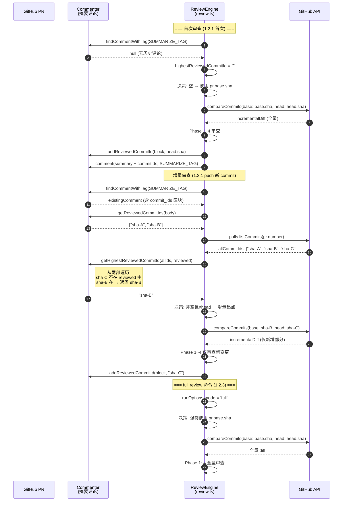
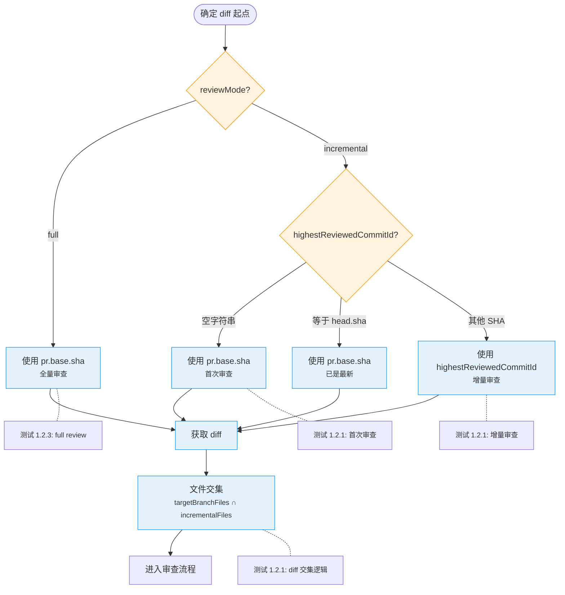
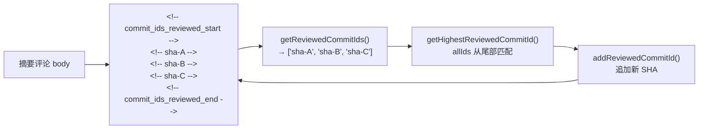
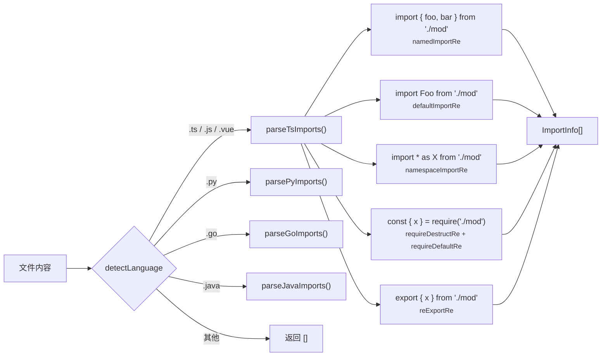
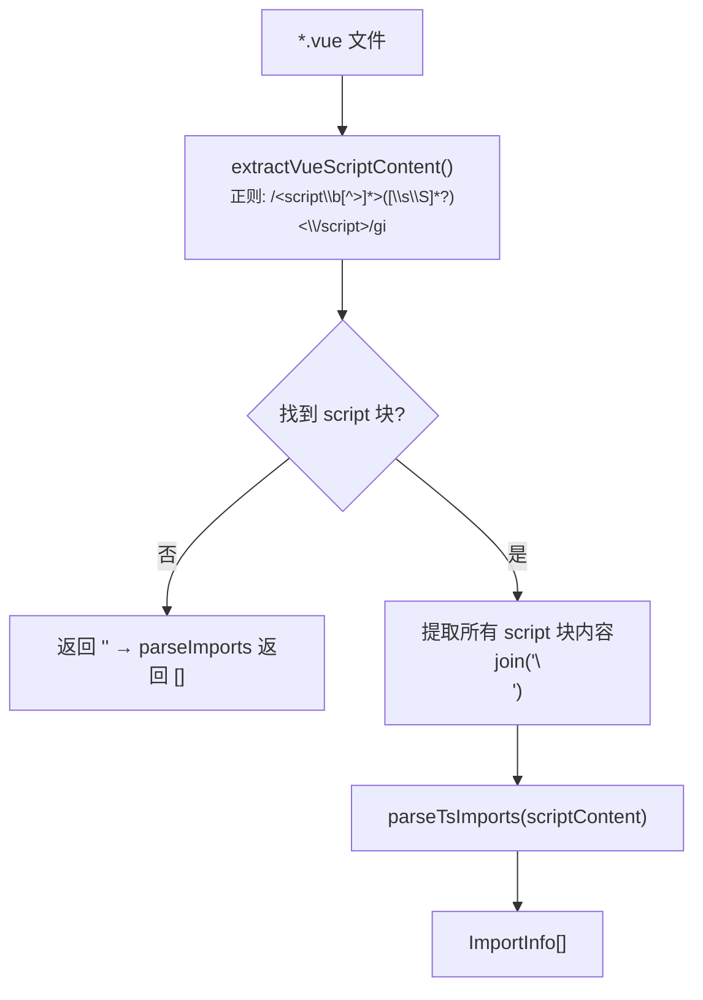

# 测试人 1 — P0 测试用例流程图

> 以下 Mermaid 图与 `__tests__/tester1/` 中的 69 个单元测试一一对应，
> 帮助理解审查引擎核心逻辑和测试覆盖点。

---

## 图 1：PR 审查主流程（对应 1.1 基础审查流程）

```mermaid
flowchart TD
    Start([PR 事件触发]) --> EventCheck{事件类型?}

    EventCheck -->|pull_request / pull_request_target| PauseCheck
    EventCheck -->|issue_comment + fromCommand| PauseCheck
    EventCheck -->|其他事件| Skip1[/跳过: 不支持的事件/]

    PauseCheck{PR 暂停状态?<br/><small>getReviewStateFromBody</small>}
    PauseCheck -->|paused 且非命令触发| Skip2[/跳过: review is paused/]
    PauseCheck -->|active| IgnoreCheck

    IgnoreCheck{PR 描述含<br/>'@codesentinel: ignore'?}
    IgnoreCheck -->|是| Skip3[/跳过: ignore keyword/]
    IgnoreCheck -->|否| FileFilter

    FileFilter[文件路径过滤<br/><small>PathFilter.check&#40;filename&#41;</small>]
    FileFilter --> FilterResult{通过过滤的文件数}
    FilterResult -->|0 个文件| Skip4[/跳过: 无匹配文件/]
    FilterResult -->|>0| MaxFiles

    MaxFiles{超出 maxFiles?}
    MaxFiles -->|是| TruncFiles[截断: 仅处理前 N 个文件<br/>记录跳过的文件]
    MaxFiles -->|否| Phase1
    TruncFiles --> Phase1

    Phase1[/<b>Phase 1: 文件摘要</b><br/>lightBot 并行生成摘要<br/>分类: NEEDS_REVIEW / APPROVED/]
    Phase1 --> Phase2

    Phase2[/<b>Phase 2: 摘要合并</b><br/>每 10 个文件一批<br/>heavyBot 合并去重/]
    Phase2 --> Phase3

    Phase3[/<b>Phase 3: 最终汇总</b><br/>生成 PR 总结 + 发布说明<br/>写入 PR 描述/]
    Phase3 --> DisableCheck

    DisableCheck{disableReview?}
    DisableCheck -->|true| PostSummary[仅发布摘要评论]
    DisableCheck -->|false| Phase4

    Phase4[/<b>Phase 4: 逐文件审查</b><br/>仅审查 NEEDS_REVIEW 的文件<br/>heavyBot + lint上下文 + 跨文件上下文<br/>→ 行级评论/]
    Phase4 --> NoiseControl

    NoiseControl[噪音控制<br/><small>prepareFindings: 去重+排序+截断</small>]
    NoiseControl --> Submit[提交 Review<br/><small>commenter.submitReview</small>]
    Submit --> PostSummary
    PostSummary --> UpdateCommitIds[更新已审查 commit ID]
    UpdateCommitIds --> Done([完成])

    %% 测试用例标注
    Skip1 -.- T111["<small>隐含于事件分发逻辑</small>"]
    Skip2 -.- T115["<small>测试 1.1: pause 状态跳过</small>"]
    Skip3 -.- T116["<small>测试 1.1.6: ignore 跳过</small>"]
    Phase1 -.- T112["<small>测试 1.1.1~1.1.2: 自动审查+摘要格式</small>"]
    Phase4 -.- T113["<small>测试 1.1.3: 行级评论定位</small>"]
    PostSummary -.- T114["<small>测试 1.1.4: 发布说明</small>"]
    DisableCheck -.- T115b["<small>测试 1.1.5: disable_review</small>"]

    classDef skip fill:#fee,stroke:#f66
    classDef phase fill:#e8f5e9,stroke:#4caf50
    classDef guard fill:#fff3e0,stroke:#ff9800
    class Skip1,Skip2,Skip3,Skip4 skip
    class Phase1,Phase2,Phase3,Phase4 phase
    class EventCheck,PauseCheck,IgnoreCheck,FilterResult,MaxFiles,DisableCheck guard
```

---

## 图 2：增量审查状态管理（对应 1.2 增量审查）

### 增量 diff 起点决策树

### Commit ID 区块结构

---

## 图 3：跨文件依赖分析流水线（对应 1.3 跨文件依赖）

```mermaid
flowchart TD
    Entry([analyzeDependencies 入口]) --> Step1

    subgraph Step1 [Step 1: 提取修改的导出符号]
        S1A[遍历 PR 变更文件] --> S1B["extractModifiedSymbols(filename, diff)<br/><small>扫描 +/- 行中的 export 声明</small>"]
        S1B --> S1C["findEnclosingExports(filename, content, touchedLines)<br/><small>补充: hunk 上下文中的导出函数</small>"]
        S1C --> S1D["allModifiedSymbols<br/>Map&lt;filename, ModifiedSymbol[]&gt;"]
    end

    S1D --> Step15

    subgraph Step15 [Step 1.5: 智能过滤]
        S15A{入口文件/测试文件?}
        S15A -->|是| S15B[移除: 入口文件无需追踪引用]
        S15A -->|否| S15C[保留]
    end

    S15C --> Empty{symbols 为空?}
    Empty -->|是| Exit1([返回空 Context])
    Empty -->|否| Step2

    subgraph Step2 [Step 2: 分析 PR 内部文件的 imports]
        S2A[获取 PR 中其他文件的内容] --> S2B["parseImports(content, filename)<br/><small>正则解析 import/require</small>"]
        S2B --> S2C["resolveImportPath(file, path, repoFiles)<br/><small>路径解析: ~/、../、别名</small>"]
        S2C --> S2D{导入指向<br/>modifiedSymbols 中的文件?}
        S2D -->|是| S2E[加入 dependencyGraph]
        S2D -->|否| S2F[跳过]
    end

    S2E --> Step3

    subgraph Step3 [Step 3: 确定外部候选文件]
        S3A["filterByExtension(repoFiles, extensions)<br/><small>筛选同语言文件</small>"]
        S3A --> S3B["sortByProximity(candidates, modifiedFiles)<br/><small>同目录优先</small>"]
        S3B --> S3C["slice(0, maxDependencyFiles)<br/><small>限制扫描上限</small>"]
    end

    S3C --> Step4

    subgraph Step4 [Step 4: 获取外部文件内容]
        S4A["并行: octokit.repos.getContent<br/><small>受 githubConcurrencyLimit 控制</small>"]
    end

    S4A --> Step5

    subgraph Step5 [Step 5: 分析外部文件 imports]
        S5A["parseImports + resolveImportPath<br/><small>同 Step 2 逻辑</small>"]
        S5A --> S5B[扩展 dependencyGraph]
    end

    S5B --> Step51

    subgraph Step51 ["Step 5.1: Nuxt 自动导入检测"]
        S51A{文件在 composables/<br/>utils/ components/ ?}
        S51A -->|是| S51B["findReferencesInContent<br/><small>无 import 语句但有符号使用</small>"]
        S51A -->|否| S51C[跳过]
    end

    S51B --> Step55
    S51C --> Step55

    subgraph Step55 ["Step 5.5: Barrel 文件传递"]
        S55A{是否经由 barrel<br/>index.ts re-export?}
        S55A -->|是| S55B[追踪间接引用方]
        S55A -->|否| S55C[跳过]
    end

    S55B --> Step6
    S55C --> Step6

    subgraph Step6 [Step 6: 引用搜索]
        S6A[对每个 dependent file:] --> S6B["findReferencesInContent(filename, content, symbolNames)<br/><small>逐行搜索符号使用（排除 import/export 声明行）</small>"]
        S6B --> S6C["FileDependencyInfo<br/>{filename, modifiedSymbols, dependentFiles, references}"]
    end

    S6C --> Output([返回 DependencyContext])

    %% 测试标注
    S1B -.- T131["<small>测试 1.3.1: 修改导出函数</small>"]
    S2B -.- T132["<small>测试 1.3.2: TS import 解析</small>"]
    S51B -.- T133["<small>测试 1.3.3: Vue composable 引用</small>"]
    S3C -.- T135["<small>测试 1.3.5: maxDependencyFiles</small>"]
    S6B -.- T131b["<small>测试 1.3.1: findReferencesInContent</small>"]

    classDef step fill:#e8f5e9,stroke:#4caf50
    classDef decision fill:#fff3e0,stroke:#ff9800
    class Step1,Step2,Step3,Step4,Step5,Step51,Step55,Step6 step
    class S15A,S2D,S51A,S55A,Empty decision
```

### parseImports 支持的模式（测试 1.3.2 覆盖）

### Vue 文件处理流程（测试 1.3.3 覆盖）

---

## 测试覆盖映射总表

| 测试编号 | 测试场景 | 对应图中节点 |
|----------|----------|--------------|
| 1.1.1 | 新建 PR 触发自动审查 | 图1: Start → Phase 1~4 完整路径 |
| 1.1.2 | 摘要评论格式 | 图1: Phase 3 → PostSummary |
| 1.1.3 | 行级评论定位 | 图1: Phase 4 |
| 1.1.4 | 发布说明写入 PR | 图1: Phase 3 |
| 1.1.5 | disable_review 跳过 | 图1: DisableCheck → 仅摘要 |
| 1.1.6 | ignore 关键词跳过 | 图1: IgnoreCheck → Skip |
| 1.2.1 | 增量审查 | 图2: 增量序列 + 决策树 UseIncr |
| 1.2.2 | commit ID 记录 | 图2: Commit ID 区块结构 |
| 1.2.3 | full review 全量 | 图2: 决策树 Mode=full |
| 1.3.1 | 修改导出函数 | 图3: Step 1 + Step 6 |
| 1.3.2 | TS import 解析 | 图3: parseImports 模式图 |
| 1.3.3 | Vue composable | 图3: Vue 处理流程 + Step 5.1 |
| 1.3.4 | 关闭依赖分析 | 图3: Entry 前的 options 开关 |
| 1.3.5 | maxDependencyFiles | 图3: Step 3 slice |
