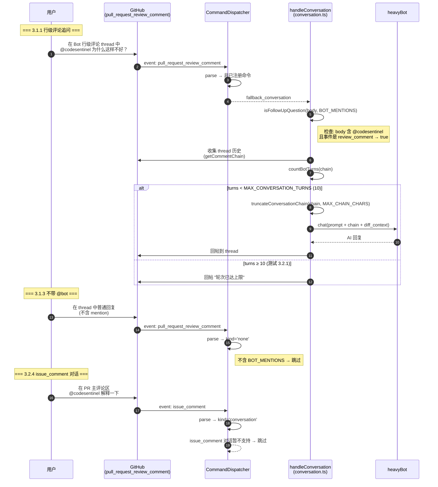
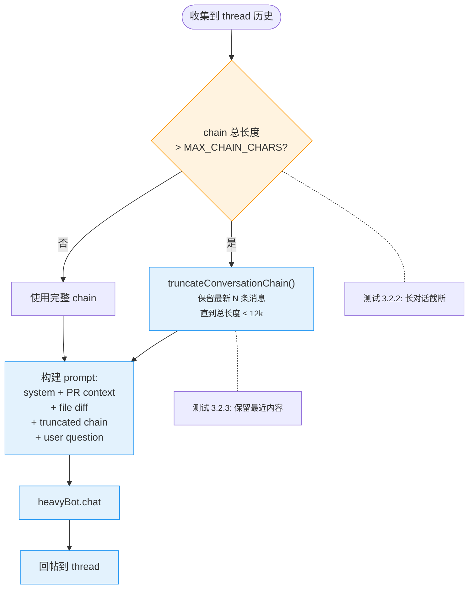
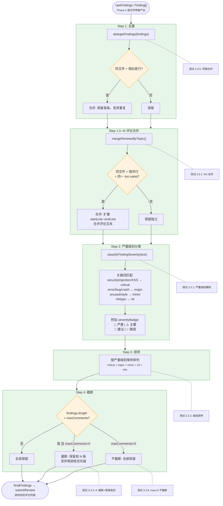
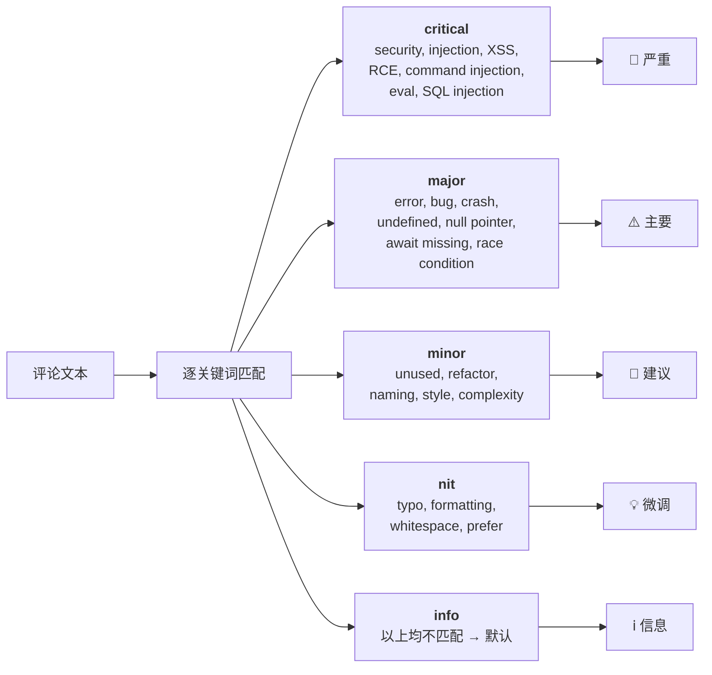
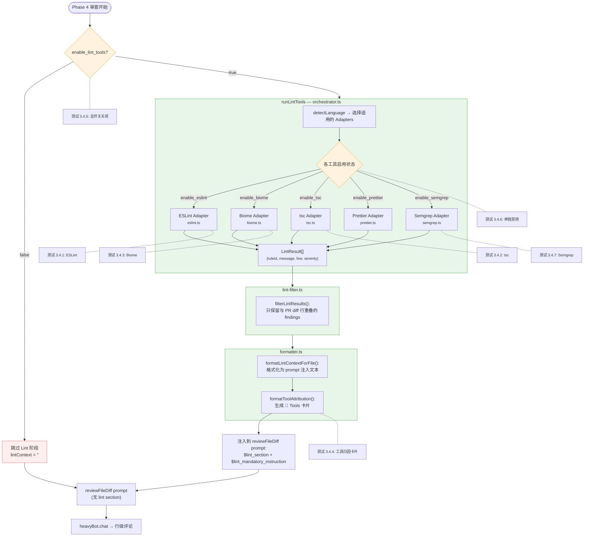
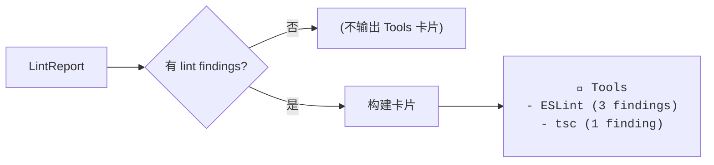
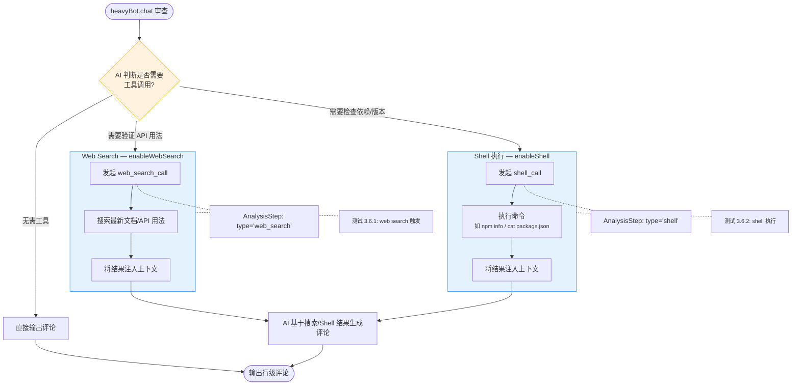

# 测试人 3 — P0 测试用例流程图

> 以下 Mermaid 图对应测试人 3 的核心测试场景，
> 帮助理解对话交互、噪音控制、Lint 集成的内部逻辑和验证点。

---

## 图 1：对话式追问流程（对应 3.1 对话追问 + 3.2 轮次控制）

### 对话截断策略

---

## 图 2：噪音控制流水线（对应 3.3 噪音控制 + 3.5 评论去重）

### 严重级别关键词映射（classifyFindingSeverity）

---

## 图 3：Linter/SAST 集成流程（对应 3.4 Lint 集成）

### 工具归因卡片结构（formatToolAttribution）

---

## 图 4：Web 搜索与 Shell 执行（对应 3.6）

---

## 测试覆盖映射总表

| 测试编号 | 测试场景 | 对应图中节点 |
|----------|----------|--------------|
| 3.1.1 | 行级评论追问 | 图1: User → Conv → Bot → Reply 完整路径 |
| 3.1.2 | 续轮追问 | 图1: 多次循环（chain 累积） |
| 3.1.3 | 不带 @bot 不触发 | 图1: parse → kind='none' → 跳过 |
| 3.1.4 | Bot 不自触发 | 图1: Dispatcher 过滤 Bot 身份 |
| 3.1.5 | 引用文件 diff | 图1: BuildPrompt (file diff) |
| 3.1.6 | 引用 PR 摘要 | 图1: BuildPrompt (PR context) |
| 3.2.1 | 10 轮限制 | 图1: countBotTurns ≥ 10 分支 |
| 3.2.2 | 长对话截断 | 截断策略图: CheckLength → Truncate |
| 3.2.3 | 保留最近内容 | 截断策略图: 从尾部保留 |
| 3.2.4 | issue_comment 不支持 | 图1: issue_comment → 跳过 |
| 3.3.1 | 严重级别徽标 | 图2: Classify → Badge |
| 3.3.2 | 级别排序 | 图2: Sort |
| 3.3.3 | 评论截断 | 图2: Truncate (maxComments) |
| 3.3.4 | 截断保留高优 | 图2: Sort → Truncate 顺序保证 |
| 3.3.5 | 同类合并 | 图2: Dedup |
| 3.3.6 | 不截断(max=0) | 图2: Truncate maxComments=0 分支 |
| 3.4.1 | ESLint | 图3: ESLint Adapter |
| 3.4.2 | tsc | 图3: tsc Adapter |
| 3.4.3 | Biome | 图3: Biome Adapter |
| 3.4.4 | 工具归因卡片 | 图3: formatToolAttribution |
| 3.4.5 | lint 总开关 | 图3: enable_lint_tools → false |
| 3.4.6 | 单独禁用 | 图3: O2 各开关 |
| 3.4.7 | Semgrep | 图3: Semgrep Adapter |
| 3.5.1 | lint 合并 | 图2: MergeByTopic (同 ruleId) |
| 3.5.2 | 不同 lint 不合并 | 图2: MergeByTopic (不同 ruleId) |
| 3.5.3 | 合并行号扩展 | 图2: M3 扩展 startLine~endLine |
| 3.5.4 | AI 同行去重 | 图2: Dedup (同首行) |
| 3.6.1 | Web 搜索 | 图4: WebSearch |
| 3.6.2 | Shell 执行 | 图4: Shell |
| 3.6.3 | 关闭 web search | 图4: enableWebSearch=false → 无 web_search |
| 3.6.4 | 关闭 shell | 图4: enableShell=false → 无 shell |
